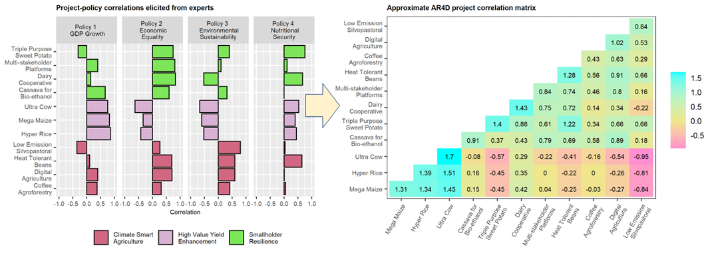

```{r setup, include=FALSE}
knitr::opts_chunk$set(echo = FALSE,
                      message = FALSE,
                      warning = FALSE,
                      dev = c("png", "tiff"),
                      dpi = 300)

library(plyr)
library(tidyverse)
library(patchwork)
library(kableExtra)
library(pracma)

label_size <- 2.5
smallLabel_size <- 2
title_size <- 6
#subtitle_size <- 7
legendText_size <- 6
axisText_size <- 6
axisTitle_size <- 7
facetTitle_size <- 7
cellText_size <- 2

```

# Introduction

Conventional agricultural research for development (AR4D) priority setting exercises have long been implemented to build insight and consensus around the strengths and weaknesses of individual agricultural research alternatives (usually projects or programs) in a given portfolio, but stop short of providing tools that can translate collective insights into optimal budget allocation shares. They also generally exclude from the allocation decision any rigorous accounting of the risk involved in each project, much less of covariances (tradeoffs and synergies) between projects---both of which are required to estimate risk at the portfolio level. As a result, AR4D budget allocations are vulnerable to multiple forms of subjective bias, and are, de facto, badly unbalanced in terms of risk minimization.

In this article, I propose a risk-adjusted portfolio optimization method to redress these issues. The proposed method solves for the impact maximizing allocation of funds, subject to a risk constraint, across a portfolio of research projects (or programs), each of which may have varying expected impacts, scaleability, time horizons, risk, synergies, and tradeoffs.

Formally, the problem may be written

\begin{equation}
\max_{\boldsymbol{\mu}}{\mathcal{E}} \:\:\: s.t. \:\:\: \sigma = \overline{\sigma}
\end{equation}

Where $\mathcal{E}$ is a measure of expected net benefit, $\sigma$ is the portfolio risk, $\overline{\sigma}$ is the risk tolerance, and the vector of decision variables $\boldsymbol{\mu}$ is the vector of expected net benefits corresponding to each project in the portfolio. The real decision variables in such a problem are, of course, the respective project investments. Here $\boldsymbol{\mu}$ is used because it simplifies the mathematical exposition; and because expected project impact may typically be modeled as a marginally diminishing function of investment, such that the optimal investment may be calculated from the optimal solution for $\boldsymbol{\mu}$. by way of introduction...Most of what follows concerns the specification of the variables appearing in this equation, and the estimation of their parameters based on the minimal data that is typically available in real life use cases. The challenges of deducing the project tradeoffs and synergies (i.e. correlations) implicit in the calculation of $\sigma$. ...the treatment of negative expected returns....first and second order conditions....walk through hypothetical use case.

Three novel methodological propositions to redress this:

Firstly the specification of expected project impact, s.d., and correlations follow from the assumption gBm.

Secondly, the estimation of parameters required to evaluate ...follows from Schiek.

Thirdly, the issue of negative expected returns explained away using complex numbers.

The method is built upon the assumptions that 1) project net present value (NPV) evolves as a geometric Brownian motion (gBm) and 2) scales with investment, but exhibits marginally diminishing returns to investment. Below, I formally introduce these assumptions, including a discussion of how gBm model parameters can be estimated in the minimum data contexts characteristic of AR4D. The work presented here also rests on three novel methodological propositions:

Firstly, project synergies and tradeoffs are "reverse engineered" from expert opinion using a method recently developed by Schiek [-@schiek2021reverse]; and these are then combined with the assumption of project NPV as a gBm to define portfolio risk in terms of a "coefficient of variation-covariation" matrix, whose diagonal elements are the squared project NPV coefficients of variation, and whose off-diagonal elements are "coefficients of covariation" (an extension of the coefficient of variation in the way that covariance is an extension of variance).

Secondly, I express project level of effort in terms of a quantity analogous to kinetic energy in physics. This effectively results in a quadratic definition of project effort, which subsequently turns out to result in a correspondence between optimal budget allocations and the eigenvectors of the project NPV coefficient of covariation matrix. A budget constraint is not explicitly included in the formal statement of the risk-adjusted optimization problem, but can be arbitrarily enforced since eigenvectors are defined up to scaling. Only eigenvectors explaining a substantial fraction of portfolio variance are retained.

Thirdly, I model the project funding cycle in terms of rotations in the complex plane. While this may seem outlandish at first, I argue that it is more realistic than the conventional notion of project value as something which is always positive. This effectively provides a meaningful framework by which to interpret negative or complex valued budget allocations, and to transform them into real, positive values.

<!-- These methodological lacunae have repeatedly exposed AR4D resource allocation processes to politically driven decisionmaking, and to  thereby contributing to growing toxicity in donor-researcher relations. Here I explore the possibility of removing the methodological basis for this discord by introducing a rigorous allocation method, adapted from financial contexts, that allocates precise, optimal budget shares to each proposal based on its expected scalability, risk, and synergies/tradeoffs with the other proposals in the portfolio. -->
After introducing this methodological groundwork, I proceed to formulate and solve the risk adjusted portfolio optimization problem, detailing the first and second order conditions. This includes a discussion of the risk shadow price, enforcement of the budget constraint, and instructions for retaining only meaningful solutions. Finally, to help build intuition, I present a hypothetical application of the proposed method, followed by a discussion and conclusion. Before reaching this main content, I first contextualize the present work with respect to relevant literature, immediately below.
<!-- The article is structured as follows: After a brief contextualization of the present work rooted in the relevant literature, I formally introduce the assumptions of project net present value (NPV) as a geometric Brownian movement (gBm) and a marginally diminishing function of investment---including a discussion of how gBm model parameters can be estimated in the minimum data contexts characteristic of AR4D. This is followed by a crash-course in project NPV "kinematics", whereby the expression for AR4D effort in terms of vis viva emerges. I then explain how the funding cycle may be modeled as a rotation in the complex plane, by which it follows that negative or complex valued budget shares can be transformed into positive, real valued budget shares via an extension or contraction of the project time horizon. With the groundwork laid, I then formulate the risk adjusted portfolio optimization formulated in terms of vis viva, and walk through the first and second order conditions. This includes an discussion of the risk shadow price, enforcement of the budget constraint, and instructions for retaining only meaningful solutions. Finally, to help build intuition, I present a hypothetical application of the proposed method, followed by a discussion and conclusion. -->

# Literature review

## Mills' missing fifth step

For decades, efforts to improve AR4D quantitative foresight and decision support have focused on the development of models to assess the potential impacts of individual research projects under a range of future climate and socioeconomic scenarios. However, if the ultimate aim of such exercises is to determine an optimal allocation of research funds across the projects under assessment, then a portfolio level tool is also required in order to translate research impact assessments into optimal budget allocations.

Mills clearly identified and articulated the need for such a tool long ago [-@Mills1998], and yet work in this direction has not yet begun in earnest. Instead of portfolio optimization, AR4D institutions hold "priority setting exercises", which Mills breaks down into four steps, as follows [-@Mills1998].
<!-- Mills articulated the four steps of priority setting in agricultural research for development (AR4D) as follows : -->

>Step one is the development of an information base. Step two is the establishment of research alternatives. Step three is the evaluation of the potential impact of research alternatives. Step four, often considered the final output of a priority-setting exercise, is the ranking of alternatives into research priorities.

Mills then goes on to observe that these steps, summarized graphically in Fig \ref{fig:priorSetEx}, are insufficient. An as of yet non-existent

>fifth step, the development of guidelines for translating priorities into planning and resource allocation decisions, is necessary to establish direct links with planning and resource allocation activities [@Mills1998].

<!-- Mills identified this lacuna at a time when AR4D centers were just beginning to come under pressure from public and private donors to "do a lot more with a lot less" [@Alston1995]. Methodological work in response to this pressure focused on Steps 1-4. In hindsight, Mills' concern was well founded. Budgetary pressure on AR4D centers to "prove their relevance" [@Braunschweig2000], "show value for money" [@yet2016bayesian], and otherwise demonstrate "more efficient spending of resources" [@petsakos2018comparing] has only increased. -->
<!-- The development and refinement of ex-ante impact assessment models for the evaluation of individual research alternatives under different plausible future scenarios, in particular, is remarkable (see, for example, @Alston1995; @Antle1999; @Antle2015; Mills, 1998; and @nelson2014modeling). However, work has still not begun on Mills' missing fifth step. -->
```{r, fig.show = 'hold', out.width="10cm", fig.cap="\\label{fig:priorSetEx}The AR4D priority setting workflow, adapted from Mills (1998).", fig.align='center'}

knitr::include_graphics("Mills_missing_step5.png")

```
<!-- whereby research programs are ranked in order of importance based on their respective impact assessments. These rankings are then translated into research budget allocations in a highly subjective and ad hoc manner. -->
<!-- objective rigor in the translation of project rankings into project budget allocations -->

The persistent absence of Mills' fifth step has left AR4D funding decision-making mechanisms vulnerable to institutional inertia, stakeholder politics, and other forms of subjective bias [@Birner2016; @mccalla2014cgiar]. The Consultative Group on International Agricultural Research (CGIAR), in particular, is said to "have a long history of good intentions but limited success in developing appropriate approaches for priority setting" [@Birner2016]. An historic effort begun in 2011 to restructure CGIAR financing around a research program (CRP) portfolio model proved emblematic of this "limited success", when the results of an extensive priority setting exercise were summarily rejected by donors and stakeholders in favor of an opaque and ad hoc resource allocation [@Birner2016]. Earlier attempts at reform likewise devolved into politically driven processes [@mccalla2014cgiar].
<!-- ; and the current reform effort towards a "One CGIAR", begun in 2019, now appears to be headed in the same direction. -->

These recurring episodes are both root and branch of a longstanding malaise of "ever growing distrust" between aid donors and research communities [@leeuwis2018reforming]. Donors, facing increasingly austere fiscal outlooks, require evidence of return on investment. Researchers, in turn, bristle at the pressure to produce this evidence as a sort of ham-handed bureaucratic meddling, or "development at the expense of research" [@Birner2016], or "post-academic science" [@Moriarty2008], or even the "Balkanization" of research [@Petsko2011]. "One of the geniuses of the founders of the CGIAR," writes McCalla, "was to craft a system that encouraged aid funding of long-term research institutes but kept aid professionals from setting research agendas...." [@mccalla2014cgiar].

At face value, such disdain for the eminently reasonable request to align research with impact may seem callous and rooted in vain self-interest. However, such a caricature is at odds with the CGIAR's long history of constructive response to criticism. This is especially true since the 2011 reforms, when mandatory accountability protocols were implemented [@leeuwis2018reforming]; but was also true prior. Plan Puebla, IR20 rice, the Bean and Cassava Programs, to name only a few examples, were all in some measure born of criticism in order to better align research objectives with the agroclimatic and socioeconomic needs of resource-poor smallholders. One may say without controversy that scientists across disciplines are happy to align research with impact.

On the contrary, the cynical attitudes are merely a rational response to what game theorists call a "credible commitment problem" [@north1993institutions]: Donors have little incentive to adhere to standard, impartial, and transparent funding allocation protocols because they lack the methodological means to do so, and because they cannot trust researchers to provide accurate and/or honest impact assessments of their projects. Conversely, researchers have little incentive to cooperate with the status quo allocation procedures in good faith because they cannot trust donors to allocate funds accurately and/or impartially. In such a game, bilateral deal making and hardening research silos are optimal strategies.

The standard solution to the credible commitment problem is recourse to an independent, impartial, third party tribunal mechanism trusted by all participants [@north1993institutions]. The portfolio optimization method proposed here is designed to fulfill or at least support this role.
<!-- In such a game, cynical attitudes and hardening research silos arise as optimal strategies. -->
<!-- The cynical attitudes arise, rather, as a rational response to the credible commitment problem in which the AR4D community finds itself. Individual researchers have little incentive to cooperate with funding allocation procedures in good faith because of the high risk that other participants---i.e. donors, other researchers and stakeholders---will fail to honor their commitments to impartiality---whether through accidental errors of judgment (due to institutional inertia, for example), or rent seeking behavior (resulting from bilateral conflicts of interest, for example), or some combination thereof. -->
<!-- subjective bias that undermines fund allocation decisions in the absence of an impartial third party fund allocation mechanism trusted by both donors and researchers.-->

## Balancing research synergies and tradeofs to hedge portfolio risk

<!-- The four step priority setting method articulated by Mills takes little or no account of portfolio risk. -->
The absence of a mature portfolio resource allocation protocol has also left research portfolios exposed to high levels of risk, as the classical priority setting method takes little or no account of the uncertainty surrounding expected project impacts. Emeritus scientists at the Alliance of Bioversity International and CIAT recall implementing an informal technique to balance research risk against expected impact when allocating core funds in the early years of CIAT's existence [@JCock_perscomm; @lynam2017forever]; but the technique was never formalized, and subsequently fell into disuse. Alston and Norton acknowledged in 1995 that the treatment of risk in impact assessment models "is rudimentary and in need of further refinement" [-@Alston1995]; but work has not yet begun on this "refinement". The estimation of project correlations, which is also necessary for the calculation of portfolio risk, has received even less attention.

By neglecting research correlations, the priority setting method misses out on an opportunity to hedge research portfolio risk by balancing positive and negative correlations against each other. A key challenge hindering work in this direction is the lack of data by which to estimate such correlations. In the financial context, correlations between portfolio assets can be estimated based on abundant time series data. In the AR4D context, such data does not exist. Schiek recently redressed this problem by developing a method to "crowdsource" or "reverse engineer" research correlation matrices based solely on expert opinion [-@schiek2021reverse]. Here I draw on that work in order to deduce a formal expression for portfolio risk in the AR4D context.
<!-- In this article, I redress these issues by developing a risk-adjusted research portfolio optimization method. The proposed method solves for the impact maximizing budget allocation subject to a risk constraint, across a portfolio of research alternatives (projects or programs) with varying expected impacts, time horizons, risk, synergies, and tradeoffs. In terms of Mills' schematic, the method translates impact assessments (Mills' step three) directly into optimal budget allocations (the missing step five), bypassing the priority ranking in Mills' step four. A research priority ranking may be inferred post hoc from the optimal budget allocation, if so desired. -->
<!-- The proposed method is valid for portfolios of projects whose respective net present values 1) evolve as a geometric Brownian movement, and 2) exhibit marginally diminishing returns to investment. Moreover,  -->

## Parallel developments in the financial literature

The proposed method is partly inspired by the portfolio optimization method originally devised in the financial context [@markowitz1952portfolio, @merton1972analytic], but differs from that convention in a few key respects, especially as regards the methodological novelties just mentioned above. In passing, it is interesting to note that, empirically, financial "eigenportfolios" (i.e., portfolios balanced in accordance with one of the financial covariance matrix eigenvectors) perform relatively well, even though such budget allocations are generally not solutions to the classical financial portfolio optimization problem [@partovi2004principal; @steele1995eigen; @avellaneda2010statistical]. Efforts to devise a theoretical explanation for the empirical success of eigenportfolios are ongoing [see, for example, @guo2018eigen]. The present work is effectively one such explanation, and may thus be viewed as a contribution to that conversation.

It is also worth noting, in passing, that efforts are underway in the financial context to guarantee strictly positive budget allocations based upon the eigenportfolio approach. (Negative budget shares have a valid interpretation in the financial setting in terms of short selling, but are problematic for other reasons [@jagannathan2003risk; @michaud1989markowitz].) Those efforts are not adopted here because they apply only to the leading eigenportfolio [via an extension of the Perron-Frobenius theorem---see @boyle2014positive and references], which, in the present work, turns out to be associated with the risk-maximizing solution. The method of guaranteeing positive budget shares developed here, via rotations in the complex plane, applies to all eigenvectors, including the optimal solution.
<!-- Because of the correspondence between solutions and eigenvectors, the proposed method offers not one, but rather a menu of optimal budget allocations. I show that each budget allocation on this menu corresponds to a different risk tolerance. Building on my earlier work [], I also show how each solution may be interpreted as corresponding to a particular strategic objective or policy. (In the financial context, the eigenvectors correspond to market sectors [@Gopishka, @schiek].) The proposed method thus allows the investor to choose, from a menu of solutions, the budget allocation that best matches their risk tolerance and/or strategic focus for the funding cycle. -->
<!-- [In addition to exposing the investor to higher-than-necessary levels of risk, the ps approach leaves a great deal up to subjective...vulnerable to political pressures...bad blood. led to frustrations...] -->

# Project NPV as a geometric Brownian movement

Ex-ante impact assessment and scenario analysis are designed to quantify research project impacts at a specific point in time, usually in terms of NPV, based on assumptions about the future trajectory of numerous random processes, both research and non-research related. (To facilitate the process, assumptions regarding non-research random processes, particularly future climate and socioeconomic processes, have been conveniently packaged in pre-defined Representative Concentration Pathways (RCPs) and Shared Socioeconomic Pathways (SSPs) [@o2014new; @van2011representative].)

Because it is a function of numerous random processes, project NPV is itself a stochastic variable. The first step in portfolio analysis is to select a reasonable model of the stochastic evolution of project NPV over its life cycle. In other contexts, this choice is often aided by the availability of time series data. In the AR4D context, project NPV time series generally do not exist; and so the choice must be made based on certain assumed characteristics of the unobserved data. In particular, one must assume a certain size distribution of changes in the stochastic variable. That is to say, one must assume a distribution for the change in program NPV $\Delta x$ with respect to a judiciously small increment in time $\Delta t$. If the arithmetic return $\Delta x / x$ over a judiciously small time step $\Delta t$ is normally distributed, then the stochastic process is accurately modeled as a gBm, defined as follows.

\begin{equation}
\begin{split}
\Delta x &= x(t + \Delta t) - x(t) \\
&= x(t) m \Delta t + x(t) s \epsilon \sqrt{\Delta t}
\end{split}
\label{eq:gbmEq}
\end{equation}

Where $\epsilon$ is a normally distributed random variable with mean $0$ and variance $1$, such that the mean and variance of the arithmetic return are

\begin{equation}
\begin{split}
E \left[\frac{\Delta x}{x} \right] &= m \Delta t \\
Var \left[\frac{\Delta x}{x} \right] &= s^2 \Delta t 
\end{split}
\end{equation}
<!-- and $m_k$ is the expected growth rate; that is to say $m_k = E[\Delta x_k/x_k(\hat{t})]; \:\:\: \Delta x_k = x_k(\hat{t} + \Delta t) - x_k(\hat{t})$ -->

(For a reference, see Hull [-@hull9thEdition].)

Technically, $\Delta t$ is an instantaneous or infinitesimal time interval and hence $m$ is the expected instantaneous growth rate. In practice, it is acceptable to treat $\Delta t$ as a finitely small, but judicious, time step. As a rule of thumb, this time step should be as small as possible while still ensuring that changes in $x$ occur in every time step. In the present context, it is reasonable to assume that random research and/or non-research related changes in project NPV occur at least once per annual quarter. The time step $\Delta t$ at the project level may thus be judiciously defined as an annual quarter; and the parameters $m$ and $s$ may be interpreted as the mean and standard deviation of project quarterly growth or arithmetic return.
<!-- This selection must be made on the basis of both realism and expedience. Periods of a few substantial changes interspersed by relatively longer periods of many small changes. Geometric Brownian motion expedient and versatile  -->

By definition, project NPV appreciates over time at the quarterly discount rate $r$. Conversely put, a project growth rate different from $r$ implies that the project NPV is inaccurately calculated. Therefore, by assuming that project NPV is accurately calculated, one effectively assumes that the expected arithmetic return $m$ equals $r$. Henceforth, then, the expected quarterly growth rate $m$ is assumed to be $r$.

Geometric Brownian movement implies, furthermore, that the log return $\ln(x(\tau) / x(\hat{t}))$ over some non-infinitessimal time $\tau = T - \hat{t}$ (where $\hat{t}$ is the time at which the evaluation is made and $T > \hat{t}$) is normally distributed with mean and variance

\begin{equation}
\begin{split}
E \left[\ln \left (\frac{x(\tau)}{x(\hat{t})} \right) \right] \Bigr|_{t = \hat{t}} &= \left(m + \frac{s^2}{2} \right) \tau \\
Var \left[\ln \left( \frac{x(\tau)}{x(\hat{t})} \right) \right] \Bigr|_{t = \hat{t}} &= s^2 \tau
\end{split}
\label{eq:EVarlogRet}
\end{equation}

(See Hull [-@hull9thEdition] for details.)

This defining feature of gBm is exploited farther below to deduce the value of $s$ when it cannot be estimated directly from data.

## Expected value, variance, and covariance of project NPVs

Since this is an article about portfolios, project specific parameters such as $s$, $\tau$, and $T$ henceforth carry the project subscript $k$, with $k \in (1, n)$, where $n$ is the number of projects in the portfolio. The non-infinitessimal time span $T_k$ henceforth refers specifically to the project time horizon. Under the assumptions discussed above---that 1) project NPV evolves as a gBm, and 2) is accurately calculated---the expected value and variance of the $k^{th}$ project NPV are
<!-- at the end of the funding cycle ($x_k(T_k)$) -->

\begin{equation}
E[x_k(T_k)]\bigr|_{t = \hat{t}} = x_k(\hat{t}) e^{r \tau_k}
\label{eq:ExTraw}
\end{equation}
<!-- In many AR4D fund allocation decisions, the focus is on programs rather than projects. A program generally consists of several projects and complementary activities in different stages of implementation. At the program level, a monthly time step is probably justified, with $m_k$ thus representing the expected monthly growth rate. -->
<!-- ...focus here is on program level...which simplifies things...can be extended to project portfolios -->
<!-- Research-related factors concern the expected effectiveness of the researched technology at experiment stations. Non-research related changes in project value occur as a result of changes in the political, socio-economic, and institutional enabling environments where the new technology is to be released. Such changes may include, for example, abrupt changes in government policies, commodity price swings, changes in seed systems and other value chain mechanisms, changes in the security environment, and so forth. -->

and

\begin{equation}
Var[x_k(T_k)]\bigr|_{t = \hat{t}} = \mu_k^2 (e^{s_k^2 \tau_k} - 1)
\label{eq:xVar}
\end{equation}

<!-- $s_k = \sqrt{Var[\Delta x_k / x_k(\hat{t})]}$ -->
Where the shorthand $\mu_k = E[x_k(T_k)]\bigr|_{t = \hat{t}}$ has been introduced. Project NPV variance or standard deviation, $\sqrt{Var[x_k(T_k)]\bigr|_{t = \hat{t}}}$, are measures of project risk. Note that the expected value and standard deviation can be combined to form another measure of risk, the coefficient of variation $c_k$, as follows.

\begin{equation}
c_k = \frac{\sigma_k}{\mu_k} = \sqrt{e^{s_k^2 \tau_k} - 1}
\label{eq:xCV}
\end{equation}

Where the shorthand $\sigma_k = \sqrt{Var[x_k(T_k)]\bigr|_{t = \hat{t}}}$ has been introduced. The covariance between two project NPVs $x_k$ and $x_j$, meanwhile, is

\begin{equation}
\text{cov}[x_k(T_k), x_j(T_j)]\bigr|_{t = \hat{t}} = \mu_k \mu_j (e^{s_{kj} \sqrt{\tau_k \tau_j}} - 1)
\label{eq:xCov}
\end{equation}

Where the shorthand $s_{kj}$ has been introduced to stand for the covariance between the quarterly arithmetic returns of projects $k$ and $j$. That is, $s_{kj} = \text{cov}[\Delta x_k/x_k(\hat{t}), \Delta x_j/x_j(\hat{t})]$, with $s_{kk} = s_k^2$. Moreover, note that Eq \ref{eq:xCov} can be rearranged into an extension of the coefficient of variation as follows.

\begin{equation}
c_{kj} = \sqrt{\frac{\sigma_{kj}}{\mu_k \mu_j}} = \sqrt{e^{s_{kj} \sqrt{\tau_k \tau_j}} - 1}
\label{eq:xCcoV}
\end{equation}
<!-- Where $\rho_{kj} = \text{cor}(\Delta x_k / x_k(\hat{t}), \Delta x_j / x_j(\hat{t}))$. \rho_{i, j} s_k s_j \tau -->

Such that $c_{kk} = c_k^2$, and where the shorthand $\sigma_{kj} = \text{cov}[x_k(T_k), x_j(T_j)]\bigr|_{t = \hat{t}}$ has been introduced, with $\sigma_{kk} = \sigma_k^2$. This is a project NPV "coefficient of covariation", which may be interpreted as an indicator of the relation between the NPVs of projects $k$ and $j$, analogous to the correlation coefficient. (Whereas the correlation coefficient is the covariance normalized by the product of the respective standard deviations, the coefficient of covariation is the covariance normalized by the product of the respective means.)
<!-- Expected portfolio NPV $\mu(\hat{t})$  is then just the sum of the individual expected project NPVs. -->
<!-- \begin{equation} -->
<!-- \mu(\hat{t}) = \Sigma_k \mu_k(\hat{t}) -->
<!-- \end{equation} -->

The portfolio variance, it follows, can be expressed

<!-- = Var[X(T)]\bigr|_{t = \hat{t}} -->
\begin{equation}
\begin{split}
\sigma(\hat{t})^2 &= \mathbf{1} ' \Sigma \mathbf{1} \;\;;\;\;\; [\Sigma]_{kj} = \sigma_{kj}  \\
&= \boldsymbol{\mu}(\hat{t})' G \boldsymbol{\mu}(\hat{t}) \;\;;\;\;\; [G]_{kj} = c_{kj}
\end{split}
\label{eq:s2port}
\end{equation}

Where the notation $D(\boldsymbol{\mu})$ indicates a diagonal matrix whose diagonal elements are the elements of the vector $\boldsymbol{\mu}$; and $G$ is the project NPV "coefficient of covariation matrix". The matrix $G$ may also be expressed
<!-- is just the project NPV covariance matrix left and right multiplied by a diagonal matrix of the inverse project NPV means. -->

\begin{equation}
\begin{split}
G &= D(\boldsymbol{\mu})^{-1} \Sigma D(\boldsymbol{\mu})^{-1} \\
&= e^{\Sigma_{\ell X}} - 1 \;\;;\;\;\; [\Sigma_{\ell X}]_{kj} = s_{kj} \sqrt{\tau_k \tau_j}
\end{split}
\label{eq:G}
\end{equation}

Where the elements of the vector $\boldsymbol{\tau}$ are the project time horizons $\tau_k$, and $\Sigma_{\ell X}$ is the matrix of project log return covariances.
<!-- such that $D(\boldsymbol{\tau})^{\frac{1}{2}} \Sigma_{XX} D(\boldsymbol{\tau})^{\frac{1}{2}}$ is the life-of-project log return covariance matrix. -->

## Deducing program NPV means, variances, and covariances in minimum data contexts \label{sec:volEst}
<!-- ## Deducing the program correlation matrix in minimum data contexts -->

It is all very well to theorize and deduce formal expressions, but how are these things to be estimated in practice? In the financial context, means, variances, and covariances can be estimated from time series data in a straightforward manner. As mentioned earlier, however, no analogous data exists in the AR4D context.

Project NPV at the start of the funding cycle ($x_k(0)$) can be estimated based on ex-ante impact assessment. Given values for $r$ and $T_k$, it is then possible to calculate $\mu_k(0)$ by Eq \ref{eq:ExTraw}.
<!-- $\alpha_k$ -->
<!-- {eq:muFnw} -->

Estimation of the project NPV coefficients of variation $c_k$ and covariation $c_{kj}$ depends upon estimation of the project log return variances $s_k^2 \tau_k$ and covariances $s_{kj} \sqrt{\tau_k \tau_j}$.
<!-- upon estimation of project NPV variances $\sigma_k^2$ and covariances $\sigma_{kj}$, which in turn hinges -->

The project log return variance of a project---more precisely, the variance of the log return over the life of the project---can be deduced from the assumption that project NPV follows a gBm, and from the upper or lower bound of the 95% confidence interval about the expected log return. If the 95% confidence interval is not immediately available, it can be elicited from ex-ante impact assessments and/or expert opinion in a variety of ways. For example, the authors of the impact assessment can be asked what the maximum or minimum arithmetic return over the life of the project (LoP) is likely to be. (Or they may be asked to give the same information in percentage terms, or in terms of magnitude, which is then easily converted to an arithmetic return.)

The elicited maximum or minimum arithmetic return (call these $\bar{\mathcal{R}}_k$, $\underline{\mathcal{R}}_k$, respectively) is then transformed into a maximum or minimum log return ($\bar{\ell}_k$, $\underline{\ell}_k$) by the formula $\ell_k = \ln(\mathcal{R}_k + 1)$. Recalling that log return is normally distributed with mean and variance given in Eq \ref{eq:EVarlogRet}; and interpreting $(\bar{\ell}_k, \underline{\ell}_k)$ as the 95% confidence interval about the expected LoP log return, then

\begin{equation}
\begin{split}
\bar{\ell}_k &= (r + s_k^2 / 2) \tau_k + z s_k \sqrt{\tau_k} \\
\underline{\ell}_k &= (r + s_k^2 / 2) \tau_k - z s_k \sqrt{\tau_k}
\end{split}
\label{eq:confInt}
\end{equation}

Where $z = 1.96$ is the standard score corresponding to the 95% confidence interval of a normally distributed random variable. (The standard score $z$ can of course be adjusted to match the practitioner's idea of a suitable confidence interval corresponding to the elicited information.) Either of these equations can be solved for $s_k \sqrt{\tau_k}$. If the upper bound is elicited, the positive solution for $s_k \sqrt{\tau_k}$ is

\begin{equation}
s_k \sqrt{\tau_k} = \frac{1}{2} \left(\sqrt{z^2 - 2 (r \tau_k - \bar{\ell}_k)} - z \right)
\label{eq:sk}
\end{equation}

Whence the standard deviation of the project quarterly arithmetic return $s_k$ may be extracted. Note also that, with $s_k \sqrt{\tau_k}$ in hand, the implied opposite bound is given by Eq \ref{eq:confInt}. As a reality check on assumptions (that project NPV follows a gBm, and that NPV is accurately calculated), it may be of interest to elicit both bounds on the confidence interval, and to compare these against the implicit bounds.

Having deduced $s_k$ and $\mu_k$, it is then straightforward to compute the variances $\sigma_k^2$ and coefficients of variation $c_k$ in Eqs \ref{eq:xVar} and \ref{eq:xCV}.
<!-- Now, note that the log return over $\Delta t$, i.e. $\ln(x_k(t + \Delta t) / x_k(t) )$, is related to the arithmetic return as follows. -->
<!-- \begin{equation} -->
<!-- \frac{\Delta x_k}{x_k} &= \frac{x_k(t + \Delta t) - x_k(t)}{x_k(t)} = \frac{x_k(t + \Delta t)}{x_k(t)} - 1 \\ -->
<!-- &\Rightarrow \: \ln \left( \frac{x_k(t + \Delta t)}{x_k(t)} \right) = \ln \left( \frac{\Delta x_k}{x_k} + 1 \right) -->
<!-- \end{equation} -->
<!-- The upper and lower quarterly arithmetic returns $\bar{r}_k$ and $\underline{r}_k$ can thus be converted to upper and lower log quarterly returns (call these $\bar{\ell}_k$ and $\underline{\ell}_k$) as follows. -->
<!-- \begin{equation} -->
<!-- \begin{split} -->
<!-- \bar{\ell}_k &= \ln( \bar{r}_k + 1) \\ -->
<!-- \underline{\ell}_k &= \ln( \underline{r}_k + 1) -->
<!-- \end{split} -->
<!-- \end{equation} -->
<!-- These are the upper and lower bounds of the 95$%$ confidence interval about the mean log quarterly return, which is given by -->
<!-- \begin{equation} -->
<!-- E \left[ \ln \left( \frac{x_k(t + \Delta t)}{x_k(t)} \right) \right] = \left(r - \frac{s_k^2}{2} \right) -->
<!-- \end{equation} -->
<!-- Alternatively, an analogous statement regarding the minimum percentage return can likewise be elicited. ; or "in the very worst of cases, the minimum arithmetic return to project $k$ is probably about $-50\%$". Maybe it's good to do both.Either way, the volatility $s_k$ can be deduced from the elicited information as follows. -->

Deduction of the quarterly arithmetic return covariances $s_{kj}$ in the absence of data is considerably more complicated, but can be achieved using the "reverse engineering" method recently developed by Schiek [-@schiek2021reverse]. To briefly summarize the method: 1) correlations between project quarterly arithmetic returns and policy quarterly arithmetic returns are elicited from expert opinion. 2) Policies are interpreted as the $\hat{n}$ retained principal components of the unobserved project returns data (where $\hat{n} < n$), orthonormally rotated for clarity. 3) Given this interpretation, and letting the matrix of project-policy correlations be denoted $L_{\circlearrowright}$, an approximate project quarterly arithmetic returns correlation matrix $\tilde{K}_{XX}$ can be obtained as the outer product

\begin{equation}
\tilde{K}_{XX} = L_{\circlearrowright} L_{\circlearrowright} ' \;\;;\;\;\; [\tilde{K}_{XX}]_{kj} \approx \text{cor}(\Delta x_k / x_k(\hat{t}), \Delta x_j / x_j(\hat{t}))
\label{eq:KXX}
\end{equation}

This matrix is approximate insofar as it diverges from the data-based correlation matrix $K_{XX}$---i.e., the correlation matrix calculated from the (unobserved) data [@schiek2021reverse]. $\tilde{K}_{XX}$ may prove to be more accurate than $K_{XX}$ with respect to the true process generating the data insofar as the data are contaminated. Schiek's hypothetical example of a project-policy correlation matrix elicited from experts, and the corresponding approximate project returns correlation matrix deduced therefrom [-@schiek2021reverse], are reproduced in Fig \ref{fig:egProjCorr}.
<!-- See Schiek [-@] for details. -->

```{r, fig.show = 'hold', fig.width=5, fig.height=6, fig.align='left', fig.cap="\\label{fig:egProjCorr}(Top) Bar chart of hypothetical project-policy correlations elicited from experts; (Bottom) approximate project returns correlation matrix deduced as the outer product of the project-policy correlation matrix with itself, reproduced from Schiek (2021)."}
#====================================================================
# Define function(s)
# Barchart of variable-signal correlations
plot_corrXS_barchart <- function(mat_L, group_info = NULL,
                                 fig_title = NULL, sigNames = NULL,
                                 legendPosition = NULL,
                                 axisText_size, axisTitle_size,
                                 legendText_size,
                                 facetTitle_size, title_size){
  
  nSig <- ncol(mat_L)
  df_plot <- data.frame(Item = row.names(mat_L), mat_L)
  df_plot$Item <- as.character(df_plot$Item)
  #-------------------------------------------------------
  if(is.null(sigNames)){
    signal_id <- paste("Signal", 1:nSig)
  }else{
    #signal_id <- paste("Signal", 1:nSig, "\n", sigNames)
    signal_id <- sigNames
  }
  colnames(df_plot)[2:(nSig + 1)] <- signal_id
  #-------------------------------------------------------
  gathercols <- as.character(signal_id)
  df_plot <- gather_(df_plot, "Signal", "Correlation", gathercols)
  df_plot <- transform(df_plot,
                       Signal = factor(Signal, levels = gathercols))
  
  if(!is.null(group_info)){
    outlist <- group_fn(group_info)
    cols_ordered_by_group <- outlist[[1]]
    group_color_vec <- outlist[[2]]
    group_vec_ordered <- outlist[[3]]
    df_match_group <- data.frame(Item = cols_ordered_by_group, Group = group_vec_ordered)
    df_plot <- merge(df_plot, df_match_group, by = "Item")
    df_plot <- df_plot[order(df_plot$Group), ]
    df_plot$Item <- factor(df_plot$Item, levels = unique(df_plot$Item))
    gg <- ggplot(df_plot, aes(x = Item, y = Correlation, fill = Group))
    gg <- gg + scale_fill_manual(values = unique(group_color_vec))
  }else{
    df_plot$Item <- factor(df_plot$Item,
                           levels = rev(unique(df_plot$Item)))
    gg <- ggplot(df_plot, aes(x = Item, y = Correlation))
  }
  gg <- gg + geom_bar(stat = "identity", color = "black", position = "dodge")
  gg <- gg + ylim(limits = c(-1, 1))
  gg <- gg + facet_wrap(~ Signal, nrow = 1)
  if(!is.null(fig_title)){
    gg <- gg + labs(title = fig_title)
  }
  gg <- gg + theme(axis.text = element_text(size = axisText_size),
                   axis.title.x = element_text(size = axisTitle_size),
                   axis.title.y = element_blank(),
                   legend.title = element_blank(),
                   legend.text = element_text(size = legendText_size),
                   legend.key.size = unit(0.4, "cm"),
                   strip.text = element_text(size = facetTitle_size),
                   plot.title = element_text(face = "bold", size = title_size))
  if(!is.null(legendPosition)){
    gg <- gg + theme(legend.position = legendPosition)
  }
  gg <- gg + coord_equal()
  gg <- gg + coord_flip()
  gg
  
}
#--------------------------------------------------------------

# Define function to order data by group
group_fn <- function(group_info){
  list_groups <- group_info[[1]]
  group_names <- group_info[[2]]
  group_colors <- group_info[[3]]
  varNames_ordered <- do.call(c, list_groups)
  n_groups <- length(group_names)
  n_items <- length(varNames_ordered)
  if(sum(is.na(group_colors)) > 0){
    bag_of_colors <- randomcoloR::distinctColorPalette(k = 5 * n_groups)
    group_colors <- sample(bag_of_colors, n_groups)
    #group_colors <- viridis::viridis_pal(option = "D")(length(group_names))
  }
  #if(reverse_order){group_colors <- rev(group_colors)}
  #varNames_ordered <- colnames(mat_pctDiff)
  group_vec <- rep(NA, n_items)
  group_color_vec <- rep(NA, n_items)
  for(i in 1:n_groups){
    this_group_vec <- list_groups[[i]]
    this_group_name <- group_names[i]
    this_group_color <- group_colors[i]
    group_vec[which(varNames_ordered %in% this_group_vec)] <- this_group_name
    group_color_vec[which(varNames_ordered %in% this_group_vec)] <- this_group_color
  }
  ind_ordered_cols <- order(factor(group_vec))
  cols_ordered_by_group <- as.character(varNames_ordered[ind_ordered_cols])
  group_color_vec <- group_color_vec[ind_ordered_cols]
  group_vec_ordered <- group_vec[ind_ordered_cols]
  out_list <- list(cols_ordered_by_group, group_color_vec, group_vec_ordered, ind_ordered_cols, group_vec)
  return(out_list)
}

#--------------------------------------------------------------
# Define function to plot covariance/correlation matrices
plot_covmat <- function(covmat, fig_title = "Covariance Matrix", round_to = 2, graph_on = T, legendPosition = NULL, num_size = NULL,
                        axisText_size, title_size, legendText_size){
  covmat[upper.tri(covmat)] <- NA
  df_plot <- covmat %>% tbl_df()
  these_levels <- colnames(df_plot)
  df_plot$ItemX <- colnames(df_plot)
  gathercols <- colnames(df_plot)[-ncol(df_plot)]
  df_plot <- df_plot %>% gather_("ItemY", "Value", gathercols)
  df_plot$ItemX <- factor(df_plot$ItemX, levels = these_levels)
  df_plot$ItemY <- factor(df_plot$ItemY, levels = these_levels)
  
  #midpoint <- min(covmat) + (max(covmat) - min(covmat)) / 2
  midpoint <- 0
  gg <- ggplot(df_plot, aes((ItemX), (ItemY)))
  gg <- gg + geom_tile(aes(fill = Value))#, width = 4, height = 4)
  if(!is.null(num_size)){
    gg <- gg + geom_text(aes(label = round(Value, round_to)), size = num_size)
  }else{
    gg <- gg + geom_text(aes(label = round(Value, round_to)), size = 2.5)
  }
  if(!is.null(fig_title)){
    gg <- gg + labs(title = fig_title)
  }
  gg <- gg + theme_bw()
  gg <- gg + theme(axis.text.x = element_text(size = axisText_size, angle = 60, hjust = 1),
                   axis.text.y = element_text(size = axisText_size),
                   axis.title = element_blank(),
                   legend.title = element_blank(),
                   legend.text = element_text(size = legendText_size),
                   plot.title = element_text(face = "bold", size = title_size))
  if(!is.null(legendPosition)){
    gg <- gg + theme(legend.position = legendPosition)
  }
  gg <- gg + scale_fill_gradient2(low = "magenta", mid = "khaki", high = "cyan", midpoint, na.value = "white")
  if(graph_on){print(gg)}
  return(gg)
  
}
#====================================================================
prop_CSA <- c("Heat Tolerant\nBeans", "Coffee\nAgroforestry", "Digital\nAgriculture", "Low Emission\nSilvopastoral")
econGrowth_CSA <- c(0.11, 0.38, 0.4, -0.35)
econEquality_CSA <- c(0.7, 0.32, 0.71, 0.27)
envSust_CSA <- c(0.6, 0.42, 0.6, 0.8)
nutrition_CSA <- c(0.65, 0.06, 0.01, 0.04)
#---------------------------------------------
# prop_socialCap <- c("Micro Finance\nand Insurance", "Multi-stakeholder\nPlatforms", "Market Access")
# econGrowth_socialCap <- c(0.2, 0.45, 0.34)
# econEquality_socialCap <- c(0.87, 0.62, 0.79)
# envSust_socialCap <- c(0.1, 0.1, 0)
#---------------------------------------------
prop_smallHolder <- c("Cassava for\nBio-ethanol", "Triple Purpose\nSweet Potato", "Dairy\nCooperative", "Multi-stakeholder\nPlatforms")
econGrowth_smallHolder <- c(0.67, -0.31, 0.15, 0.4)
econEquality_smallHolder <- c(0.6, 0.75, 0.83, 0.81)
envSust_smallHolder <- c(0.32, 0.4, -0.52, 0.1)
nutrition_smallHolder <- c(0, 0.76, 0.67, 0.11)
#---------------------------------------------
prop_highYcommod <- c("Mega Maize", "Hyper Rice", "Ultra Cow")#, "Uber Palm")
econGrowth_highYcommod <- c(0.82, 0.86, 0.76)#, 0.88)
econEquality_highYcommod <- c(-0.34, -0.42, -0.63)#, -0.58)
envSust_highYcommod <- c(-0.6, -0.52, -0.67)#, -0.83)
nutrition_highYcommod <- c(0.4, 0.45, 0.53)
#---------------------------------------------
df_CSA <- data.frame(Proposal = prop_CSA, `Economic Growth` = econGrowth_CSA, `Economic Equality` = econEquality_CSA, `Environmental Sustainability` = envSust_CSA, `Nutritional Security` = nutrition_CSA, Group = "Climate Smart\nAgriculture")

# df_socialCap <- data.frame(Proposal = prop_socialCap, `Economic Growth` = econGrowth_socialCap, `Economic Equality` = econEquality_socialCap, `Environmental Sustainability` = envSust_socialCap, Group = "Social Capital")

df_smallHolder <- data.frame(Proposal = prop_smallHolder, `Economic Growth` = econGrowth_smallHolder, `Economic Equality` = econEquality_smallHolder, `Environmental Sustainability` = envSust_smallHolder, `Nutritional Security` = nutrition_smallHolder, Group = "Smallholder\nResilience")

df_highYcommod <- data.frame(Proposal = prop_highYcommod, `Economic Growth` = econGrowth_highYcommod, `Economic Equality` = econEquality_highYcommod, `Environmental Sustainability` = envSust_highYcommod, `Nutritional Security` = nutrition_highYcommod, Group = "High Value Yield\nEnhancement")

list_df <- list(df_highYcommod, df_smallHolder, df_CSA)#, df_socialCap)

df_Lrot <- as.data.frame(do.call(rbind, list_df))
colnames(df_Lrot)[2:5] <- gsub("\\.", " ", colnames(df_Lrot)[2:(ncol(df_Lrot) - 1)])

df_table <- df_Lrot[, c("Proposal", "Group")]
colnames(df_table)[1] <- "Project"

projNames <- df_table$Project

df_table$Project <- gsub("\n", " ", df_table$Project)
df_table$Group <- gsub("\n", " ", df_table$Group)
#========================================================================
#========================================================================
# Have to turn off table to fit PLOS ONE submission guidelines? Otherwise, turn back on.
# kable(df_table,
#       format = "pandoc",
#       caption = "**Hypothetical list of AR4D projects**\\label{tab:exampLoadings}") %>%
#   kable_styling(bootstrap_options = c("striped", "hover", "condensed", "responsive"))
#========================================================================
#========================================================================
#========================================================================
group_names <- as.character(unique(df_Lrot$Group))
n_groups <- length(group_names)
bag_of_colors <- randomcoloR::distinctColorPalette(k = 2 * n_groups)
group_colors_arb <- sample(bag_of_colors, n_groups)
# # Randomly assign an expected pct. return to each AR4D proposal
# n_prop <- nrow(df_Lrot)
# nSig <- ncol(df_Lrot) - 2
# # inv_scalability_ar4d <- exp(rnorm(n_prop))
# # inv_scalability_ar4d <- round(inv_scalability_ar4d / sum(inv_scalability_ar4d), 3) * 100
# #inv_scalability_ar4d <- runif(n_prop)
# inv_scalability_ar4d <- 10^-2 * c(15.9, 12.7, 17.6, 8.8, 7.4 , 9.0, 10.7, 10.8, 7.8 , 6.8, 9.4) # per unit investment
# #inv_scalability_ar4d <- 1 / scalability_ar4d 
# #nab_decRet_ar4d <- 10^-2 * inv_scalability_ar4d
# #inv_scalability_ar4d <- round(inv_scalability_ar4d / sum(inv_scalability_ar4d), 3) * 100
# #inv_scalability_ar4d <- 10^-2 * c(15.9, 12.7, 17.6, 8.8, 7.4 , 9.0, 10.7, 10.8, 7.8 , 6.8, 9.4)
# scalability_ar4d <- 1 / inv_scalability_ar4d
# #sdX_vec <- 1 / 2 * c(abs(as.matrix(inv_scalability_ar4d) + 2 * as.matrix(rnorm(n_prop))))
# #sdX_vec <- 1.61 * c(abs(as.matrix(inv_scalability_ar4d) * as.matrix(runif(n_prop))))
# sdX_vec <- 10^-2 * c(21.2785349, 9.5972656, 18.4114015, 9.4742876, 2.7923296, 0.6912369, 5.9851785, 12.0813232, 7.0012194, 6.2880289, 7.1941543)
# #sdX_vec <- 1 / 2 * c(12.868125, 12.490252, 11.344356, 11.007095, 4.783202, 10.734870, 9.144469, 8.444207, 5.876558, 7.155542, 12.647645)
# df_pctRet <- data.frame(inv_scalability_ar4d, Item = df_Lrot$Proposal, Group = df_Lrot$Group)
# names(inv_scalability_ar4d) <- df_Lrot$Proposal
# # Plot expected returns for each AR4D proposal
# group_colors <- group_colors_arb
# #plot_returns_barchart(df_pctRet, group_colors)
# list_graph_options <- list()
# list_graph_options[["fig_title"]] <- "AR4D project expected return"
# list_graph_options[["ylab"]] <- NULL
# list_graph_options[["legend_position"]] <- "none"
# list_graph_options[["axisTextX_off"]] <- T
# gg_perRet <- plot_returns_barchart(df_pctRet, group_colors, list_graph_options, graph_on = F)
# 
# df_sd <- data.frame(sdX_vec, Item = df_Lrot$Proposal, Group = df_Lrot$Group)
# list_graph_options[["fig_title"]] <- "Risk (standard deviation)"
# list_graph_options[["legend_position"]] <- NULL
# list_graph_options[["axisTextX_off"]] <- NULL
# 
# gg_perSd <- plot_returns_barchart(df_sd, group_colors, list_graph_options, graph_on = F)
# 
# gg_perRet / gg_perSd
#==============================================================
#==============================================================
#==============================================================
#==============================================================
df_x <- df_Lrot
df_x$Group <- NULL
matLcolNames <- colnames(df_x)
df_x$Proposal <- NULL
mat_Lrot <- as.matrix(df_x)
rownames(mat_Lrot) <- projNames
list_groups <- list(prop_highYcommod, prop_smallHolder, prop_CSA)
n_groups <- length(list_groups)
bag_of_colors <- randomcoloR::distinctColorPalette(k = 5 * n_groups)
group_colors <- sample(bag_of_colors, n_groups)
group_info <- list(list_groups, group_names, group_colors)
sigNames <- c("GDP Growth", "Economic\nEquality", "Environmental\nSustainability", "Nutritional\nSecurity")
nSig <- length(sigNames)
sigNames <- paste("Policy", 1:nSig, "\n", sigNames)
fig_title <- "Project-policy correlations elicited from experts"
gg_bar <- plot_corrXS_barchart(mat_Lrot, group_info, fig_title,
                               sigNames,
                               legendPosition = "right",
                               axisText_size, axisTitle_size,
                               legendText_size,
                               facetTitle_size, title_size)
#ggsave("Fig 2.tiff", width = 5, height = 4)
#gg_bar
#==============================================================
#D_sdX <- diag(sdX_vec)
KdxdxTilde <- mat_Lrot %*% t(mat_Lrot)
# D_sdCorrect <- diag(1 / sqrt(diag(KxxTilde)))
# KxxTilde <- D_sdCorrect %*% KxxTilde %*% D_sdCorrect
colnames(KdxdxTilde) <- row.names(mat_Lrot)
fig_title <- "Approximate AR4D project correlation matrix"
gg_Kdxdx <- plot_covmat(KdxdxTilde, fig_title, round_to = 2, graph_on = F, legendPosition = NULL, num_size = cellText_size, axisText_size, title_size, legendText_size)
#ggsave("Fig 3.tiff")
#==============================================================
gg_bar + gg_Kdxdx + plot_layout(ncol = 1)
#==============================================================
nProj <- nrow(df_table)

```
<!-- # ```{r, fig.show = 'hold', out.width="10cm", fig.cap="\\label{fig:egProjCorr}(Left) Bar chart of hypothetical project-policy correlations elicited from experts; (Right) approximate project returns correlation matrix deduced as the outer product of the project-policy correlation matrix with itself, reproduced from Schiek (2021).", fig.align='center'} -->
<!--  -->
<!-- ``` -->

An approximate project quarterly arithmetic returns covariance matrix then follows as 

\begin{equation}
\tilde{\Sigma}_{\Delta X} = D(\mathbf{s}) \tilde{K}_{XX} D(\mathbf{s}) \label{eq:SigXX}
\end{equation}

(Where the elements of the vector $\mathbf{s}$ are the project volatility parameters $s_k$ deduced in Eq \ref{eq:sk}.) And an approximate project LoP log returns covariance matrix follows as

\begin{equation}
\tilde{\Sigma}_{\ell X} = D(\boldsymbol{\tau})^{\frac{1}{2}} \tilde{\Sigma}_{\Delta X} D(\boldsymbol{\tau})^{\frac{1}{2}}  \label{eq:SigXXlop}
\end{equation}

(Where the elements $\boldsymbol{\tau}$ are the respective project time horizons.) Having deduced $\tilde{\Sigma}_{\ell X}$, an approximate coefficient of covariation matrix $\tilde{G}$ then follows from Eq \ref{eq:G}.
<!-- and the elements of $\boldsymbol{\tau}$ are the project time horizons $\tau_k$. -->
<!-- the project NPV covariances and coefficients of covariation in Eqs \ref{eq:xCov} and \ref{eq:xCcoV}. -->

# Cyclically real expected project NPV \label{sec:cycReal}

## The funding cycle

The project funding cycle may be broadly defined as the process by which value is transformed from one tangibly or demonstrably real form to another. More specifically, in the AR4D context, it is the process by which a certain amount of funds is transformed into measurable project impacts. Project impacts at the end of a funding cycle may take the form of a demonstrable change in key development indicators; or they may be tangible impacts of a more intermediate nature, such as completed experiments, pilot implementations, proofs of concept, and/or empirical studies that resolve a prerequisite research question---with a view to demonstrable changes in key development indicators farther down the road, at the end of subsequent funding cycles.

## Project time horizons are measured in terms of funding cycles

The duration of a funding cycle is thus, by definition, the time elapsed between the disbursement of funds and the transformation of those funds into the realization of an agreed upon, tangible set of project impacts or "deliverables". Projects are usually designed so that this transformation occurs in a specific period of time. Henceforth, let $T$ stand for the duration of the funding cycle expressed in terms of the judiciously chosen time step $\Delta t$. A typical AR4D funding cycle currently lasts 1-5 years. For the sake of argument, say it is 3 years. If the judicious time step $\Delta t$ is defined as an annual quarter, then, $T = 12$, in this case.

Preferably, projects should not begin or end in the middle of a funding cycle; and so AR4D project time horizons should be measured as a positive integer multiple of $T$. That is, $T_k = T\nu_k \;;\;\; \nu_k \in \mathbb{Z}^+$.

## Project NPV is cyclically real

In the course of the funding cycle, project funds are productively consumed to generate project deliverables. During this process of transformation from one tangible form to another, the "project value" that undergoes the transformation exists in a limbo state where it is a complex amalgam of sunk cost, deliverables in formation, and funds not yet spent, still in their monetary form.

In other words, the value of the investment during the transformative process is not real, at least not in any immediately tangible or demonstrable sense. One speaks of "project value" at any point in the funding cycle, but one understands that this refers not to any palpable value the project might have at that point, but rather _either_ the value of the monetary investment at the start of the cycle, _or_ the expected value of project deliverables at the end of the cycle.

In this sense, project NPV is "cyclically real". That is, it is cyclically tangible or demonstrable, particularly at the start and end of funding cycles. One may also discern a sunk cost point, where the value is real but negative. At other points in the cycle, project NPV exists, but not in a way that intersects with our reality in any tangible or demonstrable sense. Mathematically, this means that the expected NPV model in equation \ref{eq:muFnw} is effectively restricted to the domain of $\hat{t}$ that are integer multiples of $T$.

## Modeling project NPV in the complex plane

A similar statement can be made about complex numbers. Recall that a complex number $e^{i \theta}$ is defined

\begin{equation}
e^{i \theta} = \cos(\theta) + i \sin(\theta)
\label{eq:compNum}
\end{equation}

Where $i = \sqrt{-1}$ and $\theta \in (0, 2\kappa \pi)$ for any positive integer $\kappa$. Complex numbers are thus cyclically real---at $\theta = \kappa \pi$. Elsewhere, they have no physically meaningful interpretation (leaving quantum mechanics aside for now), but nonetheless may be expressed in terms of a real part, $\cos(\theta)$, and an imaginary part, $i\sin(\theta)$. The complex plane thus presents a framework by which to extend $\mu_k(\hat{t})$ (Eq \ref{eq:muFnw}) to time points between the integer multiples of the funding cycle $T$.

To build up to this extension intuitively, note first of all that expected project NPV evaluated at the start of the funding cycle---that is to say $\mu_k(0) = x_k(0)e^{r T \nu_k}$---has the following equivalent expression in the complex plane.

\begin{equation}
\mu_k(0) = x_k(0) e^{\omega 2 \pi \nu_k}
\end{equation}

Where the funding cycle duration $T$ is mapped to $2 \pi$, so that $\omega 2 \pi = r T$; and the time step $\Delta t$ maps to $\Delta \theta$ such that $\Delta \theta = 2 \pi / T$. Now, consider that, by Eq \ref{eq:compNum}, $e^{2i \pi} = 1$. Hence, $\mu_k(0)$ may also be written

\begin{equation}
\mu_k(0) = x_k(0) e^{2 \pi \nu_k (\omega + i)}
\end{equation}

Extension to all angles $\theta \in (0, 2 \kappa \pi)$ in the complex plane then results in the following expression.

\begin{equation}
\begin{split}
\mu_k(\theta) &= x_k(\theta) e^{(2 \nu_k \pi - \theta)(\omega + i)} \\
&= \tilde{x}_k(\theta) \left(\frac{w_k}{C} \right)^{\alpha_k} e^{(T_k - \theta)(\omega + i)}
\end{split}
\label{eq:muFnwComp}
\end{equation}
<!-- [graphic? $\mu_k(\hat{\theta}) / x_k(\hat{\theta})$ decay---ratio of E[x(T)]|_t / x(t)] -->

This extension of expected project NPV to all points on the complex plane encompasses the sunk cost point occurring halfway through the funding cycle ($\theta = (2 \kappa - 1) \pi$), when the investment is real valued, but negative.

\begin{equation}
\begin{split}
\mu_k((2\kappa - 1) \pi) &= x_k((2\kappa - 1) \pi) e^{(T_k - (2\kappa - 1) \pi) (\omega + i)} \\
&= -x_k((2\kappa - 1) \pi) e^{(2 (\nu_k - \kappa) + 1) \pi \omega}
\end{split}
\end{equation}

<!-- ## Negative project NPV, time horizon adjustments to ensure real valued budget allocations -->
<!-- This extension of expected project NPV to all points on the complex plane encompasses the sunk cost point occurring halfway through the funding cycle ($\theta = (2 \kappa - 1) \pi$), when the investment is real valued, but negative. -->

<!-- \begin{equation} -->
<!-- \begin{split} -->
<!-- \mu_k((2\kappa - 1) \pi) &= x_k((2\kappa - 1) \pi) e^{(T_k - (2\kappa - 1) \pi) (\omega + i)} \\ -->
<!-- &= -x_k((2\kappa - 1) \pi) e^{(2 (\nu_k - \kappa) + 1) \pi \omega} -->
<!-- \end{split} -->
<!-- \end{equation} -->

<!-- <!-- By definition, the funding cycle begins and ends on a positive real value. A project investment that is negative at the start of the funding cycle thus implies that it is out of phase with the funding cycle by an odd integer multiple of $\pi$. --> <!-- Without loss of generality, consideration may be limited to the case where the odd integer multiple is $1$. That is, if $\mu_k(0) < 0$, this implies -->

<!-- \begin{equation} -->
<!-- \begin{split} -->
<!-- \mu_k(0) &= -x_k(0) e^{T_k (\omega + i)} \;\;\;;\;\; T_k = 2 \pi \nu_k \\ -->
<!-- &= x_k(0) e^{T_k (\omega + i) \pm i \pi} -->
<!-- \end{split} -->
<!-- \end{equation} -->

<!-- Negative project NPV is problematic for portfolio optimization since it implies a complex valued budget allocation. To see this, note that an expression for the project budget allocation is obtained by solving Eq \ref{eq:muFnwComp} for $w_k$ at $\theta = 0$. -->

<!-- \begin{equation} -->
<!-- w_k = C \left( \frac{\mu_k(0)}{\tilde{x}_k(0)} e^{-T_k (\omega + i)} \right)^{\frac{1}{\alpha_k}} -->
<!-- \label{eq:wFnmuComp} -->
<!-- \end{equation} -->

<!-- Whereby it is evident that $w_k$ is complex valued if $\mu_k(0) < 0$ and $T_k = 2 \pi \nu_k$. To ensure that budget allocations are always real valued, the time horizon is henceforth redefined -->

<!-- \begin{equation} -->
<!-- T_k = 2 \pi \left(\nu_k \mp \frac{1}{2} \kappa_k \right) -->
<!-- \label{eq:Tk} -->
<!-- \end{equation} -->

<!-- Where -->

<!-- \begin{equation} -->
<!-- \kappa_k = -->
<!-- \begin{cases} -->
<!-- 0, & \text{if $\mu_k(0) > 0$} \\ -->
<!-- 1, & \text{if $\mu_k(0) < 0$} -->
<!-- \end{cases} -->
<!-- \end{equation} -->

<!-- In this modified definition of the time horizon, a half cycle phase correction is automatically triggered if expected project NPV is negative. The phase correction amounts to a half cycle extension or contraction of the project time horizon. (The decision of whether to extend or contract the horizon is made by the investor and/or research project managers.) This in turn guarantees that the budget allocation is real valued. To see this, consider a case where $\mu_k(0) < 0$ and apply the modified definition of $T_k$. -->

<!-- \begin{equation} -->
<!-- \begin{split} -->
<!-- w_k &= C \left( \frac{\mu_k(0)}{\tilde{x}_k(0)} e^{-T_k (\omega + i)} \right)^{\frac{1}{\alpha_k}} \;\;;\;\;\; \mu_k(0) < 0\\ -->
<!-- &= C \left( \frac{e^{ \pm i \pi} |\mu_k(0)|}{\tilde{x}_k(0)} e^{-2 \pi \left(\nu_k \mp \frac{1}{2} \right) (\omega + i)} \right)^{\frac{1}{\alpha_k}} \\ -->
<!-- &= C \left(\frac{|\mu_k(0)|}{\tilde{x}_k(0)} e^{-2 \pi \left(\nu_k \mp \frac{1}{2} \right) (\omega + i) \pm i \pi} \right)^{\frac{1}{\alpha_k}} \\ -->
<!-- &= C \left(\frac{|\mu_k(0)|}{\tilde{x}_k(0)} e^{-2 \pi \omega \left( \nu_k \mp \frac{1}{2} \right) + 2 i \pi \left( \nu_k \mp \frac{1}{2} \right) \pm i \pi} \right)^{\frac{1}{\alpha_k}} \\ -->
<!-- &= C \left(\frac{|\mu_k(0)|}{\tilde{x}_k(0)} e^{-2 \pi \omega \left( \nu_k \mp \frac{1}{2} \right) + 2 i \pi \nu_k \mp i \pi  \pm i \pi} \right)^{\frac{1}{\alpha_k}} \\ -->
<!-- &= C \left(\frac{|\mu_k(0)|}{\tilde{x}_k(0)} e^{-2 \pi \omega \left( \nu_k \mp \frac{1}{2} \right)} \right)^{\frac{1}{\alpha_k}} -->
<!-- \end{split} -->
<!-- \label{eq:wRotate} -->
<!-- \end{equation} -->
<!-- # ```{r, fig.show = "hold", fig.width = 6, fig.height=3, fig.align="center", fig.cap="\\label{fig:logSpiral}Log spiral in (left) polar and (right) complex coordinates over 0 \\geq \\theta \\geq 2 \\pi.", echo = FALSE} -->
<!-- theta <- seq(0, 2 * pi, length.out = 50) -->
<!-- r <- 0.01 -->
<!-- Tt <- 40 -->
<!-- omega <- r * Tt / (2 * pi) -->
<!-- a <- 1 -->
<!-- x <- a * exp(omega * theta) * cos(theta) -->
<!-- y <- a * exp(omega * theta) * sin(theta) -->
<!-- df_plot <- data.frame(x, y) -->
<!-- thisTheta <- pi / 3 -->
<!-- thisX <- a * exp(omega * thisTheta) * cos(thisTheta) -->
<!-- thisY <- a * exp(omega * thisTheta) * sin(thisTheta) -->
<!-- theta <- seq(0, thisTheta, length.out = 15) -->
<!-- x <- 0.25 * cos(theta) -->
<!-- y <- 0.25 * sin(theta) -->
<!-- df_angle <- data.frame(x, y) -->
<!-- gg <- ggplot() -->
<!-- gg <- gg + geom_path(data = df_plot, aes(x, y, group = 1)) -->
<!-- gg <- gg + geom_point(data = data.frame(x = thisX, y = thisY), -->
<!--                       aes(x, y), size = 2) -->
<!-- gg <- gg + geom_segment(aes(x = 0, xend = thisX, y = 0, yend = thisY)) -->
<!-- gg <- gg + geom_path(data = df_angle, aes(x, y, group = 1)) -->
<!-- gg <- gg + geom_hline(yintercept = 0) -->
<!-- gg <- gg + geom_vline(xintercept = 0) -->
<!--                         # arrow=arrow(length=unit(0.2,"cm")), linetype = 1) -->
<!-- gg <- gg + annotate( -->
<!--     geom = "text", x = thisX, y = thisY,  -->
<!--     label = expression(italic(mu(theta)==x(0)~e^{omega*theta})), hjust = -0.1, vjust = -0.1, size = 3.5 -->
<!--   ) -->
<!-- gg <- gg + annotate( -->
<!--     geom = "text", x = -0.1, y = 1.7,  -->
<!--     label = expression(italic(y)), size = 4 -->
<!--   ) -->
<!-- gg <- gg + annotate( -->
<!--     geom = "text", x = 1.7, y = -0.1,  -->
<!--     label = expression(italic(x)), size = 4 -->
<!--   ) -->
<!-- gg <- gg + annotate( -->
<!--     geom = "text", x = 0.15, y = 0.1,  -->
<!--     label = expression(theta), size = 3.5 -->
<!--   ) -->
<!-- gg <- gg + coord_cartesian(ylim = c(-1.7, 1.7), xlim = c(-1.7, 1.7)) -->
<!-- gg <- gg + theme_bw() -->
<!-- gg <- gg + theme(axis.title = element_blank(), -->
<!--                  axis.text = element_blank(), -->
<!--                  axis.ticks = element_blank(), -->
<!--                  panel.grid = element_blank()) -->
<!-- ggPolar <- gg -->
<!-- gg <- ggplot() -->
<!-- gg <- gg + geom_path(data = df_plot, aes(x, y, group = 1)) -->
<!-- gg <- gg + geom_point(data = data.frame(x = thisX, y = thisY), -->
<!--                       aes(x, y), size = 2) -->
<!-- gg <- gg + geom_segment(aes(x = 0, xend = thisX, y = 0, yend = thisY)) -->
<!-- gg <- gg + geom_path(data = df_angle, aes(x, y, group = 1)) -->
<!-- gg <- gg + geom_hline(yintercept = 0) -->
<!-- gg <- gg + geom_vline(xintercept = 0) -->
<!--                         # arrow=arrow(length=unit(0.2,"cm")), linetype = 1) -->
<!-- gg <- gg + annotate( -->
<!--     geom = "text", x = thisX, y = thisY,  -->
<!--     label = expression(mu==x(0)~e^{(omega+i)*theta}), hjust = -0.1, vjust = -0.1, size = 3.5 -->
<!--   ) -->
<!-- gg <- gg + annotate( -->
<!--     geom = "text", x = -0.1, y = 1.7,  -->
<!--     label = expression(italic(iy)), size = 4 -->
<!--   ) -->
<!-- gg <- gg + annotate( -->
<!--     geom = "text", x = 1.7, y = -0.1,  -->
<!--     label = expression(italic(x)), size = 4 -->
<!--   ) -->
<!-- gg <- gg + annotate( -->
<!--     geom = "text", x = 0.15, y = 0.1,  -->
<!--     label = expression(theta), size = 3.5 -->
<!--   ) -->
<!-- gg <- gg + coord_cartesian(ylim = c(-1.7, 1.7), xlim = c(-1.7, 1.7)) -->
<!-- gg <- gg + theme_bw() -->
<!-- gg <- gg + theme(axis.title = element_blank(), -->
<!--                  axis.text = element_blank(), -->
<!--                  axis.ticks = element_blank(), -->
<!--                  panel.grid = element_blank()) -->
<!-- ggComp <- gg -->
<!-- ggPolar + ggComp + plot_layout(ncol = 2) -->
<!-- ``` -->

# Risk adjusted portfolio optimization

## First order conditions

Given the groundwork laid out above, the portfolio optimization problem may now be formulated and solved in terms of portfolio vis viva maximization subject to a risk tolerance threshold.

\begin{equation}
\max_{\boldsymbol{\mu}}{\mathcal{E}} \:\:\: s.t. \:\:\: \sigma = \overline{\sigma}
\end{equation}

Where the portfolio risk $\sigma$ is defined $\sigma = \sqrt{\boldsymbol{\mu} ' G \boldsymbol{\mu}}$ (recall Eq \ref{eq:s2port}).
<!-- Without loss of generality, the control variables $\mathbf{w}$ may be swapped for $\boldsymbol{\mu}$. -->
<!-- Because $\mu_k(w_k)$ is monotonically increasing in $w_k$ -->

\begin{equation}
\max_{\boldsymbol{\mu}}{\mathcal{E}} \:\:\: s.t. \:\:\: \sigma = \overline{\sigma}
\label{eq:probStat}
\end{equation}

Some may object that this formulation of the portfolio optimization problem lacks a budget constraint. It will soon become clear that no such constraint is necessary.

The objective function or lagrangian is

\begin{equation}
\begin{split}
\mathcal{L} &= \mathcal{E} + \lambda (\sigma - \overline{\sigma}) \\
&= \frac{r^2}{2} \boldsymbol{\mu} ' \boldsymbol{\mu} - \lambda (\sqrt{\boldsymbol{\mu} ' G \boldsymbol{\mu}} - \overline{\sigma})
\end{split}
\end{equation}

The lagrangian multiplier $\lambda$ may be interpreted as the risk shadow price, that is to say, the marginal cost of a marginal increment in risk above the tolerance threshold $\bar{\sigma}$. Formally,

\begin{equation}
\frac{\partial \mathcal{L}}{\partial (\sigma - \overline{\sigma})} = \lambda
\end{equation}

Alternatively, $\lambda$ can be thought of as the marginal benefit of a marginal decrease in risk below the tolerance threshold $\overline{\sigma}$.

The first order conditions with respect to $\boldsymbol{\mu}$ are
<!-- [The project vis viva is proportional to the risk gradient.] -->

\begin{equation}
\nabla_{\boldsymbol{\mu}} \mathcal{L} = r^2 \boldsymbol{\mu} - \frac{\lambda}{\sigma} G \boldsymbol{\mu} = \mathbf{0}
\end{equation}

Where $\mathbf{0}$ is a vector of zeros. This can then be rearranged as follows.

\begin{equation}
G \boldsymbol{\mu} - \frac{r^2 \sigma}{\lambda} \boldsymbol{\mu} = \mathbf{0}
\end{equation}

The program NPV vector $\boldsymbol{\mu}^*$ satisfying the first order conditions is thus given by any of the eigenvectors of $G$, with corresponding risk shadow price given in terms of the respective eigenvalue. More specifically, letting $\mathbf{q}_j$ and $\upsilon_j$ stand for the $j^{th}$ eigenvector and eigenvalue of $G$, respectively, then the $j^{th}$ solution $\boldsymbol{\mu}_j^*$ can be written
<!-- $\frac{r^2 \sigma}{\gamma_j}$ $\lambda$ given by the inverse of the respective eigenvalues, scaled by $r^2$.]  -->

\begin{equation}
\boldsymbol{\mu}_j^* = \beta \mathbf{q}_j \:\:; \:\:\: \mathbf{q}_j ' \mathbf{q}_j = 1
\label{eq:NPVstar}
\end{equation}

while the risk shadow price $\lambda_j$ works out to

\begin{equation}
\lambda_j = \beta^2 \frac{r^2}{\sigma_j^*} = r^2 \frac{\sigma_j^*}{\upsilon_j}
\end{equation}

Where $\sigma_j^*$ is the portfolio risk corresponding to the $j^{th}$ solution,

\begin{equation}
\begin{split}
\sigma_j^* &= \sqrt{\beta \mathbf{q}_j ' G \beta \mathbf{q}_j} \\
&= \beta \sqrt{\upsilon_j}
\end{split}
\label{eq:riskJraw}
\end{equation}

The risk shadow price is thus inversely proportional to portfolio risk. This makes sense. As risk increases, the marginal benefit of additional increments in risk decrease.

Because eigenvectors are defined up to scaling, the constant $\beta$ may be arbitrarily assigned so as to enforce a portfolio impact, risk, or budget target/constraint. (The budget constraint is often the most binding of these three.) This obviates the need to explicitly include a budget constraint in the objective function.

### The candidate optimal budget allocations

The budget allocations satisfying the first order conditions ($w_{kj}^*$) are given by Eq \ref{eq:wFnmuComp} evaluated at $\mu_{kj}^*$.
<!-- \begin{equation} -->
<!-- \mathbf{w}_{kj}^* = C \left(\frac{\mu_{kj}^*}{\tilde{x_k(0)}}e^{- r T_k } \right)^{\frac{1}{\alpha_k}} -->
<!-- \end{equation} -->
<!-- But recall that this has the following equivalent expression in the complex plane. -->

\begin{equation}
\mathbf{w}_{kj}^* = C \left(\frac{\mu_{kj}^*}{\tilde{x}_k(0)}e^{- T_k (\omega + i)} \right)^{\frac{1}{\alpha_k}}
\label{eq:wStarRaw}
\end{equation}
<!-- \begin{equation} -->
<!-- \mathbf{w}_{kj}^* = C \left(\frac{q_{kj}}{\tilde{x_k(0)}} (-1)^{2 \kappa_k + 1} e^{-r T_k} \right)^{\frac{1}{\alpha_k}} -->
<!-- \label{eq:wStar} -->
<!-- \end{equation} -->

<!-- in \ref{sec:cycReal} -->
The eigenvectors $\mathbf{q}_j$ may include negative elements, which in turn implies negative project NPV $\mu_{kj}^*$. As explained above, a negative expected NPV may be interpreted as the project value at the sunk cost point in the funding cycle; and negative values are problematic for portfolio optimization since it implies a complex valued budget allocation (Eq \ref{eq:wStarRaw}). The project time horizon $T_k$ is defined in Eq \ref{eq:Tk} so as to automatically extend or contract the time horizon by half a funding cycle, such that the budget allocations $\mathbf{w}_{kj}^*$ are guaranteed to be real valued. Note, moreover, that all of the terms in Eq \ref{eq:wStarRaw} are positive, whereby it is guaranteed that $\mathbf{w}_{kj}^*$ is also positive.
<!-- And in vector notation, -->
<!-- \begin{equation} -->
<!-- \hat{\mathbf{w}}_j^* = \Sigma_{j = 1}^m C_j (D(\tilde{\mathbf{x}}(0))^{-1} \mathbf{q}_j (-1)^{2 \kappa - 1} e^{-r T \left(\frac{1}{2} + \kappa \right)})^{\frac{1}{\boldsymbol{\alpha}}} -->
<!-- \label{eq:wStarPolicy} -->
<!-- \end{equation} -->
<!-- \begin{equation} -->
<!-- \hat{\boldsymbol{\mu}}_j^* = (-1)^{1 - 2 \kappa} e^{rT \left(\kappa - \frac{1}{2}\right)} \beta_j \mathbf{q}_j -->
<!-- \end{equation} -->

### Scaling the solution to enforce constraints \label{sec:scaleConst}

Because eigenvectors are defined up to scaling, the optimal solution can be arbitrarily scaled in accordance with any portfolio impact, risk, or budget target/constraint. The budget constraint is usually the most binding of these three. In order to arbitrarily enforce the budget constraint $C$, then, note that the candidate optimal budget allocations may be rewritten

\begin{equation}
w_{kj}^* = C \left(\frac{\beta_j q_{kj}}{\tilde{x}_k(0)} e^{-T_k (\omega + i)} \right)^{\frac{1}{\alpha_k}}
\label{eq:wStar}
\end{equation}
<!-- \begin{equation} -->
<!-- \hat{\mathbf{w}}_j^* = \Sigma_{j = 1}^m C_j (D(\tilde{\mathbf{x}}(0))^{-1} \beta_j \mathbf{q}_j (-1)^{2 \kappa - 1} e^{-r T \left(\frac{1}{2} + \kappa \right)})^{\frac{1}{\boldsymbol{\alpha}}} -->
<!-- \label{eq:wStarPolicy} -->
<!-- \end{equation} -->

Where $\mathbf{q}_j {'} \mathbf{q}_j = 1$ and $\beta_j$ is an arbitrary scaling constant, which may be chosen such that $\hat{\mathbf{w}}_j^* {'} \mathbf{1} = C$.

In vector notation,

\begin{equation}
\mathbf{w}_j^* = C ( \beta_j D(\mathbf{q}_j) D(\tilde{\mathbf{x}}(0))^{-1} D(e^{\mathbf{T}})^{-\omega - i} )^{\frac{1}{\boldsymbol{\alpha}}}
\label{eq:wStarVec}
\end{equation}

When choosing the scaling constant $\beta_j$ to enforce the budget constraint, the corresponding optimal vis viva $\mathcal{E}_j^*$ is also thereby defined.
<!-- Eq \ref{eq:ErawPort} -->

\begin{equation}
\begin{split}
\mathcal{E}_j^* &= \frac{r^2}{2} \hat{\boldsymbol{\mu}}_j^* {'} \hat{\boldsymbol{\mu}}_j^* \\
&= \frac{r^2}{2} \beta_j \mathbf{q}_j {'} \beta_j \mathbf{q}_j = \frac{r^2}{2} \beta_j^2
\end{split}
\label{eq:visViva}
\end{equation}
<!-- Note that $\beta_j^2$ corresponds to the constant $\rho$ in Eq \ref{eq:Newt2}. -->

Moreover, the optimal portfolio risk $\sigma_j^*$ (Eq \ref{eq:riskJraw}) and risk shadow price $\lambda_j$ (Eq \ref{eq:lamJraw}) must also be redefined more carefully as follows.

\begin{equation}
\begin{split}
\sigma_j^* &= \sqrt{\boldsymbol{\mu}_j^* {'} G \boldsymbol{\mu}_j^*} = \sqrt{(\beta_j \mathbf{q}_j) {'} G (\beta_j \mathbf{q}_j)} \\
&= \beta_j \sqrt{\upsilon_j}
\end{split}
\label{eq:riskJ}
\end{equation}

\begin{equation}
\lambda_j = \frac{r^2}{\beta_j \sqrt{\upsilon_j}}
\label{eq:lamJ}
\end{equation}

Finally, note that the vis viva to risk ratio may be expressed as follows.

\begin{equation}
\frac{\mathcal{E}_j^*}{\sigma_j^*} = \frac{r^2 |\beta_j|}{2 \sqrt{\upsilon_j}}
\label{eq:visToRisk}
\end{equation}

## Second order condition \label{sec:soc}

The second order condition guaranteeing that the solution $\boldsymbol{\mu}_j^*$ is a maximizer of $\mathcal{L}$ is

\begin{equation}
\mathbf{a} ' H \mathbf{a} < 0 \:|\: \mathbf{a} ' \nabla \mathcal{E} = 0
\label{eq:soc}
\end{equation}

Where $H$ is the Hessian of $\mathcal{L}$ evaluated at the solution $\boldsymbol{\mu}_j^*$, that is,

\begin{equation}
H = \nabla_{\boldsymbol{\mu}}^2 \mathcal{L}|_{\boldsymbol{\mu}^*}
\end{equation}

And $\mathbf{a}$ is any nonzero, real valued vector in the null space of the constraint gradient evaluated at the solution, (i.e. $\nabla_{\boldsymbol{\mu}} \sigma |_{\boldsymbol{\mu} = \boldsymbol{\mu}_j^*}$).

In other words, the second order condition is fulfilled if and only if $H$ is negative definite.

To resolve this condition into a more intelligible form, note that $\mathbf{a}$ can be rewritten in terms of any arbitrary, nonzero, real valued vector $\mathbf{y}$ multiplied by a basis $Z$ whose columns are in the null space of $\nabla_{\boldsymbol{\mu}} \sigma |_{\boldsymbol{\mu} = \boldsymbol{\mu}^*}$.

\begin{equation}
Z \mathbf{y} = \mathbf{a} \:|\: \nabla_{\boldsymbol{\mu}} \sigma |_{\boldsymbol{\mu} = \boldsymbol{\mu}_j^*} ' Z = \mathbf{0}
\end{equation}

Since $\nabla_{\boldsymbol{\mu}} \sigma |_{\boldsymbol{\mu} = \boldsymbol{\mu}_j^*}$ is any eigenvector of $G$, say the $j^{th}$ eigenvector, then the other eigenvectors constitute a valid basis $Z$. Letting the notation $Q_j$ stand for the matrix of eigenvectors of $G$ excluding the $j^{th}$ column, then $Z = \beta Q_j$. The second order condition can thus be rewritten

\begin{equation}
\mathbf{y} ' H_j \mathbf{y} > 0
\end{equation}

Where $H_j$ is the "projected" Hessian of $\mathcal{L}$ evaluated at the $j^{th}$ solution $\boldsymbol{\mu}_j^*$.

\begin{equation}
H_j = \beta^2 Q_j ' \nabla_{\boldsymbol{\mu}}^2 \mathcal{L}|_{\boldsymbol{\mu}_j^*} Q_j
\end{equation}

It is easy to determine whether $H_j$ is negative definite or not since it is a diagonal matrix. To see this, note that

\begin{equation}
\begin{split}
\nabla_{\boldsymbol{\mu}}^2 \mathcal{L}|_{\boldsymbol{\mu}^*} &= r^2 I - \frac{\lambda_j}{\sigma^*_j} G \\
&= r^2 \left(I - \frac{1}{\upsilon_j} G \right)
\end{split}
\end{equation}

Substituting the right hand side of this equation for $\nabla_{\boldsymbol{\mu}}^2 \mathcal{L}|_{\boldsymbol{\mu}_j^*}$ in the previous equation thus gives

\begin{equation}
\begin{split}
H_j &= r^2 \beta^2 Q_j ' \left(I - \frac{1}{\upsilon_j} G \right) Q_j \\
&= r^2 \beta^2 \left(Q_j ' Q_j - \frac{1}{\upsilon_j} Q_j ' G Q_j \right) \\
&= r^2 \beta^2 \left( I - \frac{1}{\upsilon_j} D(\boldsymbol{\upsilon}_j) \right)
\end{split}
\end{equation}

Where $\boldsymbol{\upsilon}_j$ is the vector of eigenvalues of $G$ excluding the $j^{th}$ eigenvalue, and $\boldsymbol{\sigma}^*_j$ is the corresponding vector of portfolio risk levels excluding the $j^{th}$ element $\sigma^*_j$. Keeping in mind that the eigenvalues of $G$ are positive (because $G$ is positive definite), the second order condition can be reduced to the following expression.

\begin{equation}
\frac{\upsilon_k}{\upsilon_j} > 1 \;\;;\;\;\; \text{for all $k \neq j$}
\end{equation}

It then follows that only the candidate solution with the smallest eigenvalue results in a negative definite $H_j$ and is thus optimal, i.e., the maximizer of $\mathcal{L}$. By the same token, the candidate solution with the largest eigenvalue results in a positive definite $H_j$ and thus minimizes $\mathcal{L}$, while the remaining eigenvalues in between result in indefinite $H_j$ and thus correspond to saddle point solutions.
<!-- \begin{equation} -->
<!-- \begin{split} -->
<!-- \sigma^*_a &= \min(\boldsymbol{\sigma^*}) \\ -->
<!-- &\rightarrow \frac{\upsilon_j}{\upsilon_a} > \beta \;\;;\;\;\; \text{for all $j \neq a$} -->
<!-- \end{split} -->
<!-- \end{equation} -->
<!-- is that for which the projected Hessian ($H_a$) is negative definite, and is hence the solution that satisfies the second order condition (Eq \ref{eq:soc}), and thus maximizes $\mathcal{L}$. By the same token, the solution $\{\mathbf{q}_b, \upsilon_b, \beta_b \}$ such that -->
<!-- \begin{equation} -->
<!-- \begin{split} -->
<!-- \sigma^*_b &= \max(\boldsymbol{\sigma^*}) \\ -->
<!-- &\rightarrow \frac{\upsilon_j}{\upsilon_a} < \beta \;\;;\;\;\; \text{for all $j \neq b$} -->
<!-- \end{split} -->
<!-- \end{equation} -->
<!-- is that for which the projected Hessian ($H_{b}$) is positive definite, and hence the solution that minimizes $\mathcal{L}$; and all other solutions produce indefinite $H_{\gamma}$, corresponding to saddle point solutions. -->
<!-- trailing eigenvector of $\mathbf{q}_n$ is the solution that minimizes $\mathcal{L}$, and the intermediate eigenvectors $(1 < k < n)$ represent saddle point solutions of $\mathcal{L}$ between these two extremes. -->
<!-- ...Since $G$ is positive definite, its eigenvalues are positive. And since $\upsilon_1 > \upsilon_2 > ... > \upsilon_n$ for a portfolio of $n$ items, it is straightforward to see that $H_1$ is negative definite, $H_n$ is positive definite, and the matrices $H_{1 < k < n}$ are indefinite. -->
<!-- (i.e., the case where $\boldsymbol{\mu}^*$ equals the leading eigenvector of $K$) -->
<!-- (i.e., the case where \boldsymbol{\mu}^* equals the trailing eigenvector of $G$) -->
<!-- The leading eigenvector $\mathbf{q}_1$ is thus the solution that satisfies the second order condition (Eq \ref{eq:soc}), and thus maximizes $\mathcal{L}$. By the same token, the trailing eigenvector of $\mathbf{q}_n$ is the solution that minimizes $\mathcal{L}$, and the intermediate eigenvectors $(1 < k < n)$ represent saddle point solutions of $\mathcal{L}$ between these two extremes. -->

## Keeping only meaningful solutions

The trailing eigenvectors of a synergy-tradeoff matrix (i.e., a covariance or correlation or coefficient of covariation matrix) tend to represent noise in the data. The budget allocations associated with these eigenvectors are thus effectively random, and should be discarded from the menu of eligible solutions. To ensure that solutions are meaningful, only the leading $\hat{n}$ eigenvectors required to explain a high fraction of total portfolio variance should be retained. (This is tantamount to the "spectral cut-off" method used in the financial context [@guo2018eigen; @carrasco2011optimal].)

The fraction of portfolio variance explained by any given eigenvector $\mathbf{q}_j$ (call this $\psi_j$) is the corresponding eigenvalue $\upsilon_j$ divided by the sum of all the eigenvalues (see Abdi [-@abdi2010principal] for details).

\begin{equation}
\psi_j = \frac{\upsilon_j}{\sum_{k = 1}^n \upsilon_k}
\end{equation}

The cumulative variance captured by a group of $\hat{n} < n$ leading eigenvectors is then

\begin{equation}
\zeta_{\hat{n}} = \sum_{j=1}^{\hat{n}} \psi_j
\end{equation}

Such that $\zeta_n = 1$.

The number of retained eigenvectors $\hat{n}$ should be high enough to explain, for example, $\zeta_m \geq 0.98$, although the exact threshold is left to the practitioner's discretion.

## Modeling diminishing returns to investment \label{sec:dimRet}

Generally speaking, project NPV scales with investment. That is to say, beyond a certain minimum level of funding required to generate, release, and support the diffusion and uptake of the project's research product(s) on a pilot level, further increments in project investment have the effect of broadening the scope of impact---i.e. extending the size and number of populations or markets where the research product is released and has an impact. For reasons well known to economists, this scaling is not linear, but rather marginally diminishing. Project NPV $x_k(\hat{t})$ may thus be expressed as a marginally diminishing function of the funding allocation $w_k$, as follows.

\begin{equation}
x_k(\hat{t}) = \tilde{x}_k(\hat{t}) \left(\frac{w_k}{C} \right)^{\alpha_k}
\label{eq:npvFnW}
\end{equation}

Where $C$ is the portfolio budget, $\tilde{x}_k(\hat{t})$ is the maximum financially feasible NPV---i.e., the NPV if the entire budget were invested in the project (the case where $w_k = C$)---and the exponent $\alpha_k$ is the elasticity of project NPV with respect to funding. That is,

\begin{equation}
\alpha_k = \frac{\partial \ln(x_k(\hat{t}))}{\partial \ln(w_k)}
\end{equation}

And $\alpha_k$ lies between $0$ and $1$, reflecting marginally diminishing returns to investment.

Substituting the right hand side of Eq \ref{eq:npvFnW} for $x_k(\hat{t})$, expected project NPV $\mu_k$ becomes a function of investment.

\begin{equation}
\mu_k(\hat{t}) = \tilde{x}_k(\hat{t}) \left( \frac{w_k}{C} \right)^{\alpha_k} e^{r \tau_k}
\label{eq:muFnw}
\end{equation}

Note that project NPV variances and covariances $\sigma_{jk}$ are also functions of investment, since $\mu_k$ appears in their definition.

Eq \ref{eq:npvFnW} is an ansatz. Practitioners may design other functional forms more suitable to their particular context; but, in general, $x_k(\hat{t})$ should be greater than zero, and should be marginally diminishing in the investment $w_k$.

# Hypothetical use case

In the illustrative example below, the method described in the sections above is applied to optimize an investment across the hypothetical AR4D project portfolio referenced in Fig \ref{fig:egProjCorr}. This calculation requires the global parameters $C$ (the budget) and $r$ (the quarterly discount rate); and, for each project, the current maximum NPV $\tilde{x}_k$ and scale elasticity $\alpha_k$ (revisit Eq \ref{eq:npvFnW} for details), the time horizon $T_k$, and the standard deviation of the quarterly arithmetic return $s_k$. The leading eigenvectors of the project NPV coefficient of covariation matrix $G$ are also required.

```{r}
# RupLoP <- 1.5
# Tk <- 12 * 4
# #RupLoP = (1 + rUp)^Tk - 1
# rUp <- (RupLoP + 1)^(1 / Tk) - 1
#--------------------------------------------------------------
# Arithmetic and log return over judicious time step (quarterly)
rYrlyArith <- 0.04 #0.035 # Equal to the discount rate
tStep <- 4 #T step per year
rQrtrlyArith <- (1 + rYrlyArith)^(1 / tStep) - 1
# Convert arithmetic return to log return
r <- round(log(1 + rQrtrlyArith), 3)
```

For ease of interpretation, the budget is normalized to 100, and the current maximum project NPVs ($\tilde{x}_k$) are expressed in the same units. An annual discount rate of `r rYrlyArith` is assumed, which works out to a quarterly discount rate of `r round(rQrtrlyArith, 3)`. The $\tilde{x}_k$ are usually reported in ex-ante impact assessments, or can be extrapolated from the information given in such assessments. Estimation of the scale elasticity parameter $\alpha_k$ is not currently a standard part of AR4D ex-ante impact assessments, but can be reasonably elicited through consultation with experts and literature. For commodity AR4D projects, given sufficient prior notice, both $\tilde{x}_k$ and $\alpha_k$ could, in principle, be estimated econometrically, using, for example, data gathered during field trials. Hypothetical values for $\tilde{x}_k$ and $\alpha_k$ are randomly assigned to each project in the left panel of Fig \ref{fig:params}.

<!-- in section \ref{sec:cycReal} -->
As discussed above, project time horizons should be integer multiples of the duration of the funding cycle. In this example, the duration of the funding cycle is 3 years. Hypothetical time horizons are assigned to each project in the central panel of Fig \ref{fig:params} in terms of funding cycles, years, and quarters. Projects are assumed to be in varying stages of implementation at the time of the portfolio optimization exercise; and so the displayed time horizons do not necessarily indicate the projects' full duration from inception to finish.

<!-- section \ref{sec:volEst} -->
The standard deviation of the LoP arithmetic returns is deduced from either the upper or lower bound of the 95% confidence interval about the expected arithmetic LoP return, which is elicited from ex-ante impact assessments and/or experts and literature. The standard deviations of the LoP log returns $s_k \sqrt{\tau_k}$ are then deduced from this information by Eq \ref{eq:sk}. The implied opposite bound is then also computed. The hypothetical elicited LoP return 95% confidence interval, implied quarterly return 95% confidence interval, and values of $s_k$ deduced therefrom, are presented in the right panel of Fig \ref{fig:params}.

```{r, fig.show = 'hold', fig.width=5, fig.height=4, fig.align='left', fig.cap="\\label{fig:params}Hypothetical project parameters."}
#--------------------------------------------------------------
randSeed <- round(runif(1), 4) * 10^4
#randSeed <- 1622
#randSeed <- 6807
#randSeed <- 4056
#randSeed <- 6529
#randSeed <- 672
#randSeed <- 8838
#randSeed <- 2854
#randSeed <- 4692
#randSeed <- 6457
#randSeed <- 6433
#randSeed <- 9255
randSeed <- 4072
set.seed(randSeed)
#--------------------------------------------------------------
# Project params
C <- 100 #Budget
#alpha <- c(0.65, 0.65, 0.6, 0.75, 0.65, 0.6, 0.65, 0.8, 0.7, 0.75, 0.7)
alpha <- runif(nProj, 0.65, 0.95)
alpha <- round(alpha, 2)
#xTilde <- C * exp(rnorm(nProj, 1.1, 0.3))
xTilde <- C * exp(rnorm(nProj, 1.1, 0.25))
xTilde <- round(xTilde, 2)
#TvecYrs <- c(18, 14, 8, 15, 11, 5, 6, 12, 7, 3, 13)
#TvecTstep <- TvecYrs * tStep
fundCycDuration <- 3 # Say 3 year funding cycle
TvecFundCyc <- c(6, 5, 3, 5, 4, 2, 2, 4, 2, 1, 4) # nu_k
TvecYrs <- TvecFundCyc * fundCycDuration
TvecTstep <- TvecYrs * tStep
omega <- r * fundCycDuration * tStep / (2 * pi)
#TvecFcyc <- round(TvecTstep / tFundCyc, 2) # nu_k
#Tt <- paste(TvecYrs, TvecTstep, TvecFcyc, sep = "/")
#--------------------------------------------------------------
# Deduce project risk
# First calculate expected project returns over their respective time horizons (LoP)
ErTkArith <- (1 + rQrtrlyArith)^(TvecTstep) - 1
# Arithmetic LoP return upper and lower bounds (95% conf interval)
# Elicit max return over life of project from ex-ante impact assessment
rTkArith_max <- ErTkArith + exp(rnorm(nProj, 1.8, 0.3))
# Convert to log return
rTkLog_max <- log(rTkArith_max + 1)
# Now can deduce stand dev of the project LoP log returns (i.e. s*sqrt(tau))
zBound <- 1.96
discrim <- zBound^2 - 2 * (r * TvecTstep - rTkLog_max)
sVecLoP <- (-zBound + sqrt(discrim)) / 2
# The stand dev of the project LoP arithmetic returns over the judicious time step (i.e. quarterly arithmetic returns - s) then follows
sVecQrtrly <- sVecLoP / sqrt(TvecTstep)
# Deduce implied min arith and log returns for fun
rTkLog_min <- (r + sVecQrtrly^2 / 2) * TvecTstep - zBound * sVecLoP
rTkArith_min <- exp(rTkLog_min) - 1
# # rTkArith_min <- 2 * ErTkArith - rTkArith_max
# # Covert to max return over the judicious time step (quarterly)
# rQrtrlyArith_max <- (1 + rTkArith_max)^(1 / TvecTstep) - 1
# # Deduce min quarterly return based on symmetry of normal distribution
# rQrtrlyArith_min <- 2 * rQrtrlyArith - rQrtrlyArith_max
# rQrtrlyArith_max <- round(rQrtrlyArith_max, 4)
# # Deduce s
# sVecQrtrly <- (rQrtrlyArith_max - rQrtrlyArith) / zBound
# sVecLoP <- sVecQrtrly * sqrt(TvecTstep)
# sVecLoP <- round(sVecLoP, 4)
# sVecQrtrly <- round(sVecQrtrly, 4)
# Display conf interval
confInt95LoP <- paste0("(", round(rTkArith_min, 2), ", ", round(rTkArith_max, 2), ")")
# confInt95qrtrly <- paste0("(", round(rQrtrlyArith_min, 3), ", ", round(rQrtrlyArith_max, 3), ")")
#--------------------------------------------------------------
df_alphaXtilde <- data.frame(Project = projNames, alpha, xTilde)
cNames_alphaXtilde <- c(expression("Scale\nElast. "*alpha*""), expression("Expected Max\nNet Benefit "*tilde(x)*""))
df_t <- data.frame(Project = projNames, Years = TvecYrs, Quarters = TvecTstep, FundCyc = TvecFundCyc)
cNames_t <- c("Fund.\nCycles", "Qrtrs", "Yrs")
df_sDeduce <- data.frame(Project = projNames, confInt95LoP, round(sVecQrtrly, 4), round(sVecLoP, 4))
cNames_sDeduce <- c("95% Conf. Int.\nLoP Arith. Ret.\n(Elicited)", "Stand. Dev.\nLoP Ret.\n(Deduced)", "Stand. Dev.\nQrtrly Ret.\n(Deduced)")
# df_param <- df_param %>% gather(var, val, alpha:sVec)
# cNames <- c(expression("Scale\nelasticity ("*alpha*")"),
#             "Qrtrly arith return\n95% conf. interval",
#             "Stand. dev.of \narithmetic ret.",
#             "Time horizon\n(Yrs / Qrtrs /\nFunding Cycles)",
#             expression("E[max impact] ("*tilde(x)*")")
#             )
# gg <- ggplot(df_param, aes(x = var, y = proj,
#                            label = val))
#--------------------------------------------------------------
# Define project parameter plot fn
plotParams <- function(df_plot, theseCnames, thisTitle, yNames = T,
                       axisText_size, title_size, facetTitle_size,
                       cellText_size){
gg <- ggplot(df_plot, aes(x = var, y = Project,
                           label = val))
gg <- gg + geom_tile(alpha = 0)
gg <- gg + scale_x_discrete("var", labels = theseCnames, position = "top")
# gg <- gg + facet_wrap(~var, nrow = 1, labeller = labeller(var = facetTitles))
gg <- gg + labs(title = thisTitle)
gg <- gg + geom_text(size = cellText_size)
gg <- gg + theme_bw()
gg <- gg + theme(axis.title = element_blank(),
                 axis.text.y = element_text(size = axisText_size),
                 axis.text.x = element_text(size = axisText_size),
                 panel.grid = element_blank(),
                 plot.title = element_text(size = title_size),
                 strip.text = element_text(size = facetTitle_size))
if(yNames == F){
gg <- gg + theme(axis.text.y = element_blank())

}

return(gg)
}
#--------------------------------------------------------------
outlist <- group_fn(group_info)
cols_ordered_by_group <- outlist[[1]]
group_color_vec <- outlist[[2]]
group_vec_ordered <- outlist[[3]]
df_match_group <- data.frame(Project = cols_ordered_by_group, Group = group_vec_ordered)
#--------------------------------------------------------------
gathercols <- colnames(df_alphaXtilde)[-1]
df_plot <- df_alphaXtilde %>% gather_("var", "val", gathercols)
df_plot <- merge(df_plot, df_match_group, by = "Project")
df_plot <- df_plot[order(df_plot$Group), ]
df_plot$Project <- factor(df_plot$Project, levels = unique(df_plot$Project))
gg_alphaXtilde <- plotParams(df_plot,
                             theseCnames = cNames_alphaXtilde,
                             thisTitle = "Investment model params\n(Ex-ante impact assessment)",
                             yNames = T,                        axisText_size, title_size, facetTitle_size,
                       cellText_size)
#--------------------------------------------------------------
gathercols <- colnames(df_t)[-1]
df_plot <- df_t %>% gather_("var", "val", gathercols)
df_plot <- merge(df_plot, df_match_group, by = "Project")
df_plot <- df_plot[order(df_plot$Group), ]
df_plot$Project <- factor(df_plot$Project, levels = unique(df_plot$Project))
gg_t <- plotParams(df_plot,
                   theseCnames = cNames_t,
                   thisTitle = "Time horizons",
                   yNames = F,                        axisText_size, title_size, facetTitle_size,
                       cellText_size)
#--------------------------------------------------------------
gathercols <- colnames(df_sDeduce)[-1]
df_plot <- df_sDeduce %>% gather_("var", "val", gathercols)
df_plot <- merge(df_plot, df_match_group, by = "Project")
df_plot <- df_plot[order(df_plot$Group), ]
df_plot$Project <- factor(df_plot$Project, levels = unique(df_plot$Project))
gg_sDeduce <- plotParams(df_plot,
                   theseCnames = cNames_sDeduce,
                   thisTitle = "Deduction of standard deviations",
                   yNames = F,                        axisText_size, title_size, facetTitle_size,
                       cellText_size)
#--------------------------------------------------------------

#wrap_plots(list(gg_alphaXtilde, gg_t, gg_sDeduce))
gg_alphaXtilde + gg_t + gg_sDeduce + plot_layout(widths = c(1, 1, 1.65))

#===================================================================
#===================================================================
#===================================================================
SigdxdxTilde <- diag(sVecLoP) %*% KdxdxTilde %*% diag(sVecLoP)
Gtilde <- exp(SigdxdxTilde) - 1
ups <- eigen(Gtilde)$values
xx <- cumsum(ups) / sum(ups)
thresh <- 0.98
nSigG <- which(xx > thresh)[1]
upsTilde <- ups[1:nSigG]
Qtilde <- eigen(Gtilde)$vectors[, 1:nSigG]
#-------------------------------------------------------------------
# SigdSdS <- t(mat_Lrot) %*% mat_Lrot
# qP <- colSums(Qtilde)
# #SigP <- diag(qP) %*% (exp(SigdSdS) - 1) %*% diag(qP)
# # diag((mat_Lrot) %*% t(mat_Lrot))
# uSigP <- eigen(SigP)$values
# eVecSigP <- eigen(SigP)$vectors
# #B <- eigen(SigdSdS)$vectors
# # L <- mat_Lrot %*% B
# # Ptilde <- L %*% diag(1 / sqrt(gammaSigdSdS))
#-------------------------------------------------------------------

```

To deduce the coefficient of covariation matrix $G$, an approximate project quarterly returns correlation matrix $\tilde{K}_{XX}$ is first "reverse engineered" from expert opinion and/or literature using Schiek's method [-@schiek2021reverse]. This is the matrix displayed in the right panel of Fig \ref{fig:egProjCorr} (revisit Eq \ref{eq:KXX} for details). The corresponding quarterly arithmetic return and LoP log return covariance matrices $\tilde{\Sigma}_{\Delta X}$ and $\tilde{\Sigma}_{\ell X}$ then follow from $\tilde{K}_{XX}$, the deduced $s_k$, and the time horizons $T_k$ (revisit Eqs \ref{eq:SigXX} and \ref{eq:SigXXlop} for details). The approximate coefficient of covariation matrix $\tilde{G}$ then follows by Eq \ref{eq:G}. The leading eigenvector-eigenvalue pairs $\{\mathbf{q}_j,\upsilon_j\}$ of $\tilde{G}$ accounting for `r 100 * thresh`% of portfolio variance are retained as the $\hat{n}$ candidate solutions to the portfolio optimization problem. In this example, $\hat{n} = `r nSigG`$ (Fig \ref{fig:Gtilde}).
<!-- The matrix $\tilde{G}$ is displayed in the top panel of Fig \ref{fig:Gtilde}. The individual and cumulative portions of portfolio covariation described by each of the eigenvectors of $\tilde{G}$ are displayed in the bottom panel.  -->

<!-- **Fig ... (Top) The crowdsourced approximate project NPV coefficient of covariation matrix. (Bottom) Plot of the individual and cumulative portions of portfolio covariation** explained by each of the eigenvectors of the crowdsourced project coefficient of covariation matrix. -->

<!-- &nbsp; -->

<!-- **Fig .... Plot of the individual and cumulative portions of portfolio covariation** explained by each of the eigenvectors of the crowdsourced project coefficient of covariation matrix. -->
<!-- &nbsp; -->
<!-- The plot shows that, for the financial data set, the leading `r nSig` signals are sufficient to meet this criterion. -->
<!-- \ref{fig:wStarVecs} -->

```{r, fig.show = 'hold', fig.width=5, fig.height=5, fig.align='left', fig.cap="\\label{fig:Gtilde}(Top) The crowdsourced approximate project NPV coefficient of covariation matrix. (Bottom) Plot of the individual and cumulative portions of portfolio covariation explained by each of the eigenvectors of the crowdsourced project coefficient of covariation matrix.", echo=F}

#------------------------------------------------------------------
# Plot Gtilde
fig_title <- "Elicited AR4D project NPV coefficient of covariation matrix"
colnames(Gtilde) <- projNames
row.names(Gtilde) <- projNames
ggGtilde <- plot_covmat(Gtilde, fig_title, round_to = 3, graph_on = F,
                        legendPosition = NULL, num_size = cellText_size,
                        axisText_size, title_size, legendText_size)
#------------------------------------------------------------------
# Plot individual and cumulative portions of portfolio covariation explained by each eigenvector of G
df_plot <- data.frame(Eigvec = paste("Eigvec", 1:length(ups)),
                      Portion_explained = ups / sum(ups),
                      Portion_explained_cumul = xx)
colnames(df_plot)[2:3] <- c("Individually", "Cumulatively")
gathercols <- colnames(df_plot)[2:3]
df_plot <- gather_(df_plot, "Portion explained", "Value", gathercols)
df_plot$Eigvec <- factor(df_plot$Eigvec,
                         levels = unique(df_plot$Eigvec),
                         ordered = T)
gg <- ggplot(df_plot, aes(x = Eigvec, y = Value, fill = `Portion explained`))
gg <- gg + geom_bar(stat = "identity", color = "black", position = "dodge")
gg <- gg + scale_fill_manual(values = c("wheat3", "paleturquoise"))
gg <- gg + geom_hline(yintercept = thresh, color = "coral", size = 1, linetype = "dashed")
gg <- gg + theme(axis.text.y = element_text(size = axisText_size),
                 axis.text.x = element_text(size = axisText_size,
                                            angle = 60, hjust = 1),
                 axis.title = element_blank(),
                 legend.position = "top",
                 legend.key.size = unit(0.4, "cm"),
                 legend.title = element_text(size = legendText_size),
                 legend.text = element_text(size = legendText_size))
ggExplained <- gg
#------------------------------------------------------------------
ggGtilde + ggExplained + plot_layout(ncol = 1, heights = c(2, 1))
#------------------------------------------------------------------
#ggsave("Fig ....tiff")

```

<!-- As explained in section \ref{sec:cycReal}, -->
<!-- (revisit section \ref{sec:scaleConst} for details) -->
The corresponding candidate budget allocations are then calculated up to scaling by Eq \ref{eq:wStar}. Complex valued elements in $\mathbf{w}_j$ are transformed into real valued elements by extending or shortening the project time horizon by half a funding cycle (revisit Eqs \ref{eq:Tk} and \ref{eq:wRotate} for details). In this example, all such adjustments are half cycle extensions. The value of $\beta_j$ is chosen so as to enforce the budget constraint, that is, such that $\mathbf{w}_j {'} \mathbf{1} = C$. The $\hat{n}$ candidate solutions are presented in Fig \ref{fig:wStarMenu} together with their respective risk, vis viva, and vis viva-to-risk ratios (revisit Eqs \ref{eq:visViva}, \ref{eq:riskJ}, and \ref{eq:visToRisk} for details).

```{r, fig.show = "hold", fig.width = 5, fig.height=4, fig.align="center", fig.cap="\\label{fig:wStarMenu}Candidate budget allocations corresponding to each of the retained eigenvectors of the project NPV coefficient of covariation matrix. All of these solutions satisfy the first order conditions for the risk minimizing solution, but only the last solution satisfies the second order condition.", echo = FALSE}

# Single objective optimal budget allocation
TkHat <- 2 * pi * TvecFundCyc
mat_wShareStar <- matrix(NA, nProj, nSigG)
#mat_muStar <- matrix(NA, nProj, nSig)
visVivVec <- c()
betaStarVec <- c()
wSlack <- function(beta, Tk, omega, xTilde, muStar, alpha, C){
  wShare <- ((diag(exp(-Tk * omega)) %*% diag(1 / xTilde) %*% abs(muStar)) * beta)^(1 / alpha)
  wSlack <- sum(wShare) - C
  return(wSlack)
}
# wSlack2 <- function(beta, Tk, omega, xTilde, muStar, alpha, C){
#   wShare <- C * alpha / (omega * Tk - log(beta * abs(muStar) / xTilde))
#   wSlack <- sum(wShare) - C
#   return(wSlack)
# }
thisInt <- c(0, 100000)
# thisInt <- c(0.01, 10000)
# beta <- thisInt[1]
# wShare <- alpha / (omega * Tk - log(beta * abs(muStar) / xTilde))
# sum(wShare) - 1
# beta <- thisInt[2]
# wShare <- alpha / (omega * Tk - log(beta * abs(muStar) / xTilde))
# sum(wShare) - 1

for(j in 1:nSigG){
  muStar <- Qtilde[, j]
  ind <- which(muStar < 0)
  kappaK <- rep(0, length(TkHat))
  kappaK[ind] <- 1
  Tk <- TkHat + kappaK * pi
  out <- uniroot(wSlack, interval = thisInt,
                 Tk = Tk, omega = omega, xTilde = xTilde,
                 muStar = muStar, alpha = alpha, C = C,
                 lower = min(thisInt), upper = max(thisInt))
  betaStar <- out$root
  # print(out$f.root)
  # wShareStar <- alpha / (omega * Tk - log(betaStar * abs(muStar) / xTilde))
  wShareStar <- ((diag(exp(-Tk * omega)) %*% diag(1 / xTilde) %*% abs(muStar)) * betaStar)^(1 / alpha)
  # print(sum(wShareStar))
  #mat_muStar[, j] <- muStar * betaStar
  mat_wShareStar[, j] <- wShareStar
  visVivVec[j] <- r^2 / 2 * betaStar^2
  betaStarVec[j] <- betaStar
}
mat_muStar <- round(Qtilde, 4)
mat_wShareStar <- round(mat_wShareStar, 4)
#colSums(mat_wShareStar)
visVivVec <- round(visVivVec, 2)
#omega^2 / 2 * betaStarVec^2
muStarVec <- colSums(mat_muStar)
riskVec <- round(sqrt(upsTilde) * betaStarVec, 2)
visRiskRatio <-  round(r^2 / 2 * betaStar / sqrt(upsTilde), 2) #visVivVec / riskVec
#riskPriceVec <- round(r^2 / riskVec, 7)
#betaStarVec <- round(betaStarVec, 4)
row.names(mat_muStar) <- projNames
solCnames <- paste0("Solution ", c(1:nSigG), "\nVis viva = ", visVivVec, "\nRisk = ", riskVec, "\nRatio = ", visRiskRatio)
colnames(mat_muStar) <- solCnames
row.names(mat_wShareStar) <- projNames
colnames(mat_wShareStar) <- solCnames
#--------------------------------------------------------------------
for(j in 1:nSigG){
  SOC <- 1 - upsTilde[-j] / upsTilde[j]
  print(SOC)
}

betaStarVec * sqrt(upsTilde)
#visVivVec / sigVec
#--------------------------------------------------------------------
df_plot <- as.data.frame(mat_wShareStar)
gathercols <- colnames(df_plot)
df_plot$Project <- projNames
df_plot <- df_plot %>% gather_("Solution", "Budget allocation", gathercols)
df_plot <- transform(df_plot,
                     Solution = factor(Solution, levels = gathercols))
colnames(df_plot)[ncol(df_plot)] <- "Budget allocation"
df_plot <- merge(df_plot, df_match_group, by = "Project")
df_plot <- df_plot[order(df_plot$Group), ]
df_plot$Project <- factor(df_plot$Project, levels = unique(df_plot$Project))

gg <- ggplot(df_plot, aes(x = Project, y = `Budget allocation`,
                          fill = Group))
gg <- gg + scale_fill_manual(values = unique(group_color_vec))
gg <- gg + geom_bar(stat = "identity", color = "black", position = "dodge")
#gg <- gg + ylim(limits = c(0, 1))
gg <- gg + facet_wrap(~ Solution, nrow = 1)
#gg <- gg + labs(y = xAxis_title)
gg <- gg + theme(axis.text = element_text(size = axisText_size),
                 axis.title.x = element_text(size = axisTitle_size),
                 axis.title.y = element_blank(),
                 legend.title = element_blank(),
                 legend.position = "bottom",
                 legend.key.size = unit(0.4, "cm"),
                 legend.text = element_text(size = legendText_size),
                 strip.text = element_text(size = facetTitle_size))
gg <- gg + coord_equal()
gg <- gg + coord_flip()
gg

#====================================================================
# For display in text
optRisk <- riskVec[nSigG]
optVis <- visVivVec[nSigG]
optRatio <- visRiskRatio[nSigG]
#====================================================================

```
Of these, only the $\hat{n}^{th}$ allocation satisfies the second order condition, and is thus optimal. The optimal portfolio vis viva is thus `r optVis` dollars squared per annual quarter squared, with a risk (standard deviation) of `r optRisk`, and thus a vis viva-to-risk ratio of `r optRatio`.

A closer look at the optimal budget allocation is presented in Fig \ref{fig:wStarDetail} for a budget of USD $100 million. The budget allocation is presented in percentage terms (which may also be read as million USD over the life of the project), and in terms of million USD per funding cycle. The actual apportionment of a given project budget across its funding cycles will typically not be in equal amounts, but rather decided by project managers based on the technical requirements arising in each cycle. The allocation should be recalculated at the end of every funding cycle based on updated parameter values. Allocations may vary from one funding cycle to another based on these updates, and as some projects exit and others enter the portfolio.

```{r, fig.show = "hold", fig.width = 5, fig.height=2, fig.align="center", fig.cap="\\label{fig:wStarDetail}The optimal budget allocation in the hypothetical use case. Time horizons include the half cycle extension, where necessary, to ensure real valued budget allocations.", echo = FALSE}

TvecFundCycStar <- Tk / (2 * pi)
df_plot <- data.frame(Percent = round(mat_wShareStar[, nSigG], 2),
                      fundCycs = TvecFundCycStar,
                      USD = round(mat_wShareStar[, nSigG] / TvecFundCycStar, 4))
wShareFcyc <- sum(df_plot$USD)
colnames(df_plot)[2:3] <- c("Time horizon\n(Funding Cycles)", "Million USD per\nFunding Cycle")
gathercols <- colnames(df_plot)
df_plot$Project <- projNames
df_plot <- df_plot %>% gather_("Type", "Value", gathercols)
df_plot <- merge(df_plot, df_match_group, by = "Project")
df_plot <- df_plot[order(df_plot$Group), ]
theseRnames <- unique(df_plot$Project)
df_plot$Project <- factor(df_plot$Project, levels = unique(df_plot$Project))
theseCnames <- c("Million USD per\nFunding Cycle", "Budget Share (%)", "Time horizon\n(Funding Cycles)")
thisTitle <- "Budget: 100 million USD"
gg <- ggplot(df_plot, aes(x = Type, y = Project, label = Value))
gg <- gg + geom_tile(alpha = 0)
gg <- gg + scale_x_discrete("Type", labels = theseCnames, position = "bottom")
gg <- gg + scale_y_discrete("Project", labels = theseRnames, position = "right")
gg <- gg + geom_text(size = cellText_size)
gg <- gg + labs(title = thisTitle)
gg <- gg + theme_bw()
gg <- gg + theme(axis.title = element_blank(),
                 axis.text.y = element_text(size = axisText_size),
                 #axis.text.x = element_text(size = axisText_size),
                 axis.text.x = element_text(size = axisText_size, angle = 60, hjust = 0),
                 panel.grid = element_blank(),
                 plot.title = element_text(size = title_size),
                 strip.text = element_text(size = facetTitle_size))
gg <- gg + coord_flip()
gg


df_x <- subset(df_plot, Type = "Million USD per\nFunding Cycle")

# table_title <- "Optimal budget allocation"
# 
# df_table %>%
#   knitr::kable(
#     format = "latex",
#     caption = table_title,
#     align = "l",
#     booktabs = T,
#     #longtable = T,
#     linesep = " ",
#     escape = F
#   ) %>%
#   kableExtra::kable_styling(
#     position = "left",
#     latex_options = c("scale_down", "striped", "repeat"),
#     full_width = F,
#     stripe_color = "gray!15"
#   ) #%>%
#   # kableExtra::column_spec(column = 3:4, width = "1.5in"
#   # ) %>%
#   # kableExtra::footnote(
#   #   general = table_caption)


```

<!-- Can pick apart $K^*$ to get a better idea of how the money is being invested...PC-project correlations -->
<!-- # ```{r} -->
<!-- #===================================================================== -->
<!-- muStar <- mat_muStar[, nSigG] -->
<!-- SigStar <- diag(muStar) %*% G %*% diag(muStar) -->
<!-- t(muStar) %*% G %*% muStar -->
<!-- Kstar <- diag(1 / sqrt(diag(SigStar))) %*% SigStar %*% diag(1 / sqrt(diag(SigStar))) -->
<!-- e <- eigen(Kstar)$values -->
<!-- #e <- eigen(G)$values -->
<!-- xx <- cumsum(e) / sum(e) -->
<!-- thresh <- 0.95 -->
<!-- nSigKstar <- which(xx > thresh)[1] -->
<!-- eTilde <- e[1:nSigKstar] -->
<!-- Etilde <- eigen(Kstar)$vectors[, 1:nSigKstar] -->
<!-- #Etilde <- eigen(G)$vectors[, 1:nSigKstar] -->

<!-- mat_L <- Etilde %*% diag(sqrt(eTilde)) -->

<!-- mat_Lrot <- varimax(mat_L)[[1]] -->
<!-- mat_Lrot <- matrix(as.numeric(mat_Lrot), -->
<!--                    attributes(mat_Lrot)$dim, -->
<!--                    dimnames = attributes(mat_Lrot)$dimnames) -->
<!-- mat_R <- varimax(mat_L)[[2]] -->
<!-- mat_R <- matrix(as.numeric(mat_R), -->
<!--                 attributes(mat_R)$dim, -->
<!--                 dimnames = attributes(mat_R)$dimnames) -->

<!-- df_plot <- as.data.frame(mat_Lrot) -->
<!-- gathercols <- colnames(df_plot) -->
<!-- df_plot$Project <- projNames -->
<!-- df_plot <- df_plot %>% gather_("PC", "Loading", gathercols) -->

<!-- gg <- ggplot(df_plot, aes(x = Project, y = Loading)) -->
<!-- gg <- gg + geom_bar(stat = "identity", color = "black", position = "dodge") -->
<!-- #gg <- gg + ylim(limits = c(0, 1)) -->
<!-- gg <- gg + facet_wrap(~ PC, nrow = 1) -->
<!-- #gg <- gg + labs(y = xAxis_title) -->
<!-- gg <- gg + theme(axis.text = element_text(size = 7), -->
<!--                  axis.title.x = element_text(size = 7), -->
<!--                  axis.title.y = element_blank(), -->
<!--                  legend.title = element_blank(), -->
<!--                  legend.text = element_text(size = 7), -->
<!--                  strip.text = element_text(size = 7)) -->
<!-- gg <- gg + coord_equal() -->
<!-- gg <- gg + coord_flip() -->
<!-- gg -->

<!-- # bag_of_colors <- randomcoloR::distinctColorPalette(k = 5 * n_groups) -->
<!-- # group_colors <- sample(bag_of_colors, n_groups) -->
<!-- # group_info <- list(list_groups, group_names, group_colors) -->
<!-- # # sigNames <- c("GDP Growth", "Economic\nEquality", "Environmental\nSustainability", "Nutritional\nSecurity") -->
<!-- # # nSig <- length(sigNames) -->
<!-- # # sigNames <- paste("Policy", 1:nSig, "\n", sigNames) -->
<!-- # # fig_title <- "Project-policy correlations elicited from experts" -->
<!-- # colnames(mat_Lrot) <- as.character(1:nSigKstar) -->
<!-- # row.names(mat_Lrot) <- projNames -->
<!-- # colnames(mat_L) <- as.character(1:nSigKstar) -->
<!-- # row.names(mat_L) <- projNames -->
<!-- # gg_bar <- plot_corrXS_barchart(mat_Lrot, group_info, fig_title = NULL, sigNames) -->
<!-- # #ggsave("x.png", width = 5, height = 4) -->
<!-- # gg_bar -->
<!-- #===================================================================== -->
<!-- ``` -->

As discussed in section \ref{sec:dimRet}, the portion of project budget in excess of the funds covering project implementation at a minimum pilot level are spent on up- and out-scaling of impact---i.e. on expanding the size and number of target populations and environments, and/or impact efficiency within populations (via extension services, infrastructural improvements, microfinancing, and so forth). Such expenditures typically come in the last funding cycle.

On the other hand, it may be that the project budget allocation falls short of covering basic technical requirements over the entire life of the project. This raises the difficult question of whether or not to remove the project from the portfolio (and to recalculate the optimal budget allocation without it). If the amount allocated is at least enough to fund the minimum technical requirements of one or two funding cycles, while leaving the subsequent cycles unfunded, it may be worthwhile to retain the project, especially if the project has abandonment value. Subsequent rounds of portfolio optimization may end up covering the unfunded cycles as project NPVs and other parameters are updated, and as projects exit and enter the portfolio.

# Discussion and conclusion

The portfolio of projects appearing in the hypothetical use case examined above is diverse in research themes, impact pathways, expected NPVs, risk levels, time horizons, and stages of implementation. Real AR4D portfolios may or may not be so heterogeneous. In some decision-making contexts, the assumption that projects scale with investment may be too strong, in which case the practitioner might consider applying the method at a more aggregate level, say over a portfolio of programs, each consisting of numerous projects and complementary activities in various stages of implementation. Applications are not limited to project portfolios. AR4D breeding programs might consider using the method to optimize allocation of resources across a portfolio of genotypes, for example.
<!-- ...Portfolio optimization at the program level has the advantage that can set a common time horizon. Can set scale parameter so as to enforce the budget constraint for the funding cycle in question... -->

In the hypothetical example above, the optimal (risk-minimizing) solution is also the solution with the highest vis viva. However, this is not necessarily always so. In cases where the risk minimizing solution does not align with the vis viva maximizing solution, ambitious investors might consider choosing one of the sub-optimal budget allocations with higher vis viva in exchange for higher risk. The benefits of any particular portfolio must also be weighed against how evenly distributed the allocation is. A solution allocating most of the budget to just one or two projects is likely to generate toxic discontent in the research community.

In this article, the risk adjusted portfolio optimization problem is formulated in terms of vis viva maximization subject to a risk constraint. It is straightforward to show that the problem can just as well be formulated in terms of risk minimization subject to a vis viva constraint. The reader is also encouraged to verify that the first order conditions derived above satisfy the Euler-Lagrange condition for stationary action.
<!-- [O]ur conviction is that CGIAR researchers have indeed a genuine commitment to achieving development impact, and that they are seriously looking for ways to address critiques that the pre-reform CGIAR operated in an isolated and unaccountable manner (see the left column of Table 1) and largely ignored the social and political dimensions of agricultural development" [@leeuwis2018reforming]. -->

In every budget allocation exercise there will be participants who are disappointed with the result. The method proposed here does not change that, but it does transfer the focus of frustration from subjective biases underpinning the allocation mechanism itself to more technical biases associated with the underlying assumptions (that project NPV follows a gBm and scales sublinearly with investment) or with the information gathering and impact assessment stages (Mills' steps 1-3), based on which the allocation mechanism is parameterized. Insofar as the assumptions are correct and the parameterization is accurate, the allocation mechanism itself, in stark contrast to status quo resource allocation protocols, guarantees an optimal budget allocation.
<!-- The veracity of the information on which the solution is based may be criticized, but the solution... -->
<!-- by replacing subjective, politically driven, seat-of-your-pants decision making, with an objective, transparent, mathematical solutionly rigorous, risk-minimizing budget allocation mechanism. Whereas subjectively determined budget allocations may always be perceived as poorly judged, or skewed, -->
<!-- Donors, on the one hand, face increasingly austere fiscal outlooks, and thus pressure research communities for evidence of return on investment. Researchers, on the other hand, bristle at such pressure  -->
<!-- "One of the geniuses" of the original CGIAR structure is said to be its ability to consistently attract "aid funding of long-term research" while keeping "aid professionals from setting research agendas" -->
<!-- The bristling attitudes arise, rather, -->
<!-- * In the illustrative example given above, the scale parameters $\beta_j$ are set so as to enforce the budget constraint. They may also be set so as to enforce a specific risk constraint or vis viva target. -->
<!-- <!-- ## A menu of solutions catering to a range of risk appetites -->
<!-- may choose a suboptimal solution to aim for higher vis viva if willing to take on higher risk; however note that the higher reward higher risk solutions in Fig ... are poorly distributed may cause riots. -->
<!-- The "optimal" solution ($\boldsymbol{\mu}_{\hat{n}}^*$) is optimal in the sense that it maximizes expected portfolio impact (vis viva) subject to a risk constraint. However, this is usually also the solution that corresponds to the lowest portfolio vis viva. It may be that the other candidate solutions are higher risk, but also higher reward. -->
<!-- <!-- ...the optimal thus near the last of the trailing eigenvectors, but because scaled by $\beta_j^2$ not necessarily the last. --> 
<!-- The AR4D investor is thus presented not with a single optimal solution, but an optimal menu of solutions corresponding to a range of risk tolerances. Typically, AR4D investors are guided by a pro-poor mandate which requires them to operate in the gaps left by market failures, and hence to incline towards ambitious research portfolios. Ambition implies risk, which in turn implies that AR4D donors should endeavor to select from among the riskier solutions on the optimal menu. It should be kept in mind, moreover, that higher portfolio risk is not unambiguously bad, as it exposes the investor to an increased probability of both lower and higher portfolio return. -->
<!-- At the same time, investors must consider how evenly the solution allocates the budget across projects. While the In any budget allocation exercise, there are winners and losers. Solutions that allocate all of the budget to just one or two projects may cause a riot among the researchers.... amounts too low to be of any use. -->
<!-- Should make decision based on  -->
<!-- Nonetheless, the expected portfolio impact (vis viva) $\mathcal{E}_j$ must also be taken into consideration when selecting a solution from the menu. Obviously, a lower risk solution with higher expected impact should be selected over a higher risk solution with relatively lower vis viva. -->
<!-- <!-- The leading eigenvector of $G$ is the portfolio budget allocation that maximizes portfolio impact subject to a risk constraint. $\overline{\mathcal{E}}$. The other solutions are not necessarily sub-optimal, but rather correspond to lower investor risk tolerances. Here it is important to keep in mind that higher portfolio risk is not unambiguously bad, but rather a matter of ambition. Higher risk exposes the investor to an increased probability of both lower and higher portfolio return. Moreover, if the portfolio items follow a gBm, as assumed here, then returns are lognormally distributed; and so the risk is primarily upside. Moreover, let's not forget that AR4D institutions have a pro-poor mandate to redress market failures; and this can often mean taking on ambitious, higher risk portfolios. --> 
<!-- <!-- Note that this is reflected in the corresponding eigenvalues. The leading eigenvalue---which corresponds to the risk maximizing solution---is the largest, indicating the highest risk for a given vis viva target $\overline{\mathcal{E}}$ (recall equation \ref{eq:lambDef}), while the remaining eigenvalues are successively smaller, indicating successively lower risk levels. -->
<!-- * behaves badly i.e. allocates everything to one project when if a project's standard deviation is an order of magnitude greater than the rest. -->
<!-- * ...there was no straightforward explanation or expectation of/for conservation of vis viva (energy)...In an analogous development, financial analysts find that eigenvectors give the best solutions, even though the conventional theory does not . -->
<!-- Above I have presented a novel portfolio optimization method which... offers a menu of budget allocations depending upon risk tolerance... multiple strategic objectives or policies ... novelty comes from the novel inclusion of the vis viva constraint....parallel development in physics...positive budget allocations. -->
<!-- * In physics one might also apply the naive budget constraint approach---can only move so far in the three spatial dimensions.---it was only through empirical observation that physicists realized that a much less intuitive constraint was the one they should pay attention to, that of energy, one which practitioners still puzzle over to this day.---In finance, the naive approach has been pretty useless, led mostly to frustration. Leibniz did not reason that the quantity $v^2$ was conserved, but rather arrived at this conclusion through empirical observation...even today the rationale is not clear---ask your local physicist what energy is. In a parallel manner, portfolio managers sense that the eigenvectors of the covariance matrix are the proper solutions to the portfolio optimization problem, and have moved ahead with this idea even though the rationale for doing so is not clear. -->
<!-- * Can also get these results using the Euler condition -> equations of motion. Acceleration is proportional to the gradient of the potential energy -->
<!-- \begin{equation} -->
<!-- \nabla_{\boldsymbol{\mu}} \mathcal{L} = \frac{d}{dt} \nabla_{\dot{\boldsymbol{\mu}}} \mathcal{L} -->
<!-- \end{equation} -->
<!-- \begin{equation} -->
<!-- \nabla \sigma = \lambda \ddot{\boldsymbol{\mu}} -->
<!-- \end{equation} -->
<!-- * Might also formulate as a synergy max problem (using correlation matrix) -->
<!-- * The data by which to calculate the covariance matrix are non-existent. Elsewhere I have shown how the leading eigenvectors of the project covariance matrix effectively encode each project's contribution to distinct policy objectives (the principle component scores); and how these can be deduced from expert knowledge when data are not available [@]. The approximate covariance matrix is approximate in the sense... but insofar as it filters out noise, may actually be more accurate with respect to the true process that generates the data. Better to call it the filtered covariance matrix, then.  The eigenvectors of $K$ are just the eigenvectors of the covariance matrix premultiplied by a diagonal matrix of the inverse means $\mu_k$. ...This also precludes the problem of using too small an eigenvalue. ...It would not be possible to use this approch in the conventional approach as that way involves inverting the covariance matrix, which would no be possible since the filtered covariance matrix has $n - m$ eigenvalues equal to zero.  -->
<!-- * If expected growth rates differ, then positive weights cannot be guaranteed. Likewise, time horizons can differ from project to project, but this may introduce negative budget allocations. -->
<!-- ================================================================= -->
<!-- ================================================================= -->
<!-- ================================================================= -->
<!-- ================================================================= -->
<!-- ================================================================= -->
<!-- The task of deciding how to optimally allocate a limited budget across a portfolio of research proposals that are all, in one way or another, vitally important, is never an easy one. However, the problem articulated by Mills over twenty years ago at once suggests its solution: An impartial, transparent resource allocation mechanism, at the portfolio level, could substantially reduce the pain involved in such decisions. In this paper, I explore the possibility of developing such a tool based on risk-adjusted portfolio optimization techniques developed in the financial context. -->
<!-- Repeated efforts to reform the CGIAR have made some progress in getting researchers to think carefully about the the "theory of change" surrounding their research, but no progress on the portfolio front... tend to reinforce the very institutional inertia that the reform effort had intended to disrupt (Birner &amp; Byerlee, 2016). The aim of the present paper is to reduce the methodological basis for such failures as much as possible. -->
<!-- discussion/motivation: -->
<!-- in the absence of such tool, much of the hard work in the individual impact assessment has been repeatedly undercut by politically driven. this is about establishing rules, protocols. the example of bigwigs throwing out the impact assessment conclusions...The continued breaking of rules, failure to honor agreements, moving of goal posts, leads to what is known in game theory as a credible commitment problem, receding into silos. ... the process becomes indistinguishable from rent-seeking. -->
<!-- risk -->
<!-- scale invariant -->
<!-- can be thought of as multi objective -->
<!-- However, methodological limitations have  leave plenty of room for politics etc. to shape the decision... An historic effort begun in 2011 to restructure CGIAR financing around a "portfolio" model proved emblematic of this "limited success", when the results of an extensive priority setting exercise were rejected out of hand in favor of an ad hoc budget allocation. The end result thereby reinforced the very institutional inertia that the effort had intended to disrupt (Birner &amp; Byerlee, 2016). The aim of the present paper is to reduce the methodological basis for such failures as much as possible.   The methodological limitations of conventional priority setting are more to blame than any set of persons... Mill's missing fifth step... My aim is to improve methodological rigor and objectivity ...such that research conglomerates genuinely seeking to optimize resource allocation will have the tools required to achieve this. this is an issue faced across many fields [@physics, @medicine]   Scientists respond with ultimatums of their own, demanding a return to the days of "more stable funding" and "budget autonomy" [@leeuwis2018reforming]. -->
<!-- The conventional approach to such problems, pioneered in the financial context, -->
<!-- is... -->
<!-- \begin{equation} -->
<!-- \min_{\mathbf{w}}\: \sigma^2 \:\:\:\:s.t. \:\:\: C = \bar{C} \:, \:\:\: X = \bar{X} -->
<!-- \end{equation} -->
<!-- However, this ...numerous problems even in its native context...documented, for example, by ... [@]... In motivating context of the present article, there is also the issue of negative budget weights. Many authors have rejected the conventional approach in favor of "eigen-portfolios", i.e. budget allocations that are equal to one of the eigenvectors of the covariance matrix. Efforts to demonstrate that these eigenvectors are solutions to a portfolio optimization problem are somewhat strained, ultimately requiring that the return gradient be summarily/arbitrarily replaced by eigenvectors or a linear combination thereof [@Boyle].   ...Moreover, the conventional approach neglects the dynamic dimension of the problem. Here I present a dynamically explicit optimization model. I show that, when the model is dynamic, it makes sense to replace the cost and return constraints with a single "energy" constraint reflecting the finite effort available to elevate the net present value of a benefit stream to some desired level above its status quo value. The budget constraint is trivially enforced by including it in the formulation of energy. An energy constraint as opposed to a budget constraint and return target constraint. Keeping the dynamic part explicit has several benefits -- the optimal budget allocation is guaranteed to be positive... and the solution is rigorous, as opposed to arbitrarily insisting that the return gradient be ignored, and replaced by an eigenvector--which is tantamount to insisting that the return gradient is equal to the optimal budget allocation. -->
<!-- In the conventional formulation of the risk-adjusted portfolio optimization problem, the return and cost constraints are static, ignoring the dynamic dimension of the problem. -->
<!-- The Perron-Frobenius theorem guarantees that the leading eigenvector of a symmetric matrix with only  has strictly positive elements. -->
<!-- Since the matrix $K$ is symmetric, then its leading eigenvector generally has, or can be modified to have, only positive entries [@noutsos2006perron]. -->
<!-- Tricks for modifying the covariance matrix so that it is effectively coerced into being an eventually positive matrix. -->
<!-- Transformations of covmat [@carrasco2011optimal; ledoit2004well] -->
<!-- \ref{fig:wStarVecMO} -->
<!-- # ```{r, fig.show = "hold", fig.width = 5, fig.height=3, fig.align="center", fig.cap="\\label{fig:wStarVecMO}Multi-objective optimal budget allocations corresponding to each risk tolerance.", echo = FALSE} -->
<!-- # Multi-objective optimal budget allocation -->
<!-- #gammaSigSS -->
<!-- mat_wShareStarMO <- matrix(NA, nProj, nSig) -->
<!-- mat_muStarMO <- matrix(NA, nProj, nSig) -->
<!-- visVivMOvec <- c() -->
<!-- betaStarMOvec <- c() -->
<!-- for(l in 1:nSig){ -->
<!--   matWgts <- eVecSigP[, l] -->
<!--   muStarMO <- Q %*% matWgts -->
<!--   ind <- which(muStar < 0) -->
<!--   kappaK <- rep(0, length(TkHat)) -->
<!--   kappaK[ind] <- 1 -->
<!--   Tk <- TkHat - kappaK * pi -->
<!--   out <- uniroot(wSlack, interval = thisInt, -->
<!--                  Tk = Tk, omega = omega, xTilde = xTilde, -->
<!--                  muStar = muStarMO, alpha = alpha, -->
<!--                  lower = min(thisInt), upper = max(thisInt)) -->
<!--   betaStarMO <- out$root -->
<!--   print(out$f.root) -->
<!--   wShareStarMO <- ((diag(exp(-Tk * omega)) %*% diag(1 / xTilde) %*% abs(muStarMO)) * betaStarMO)^(1 / alpha) -->
<!--   print(sum(wShareStar)) -->
<!--   visVivMOvec[l] <- r^2 / 2 * betaStar^2 -->
<!--   mat_wShareStarMO[, l] <- wShareStarMO -->
<!--   mat_muStarMO[, l] <- muStarMO -->
<!--   visVivMOvec[l] <- r^2 / 2 * betaStarMO^2 -->
<!--   betaStarMOvec[l] <- betaStarMO -->
<!-- } -->
<!-- mat_muStarMO <- round(mat_muStarMO, 4) -->
<!-- mat_wShareStarMO <- round(mat_wShareStarMO, 4) -->
<!-- #colSums(mat_wShareStar) -->
<!-- visVivMOvec <- round(visVivMOvec, 2) -->
<!-- muStarMOvec <- colSums(mat_muStarMO) -->
<!-- sigVecMO <- round(uSigP, 2) -->
<!-- betaStarMOvec <- round(betaStarMOvec, 2) -->
<!-- row.names(mat_muStarMO) <- projNames -->
<!-- colnames(mat_muStarMO) <- paste(sigVecMO, "/", visVivMOvec) -->
<!-- row.names(mat_wShareStarMO) <- projNames -->
<!-- colnames(mat_wShareStarMO) <- paste(sigVecMO, "/", visVivMOvec) -->
<!-- #-------------------------------------------------------------------- -->
<!-- #visVivMOvec / sigVecMO -->
<!-- #-------------------------------------------------------------------- -->
<!-- df_plot <- as.data.frame(mat_wShareStarMO) -->
<!-- gathercols <- colnames(df_plot) -->
<!-- df_plot$Project <- projNames -->
<!-- df_plot <- df_plot %>% gather_("Policy", "Budget share", gathercols) -->
<!-- gg <- ggplot(df_plot, aes(x = Project, y = `Budget share`)) -->
<!-- gg <- gg + geom_bar(stat = "identity", color = "black", position = "dodge") -->
<!-- #gg <- gg + ylim(limits = c(0, 1)) -->
<!-- gg <- gg + facet_wrap(~ Policy, nrow = 1) -->
<!-- #gg <- gg + labs(y = xAxis_title) -->
<!-- gg <- gg + theme(axis.text = element_text(size = 7), -->
<!--                  axis.title.x = element_text(size = 7), -->
<!--                  axis.title.y = element_blank(), -->
<!--                  legend.title = element_blank(), -->
<!--                  legend.text = element_text(size = 7), -->
<!--                  strip.text = element_text(size = 7)) -->
<!-- gg <- gg + coord_equal() -->
<!-- gg <- gg + coord_flip() -->
<!-- gg -->
<!-- ``` -->
<!-- ## A menu of solutions catering to a range of strategic objectives -->
<!-- Generally speaking, each of the $m$ leading eigenvectors of a covariance matrix of a complex system of variables encode information about a specific aspect of the system. In the financial context, for example, Gopikrishnan et al. [-@gopik2001quant] show that each of the leading eigenvectors of a covariance matrix of hundreds of stock price series is associated with movements in a particular industry or sector, such that each element in the eigenvectors reflects a particular stock's contribution to, or participation in, movements in the respective sector. -->
<!-- [The authors even suggest this method might be used to classify firms into industries.] -->
<!-- Schiek extends the logic of Gopikrishnan et al.'s analysis to AR4D correlation matrices [-@schiek2021reverse]. In that extension, Schiek shows that the collective movements associated with each eigenvector may be interpreted as the AR4D institution's (and/or donor's) strategic objectives or policies, such that the elements of the eigenvectors may be interpreted as reflecting each research program's contribution towards the respective policy. -->
<!-- In technical language, this association between macro and micro level movements results because empirical collective movements (for e.g., sectorial movements) tend to align with the leading principal components of the system. The leading eigenvectors reflect the participation of individual variables (for e.g., stocks) in a particular collective movement because they are very nearly the covariances of variables ($X$) with leading principal components ($S$). -->
<!-- The exact covariances of variables with leading principal components ($\tilde{\Sigma}_{X, S}$) are given by -->
<!-- \begin{equation} -->
<!-- \tilde{\Sigma}_{X, S} = \tilde{P} \tilde{\Gamma} -->
<!-- \end{equation} -->
<!-- (Where the tilde "~" indicates that the expression is restricted to the $m$ leading eigenvector-eigenvalue pairs.) -->
<!-- Correlations between variables and leading principal components ($K_{X, S}$), it follows, are given by  -->
<!-- \begin{equation} -->
<!-- K_{X, S} = \tilde{P} \tilde{\Gamma}^{\frac{1}{2}} -->
<!-- \end{equation} -->
<!-- (See Schiek [-@schiek2021reverse] or Abdi [-@] for details.) -->
<!-- Pre-multiplying the correlations by an orthonormal (typically varimax) rotation matrix $B$ can be useful in clarifying which variables are associated with which collective movements. -->
<!-- <!-- (Note that this is done without loss of generality, since covariance matrices are defined up to an orthonormal rotation of their eigenvectors.) -->
<!-- \begin{equation} -->
<!-- K_{X, S}^{\circlearrowright} = B \tilde{P} \tilde{\Gamma}^{\frac{1}{2}} -->
<!-- \label{eq:Lrot} -->
<!-- \end{equation} -->
<!-- In the AR4D context, this may be interpreted as the matrix of correlations between projects and policies, and elicited from expert opinion as such [@schiek2021reverse]. This matrix will become very useful in the next section. -->
<!-- Because eigenvectors are associated with strategic objectives, by selecting a particular portfolio solution from the optimal menu, the investor effectively commits themselves to a particular strategic objective for the funding cycle. When selecting a budget allocation from the optimal menu, then, the investor must consider not only their risk tolerance, but also the strategic objective they wish to focus on for the funding cycle. -->
<!-- ## Multi-objective portfolio optimization -->
<!-- Alternatively, the investor may want to optimize across multiple strategic objectives. In other words, they may want an optimal linear combination of the solution menu. -->
<!-- \begin{equation} -->
<!-- \boldsymbol{\mu}^* = Q \boldsymbol{\beta}^* -->
<!-- \end{equation} -->
<!-- Where the optimal scaling parameters $\beta_j^*$ are defined as those which maximize policy impact subject to a policy risk tolerance. Formally, this problem can be stated as follows. -->
<!-- <!-- $\mathcal{E}^p = r^2/2\; \boldsymbol{\mu} {'} \boldsymbol{\mu}$ -->
<!-- <!-- $\sigma^p = \sqrt{\boldsymbol{\mu}^p ' G_{p,p} \boldsymbol{\mu}^p}$ -->
<!-- <!-- Which can then be solved for the optimal multi-objective budget allocation.  -->
<!-- \begin{equation} -->
<!-- \max_{\boldsymbol{\beta}} \mathcal{E}^p \:\:\:\:s.t.\:\:\: \sigma^p = \bar{\sigma}^p -->
<!-- \end{equation} -->
<!-- Where $\mathcal{E}^p$ and $\sigma^p$ are the policy vis viva and risk, defined as the policy level aggregation of the project level solution menu. -->
<!-- \begin{equation} -->
<!-- \begin{split} -->
<!-- \mathcal{E}^p &= \Sigma_{j = 1}^m \mathcal{E}_j^* \;\;;\;\;\; \mathcal{E}_j^* = \frac{1}{2} \mathbf{v}_j^* ' \mathbf{v}_j^* = \frac{r^2}{2} \boldsymbol{\mu}_j^* ' \boldsymbol{\mu}_j^* =  \frac{r^2}{2} \beta_j^2 \\ -->
<!-- &= \frac{r^2}{2} \boldsymbol{\beta} ' \boldsymbol{\beta} \\ -->
<!-- \sigma^p &= \mathbf{1} ' \Sigma^p \mathbf{1} = \boldsymbol{\beta} ' G^p \boldsymbol{\beta} -->
<!-- \end{split} -->
<!-- \end{equation} -->
<!-- Where $G^p$ is the policy coefficient of covariation matrix, which can be deduced from the policy NPV covariance matrix $\Sigma^p$, which in turn is obtained as the inner product of the crowdsourced project-policy correlation matrix (Eq \ref{eq:Lrot}) with itself (see Schiek [-@schiek2021reverse] for details). -->
<!-- \begin{equation} -->
<!-- \begin{split} -->
<!-- K_{X, S}^{\circlearrowright} ' K_{X, S}^{\circlearrowright} &= B \tilde{\Gamma} B ' \\ -->
<!-- &= \Sigma_{S,S} -->
<!-- \end{split} -->
<!-- \label{eq:SigSSeig} -->
<!-- \end{equation} -->
<!-- <!-- , and where the control variables $\boldsymbol{\mu}^p$ are the expected policy NPVs, whose elements are defined -->
<!-- <!-- \begin{equation} -->
<!-- <!-- \mu_j^p = \boldsymbol{\mu}_j^* ' \mathbf{1} -->
<!-- <!-- \end{equation} -->
<!-- <!-- But note that, since $\boldsymbol{\mu}_j^* = \mathbf{q}_j$, then $\boldsymbol{\mu}_j^* {'} \mathbf{1}$ equals the eigenvalue scaling constant $\beta_j$ (recall equation \ref{eq:wStarScaled}). Therefore, the control variables can be rewritten -->
<!-- <!-- \begin{equation} -->
<!-- <!-- \boldsymbol{\mu}^p = \boldsymbol{\beta} -->
<!-- <!-- \end{equation} -->
<!-- <!-- And so the policy optimization problem can be rewritten -->
<!-- <!-- \begin{equation} -->
<!-- <!-- \max_{\boldsymbol{\beta}} \mathcal{E}^p \:\:\:\:s.t.\:\:\: \sigma^p = \bar{\sigma}^p -->
<!-- <!-- \end{equation} -->
<!-- <!-- Where -->
<!-- <!-- \begin{equation} -->
<!-- <!-- \begin{split} -->
<!-- <!-- \mathcal{E}^p &= \frac{r^2}{2} \boldsymbol{\beta} ' \boldsymbol{\beta} \\ -->
<!-- <!-- \sigma^p &= \boldsymbol{\beta} ' G_{p,p} \boldsymbol{\beta} -->
<!-- <!-- \end{split} -->
<!-- <!-- \end{equation} -->
<!-- <!-- $K_{X, S}^{\circlearrowright} K_{X, S}^{\circlearrowright}{'}$ gives the approximate program correlation matrix $\tilde{K}_{x, x}$, while the inner product  gives the policy covariance matrix (call this $\Sigma_{S, S}^{\circlearrowright}$). In the absence of time series data by which to estimate program and policy correlations, then, the matrix $K_{X, S}^{\circlearrowright} = B \tilde{P}$ provides a means of deducing them from expert opinion. (See Schiek [-@schiek2021reverse] for details.) -->
<!-- This is just the project portfolio problem (equation \ref{eq:probStat}) stated at the policy level. The corresponding lagrangian is then -->
<!-- \begin{equation} -->
<!-- \begin{split} -->
<!-- \mathcal{L} &= \mathcal{E}^p - \lambda^p (\sigma^p - \bar{\sigma}^p) \\ -->
<!-- &= \frac{r^2}{2} \boldsymbol{\beta} ' \boldsymbol{\beta} - \lambda^p (\boldsymbol{\beta} ' G^p \boldsymbol{\beta} - \bar{\sigma}^p) -->
<!-- \end{split} -->
<!-- \end{equation} -->
<!-- And the first order conditions then follow as -->
<!-- \begin{equation} -->
<!-- \nabla_{\boldsymbol{\beta}} \mathcal{L} = r^2 \boldsymbol{\beta} - \frac{\lambda^p}{\sigma^p} G^p \boldsymbol{\beta} = \mathbf{0} -->
<!-- \label{eq:focS} -->
<!-- \end{equation} -->
<!-- <!-- Which can be rearranged -->
<!-- <!-- \begin{equation} -->
<!-- <!-- \boldsymbol{\beta} - \frac{\lambda^S}{r^2 \sigma^S} G_{S, S} \boldsymbol{\beta} = \mathbf{0} -->
<!-- <!-- \end{equation} -->
<!-- The candidate solution $\boldsymbol{\beta}^*$ may thus be any of the eigenvectors of $G^p$, with corresponding policy risk shadow price ($\lambda^p$) given in terms of the respective eigenvalue. Note from equation \ref{eq:SigSSeig} that the matrix of eigenvectors of $\Sigma^p$ is just the orthonormal rotation matrix $B$ that is applied to clarify project-policy correlations; and the respective eigenvalues are just the $m$ leading eigenvalues of the project correlation matrix $K$ (or coefficient of covariation matrix $G$). (See Schiek [-@schiek2021reverse] for details.) -->
<!-- By definition, $G_{S, S} = D(\boldsymbol{\beta})^{-1} \Sigma_{S, S} D(\boldsymbol{\beta})^{-1}$; and so it follows that the eigenvalues of $G_{S, S}$ are likewise $\tilde{\Gamma}$. Combining this information with the first order conditions (equation \ref{eq:focS}), it follows that $\sigma_j^{p*} = \sqrt{\gamma_j} = \sigma_j^*$, and -->
<!-- \begin{equation} -->
<!-- \begin{split} -->
<!-- \lambda^p_j &= r^2 \frac{\sigma_j^{S*}}{\gamma_j} \\ -->
<!-- &= \frac{r^2}{\sqrt{\gamma_j}} -->
<!-- &= \lambda_j -->
<!-- \end{split} -->
<!-- \end{equation} -->
<!-- That is, the optimal policy portfolio risk and risk shadow price are equal to the optimal project portfolio risk and risk shadow price. -->
<!-- Moreover, the eigenvectors of $G_{S, S}$ and $\Sigma_{S, S}$ are trivially related as follows. Letting $\boldsymbol{\varepsilon}_j$ and $\mathbf{b}_j$ stand for the $j^{th}$ eigenvectors of $G_{S, S}$ and $\Sigma_{S, S}^{\circlearrowright}$, respectively, -->
<!-- \begin{equation} -->
<!-- \boldsymbol{\varepsilon}_j = D(\boldsymbol{\beta})^{-1} \mathbf{b}_j -->
<!-- \end{equation} -->
<!-- But, when evaluated at the $j^{th}$ solution $\boldsymbol{\beta}_j^* = \boldsymbol{\varepsilon}_j$, this becomes -->
<!-- \begin{equation} -->
<!-- \boldsymbol{\varepsilon}_j = \mathbf{b}_j^{\frac{1}{2}} -->
<!-- \end{equation} -->
<!-- The $\ell^{th}$ candidate policy budget allocation $\boldsymbol{\beta}_{\ell}^*$ is thus given by -->
<!-- \begin{equation} -->
<!-- \boldsymbol{\beta}_{\ell}^* = \mathbf{b}_{\ell}^{\frac{1}{2}} \:\:;\:\:\: \ell \in (1, m) -->
<!-- \end{equation} -->
<!-- To avoid complex valued elements in $\boldsymbol{\beta}_{\ell}^*$, recall that negative elements in $\mathbf{b}_{\ell}$ can be made positive by adjusting the program time horizon, as explained in section \ref{sec:cycReal}. -->
<!-- Deduction of the second order condition for a maximum follows the same procedure as in the project level problem (section \ref{sec:soc}), and results in an analogous conclusion: the investor is presented not with a single optimal linear combination, but with an optimal menu of linear combinations, each corresponding to a particular portfolio risk tolerance (\sqrt{\gamma_{\ell}}). The investor should choose the solution $\boldsymbol{\beta}_{\ell}^*$ with the risk shadow price $\lambda_{\ell}$ that best matches their risk tolerance. -->
<!-- With the optimal policy weights ($\boldsymbol{\beta}_{\ell}^*$) in hand, the optimal multi-objective impact $\mathcal{E}_{\ell}^{p*}$ then follows as -->
<!-- \begin{equation} -->
<!-- \begin{split} -->
<!-- \mathcal{E}_{\ell}^{p*} &= \frac{r^2}{2} \boldsymbol{\beta}_{\ell}^* ' \boldsymbol{\beta}_{\ell}^* \\ -->
<!-- &= \mathbf{b}_{\ell}^{\frac{1}{2}} ' \mathbf{b}_{\ell}^{\frac{1}{2}} -->
<!-- \end{split} -->
<!-- \end{equation} -->
<!-- <!-- &= \frac{r^2}{2} \boldsymbol{\mu}_{\ell}^* ' \boldsymbol{\mu}_{\ell}^* \\ -->
<!-- <!-- &= \frac{r^2}{2} \boldsymbol{\beta}_{\ell}^* Q ' Q \boldsymbol{\beta}_{\ell}^* \\ -->
<!-- The optimal multi-objective project NPV vector $\boldsymbol{\mu}_{\ell}^*$ follows as the optimal linear combination of the optimal project NPV menu. -->
<!-- \begin{equation} -->
<!-- \begin{split} -->
<!-- \boldsymbol{\mu}_{\ell}^* &= \Sigma_{j = 1}^m \mu_j^* \beta_{j \ell}^* \\ -->
<!-- \boldsymbol{\mu}_{\ell}^* &= Q \boldsymbol{\beta}_{\ell}^* \\ -->
<!-- &= D(\tilde{\mathbf{c}}) \tilde{P} \boldsymbol{\beta}_{\ell}^* -->
<!-- \end{split} -->
<!-- \end{equation} -->
<!-- And the optimal multi-objective budget allocation is -->
<!-- \begin{equation} -->
<!-- \mathbf{w}_{\ell}^* = C (D(\tilde{\mathbf{x}}(0))^{-1} D(e^{-r \mathbf{T}}) \boldsymbol{\mu}_{\ell}^* )^{\frac{1}{\boldsymbol{\alpha}}} -->
<!-- \label{eq:wStarPolicy} -->
<!-- \end{equation} -->
<!-- Again, the elements in $\mathbf{T}$ are so defined that... (recall Eq \ref{eq:Tk}), complex valued budget allocations, negative elements in $\boldsymbol{\mu}_{\ell}^*$ can be made positive by adjusting the program time horizon, as explained in section \ref{sec:cycReal}. To enforce the budget constraint, the eigenvector matrix $B$ may be scaled by a parameter $\chi_{\ell}$ such that $\mathbf{w}_{\ell}^* {'} \mathbf{1} = C$. The  -->
<!-- \begin{equation} -->
<!-- \boldsymbol{\mu}_{\ell}^* = \chi_{\ell} D(\tilde{\mathbf{c}}) \tilde{P} \boldsymbol{\beta}_{\ell}^* -->
<!-- \end{equation} -->
<!-- Note that adjustments to $\chi_{\ell}$ also scale the optimal policy portfolio risk $\sigma^p$ and impact $\mathcal{E}^p$. -->
<!-- The CGIAR is said to "have a long history of good intentions but limited success in developing appropriate approaches for priority setting" [@Birner2016]. In this paper, I have attempted to reduce, in some measure, the methodological premise for this "limited success" by adaptating financial risk-adjusted portfolio optimization to the AR4D context. The proposed method can also be viewed as an AR4D tradoff/synergy assessment tool. -->
<!-- The particular set of equations that constitute the proposed mechanism may vary considerably with assumptions regarding the shape of the AR4D impact probability density and the derivation of the diminishing returns function. One might also explore what happens to optimal solutions if the mean portfolio return is replaced by the mode of the portfolio return. The hypothetical example given above takes place at the program level, but could have also been given at the project, or some other, level, so long as the proposals are scaleable. -->
<!-- Further pursuit of this inquiry implies a more nuanced approach to the ex-ante impact evaluation of individual AR4D proposals in Step 3 of Mills' resource allocation workflow. In particular, to be of real use in risk adjusted optimization of resource allocations, ex-ante impact assessment methods must focus on how AR4D proposal impacts _scale_ with investment, rather than the impact they might have at a given level of funding. They must also include a mature risk assessment method. -->
<!-- The AR4D investor's budget and return shadow prices are revealed as a byproduct of the method proposed here. These shadow prices essentially constitute the investor's bid price for research capital and impact, respectively. If publicized, they could thus help guide investors in search of suitable partners. More broadly, they might also serve to lay some of the demand side groundwork for an AR4D marketplace. At the same time, however, it is important to keep in mind that research proposals are _not_ stocks and bonds. Adaptation of financial tools to the AR4D context requires an open mind, unconditioned by financial tropes. -->
<!-- *Exploration of the risk adjusted portfolio optimization apparatus introduced in this article suggests that the shape of the risk-reward frontier and budget allocation can vary widely from one set of input values to another. In the hypothetical example above, I arbitrarily set proposal risk to be more or less proportional to proposal return. The shape and extent of the solution frontier vary considerably when risk is assigned in a more random fashion. -->
<!-- In particular, I have introduced adjustments to the existing portfolio optimization method so as to accommodate the diminishing returns, lack of data, and strictly positive budget shares that distinguish the AR4D context from the financial context. -->
<!-- In AR4D resource allocation procedures there arises what is known in game theory as a "credible commitment problem" -->
<!-- The problem is not unique to the AR4D context. Researchers in physics and medicine, in particular,   is faced by research institutes across disciplines and scales. -->
<!-- * May not be exactly "accurate", but generates an optimal solution that is consistent with what we think we know about the domain. Moreover, it should kept in mind that data are not infallible sources of information. Data of the sort considered here, in particular, are inherently noisy. Under such circumstances, arguably, it may be preferible to build up the covariance matrix from crowdsourced domain knowledge, in the manner shown above, rather than calculate it from data. Hence, domain knowledge of the key dimensions of the problem space, and of how the various moving parts of the problem (i.e. the portfolio items) map onto these dimensions, is a sufficient---and, in noisy contexts, possibly superior---substitute for data. -->
<!-- "long history of good intentions but limited success in developing appropriate approaches for priority setting". An historic effort begun in 2011 to restructure CGIAR financing around Core Research Programs (CRPs) was ad hoc, thereby reinforcing the very institutional inertia it was designed to disrupt [@Birner2016]. ReDonor attempts to establish criteria and methods for a merit-based allocation of ever-scarcer research funds are seen as invasive characterized as  -->
<!-- "One of the geniuses" of such institutes is said to be their ability to consistently attract "aid funding of long-term research" while keeping "aid professionals from setting research agendas and hiring scientists" (McCalla, 2014). Donor attempts to establish criteria and methods for a merit-based allocation of ever-scarcer research funds are characterized as -->
<!-- "development at the expense of research" (Birner &amp; Byerlee, 2016) or even the "Balkanization" of research (Petsko, 2011) . -->
<!-- ## Separating signals from noise, identifying main assets contributing to market movements -->
<!-- MV analysis is, in many ways, still a work in progress, with unresolved methodological issues severely limiting its usefulness even in its native financial context. In particular, covariance matrices estimated from price data tend to contain a lot of noise; and the optimal solutions then tend to diverge considerably from reality as a result of this [@michaud1989markowitz]. In my adaptation below, I propose a new approach to this problem by first dimensionally reducing the portfolio from several dozen assets to just a handful of "signals" constructed from the eigenvectors of the correlation matrix that can be meaningfully distinguished from noise. -->
<!-- \pagebreak -->

# References {-}
<!-- <div id="refs"></div> -->
<!-- # Appendix: Securities appearing in the financial example {-} -->
<!-- # Figures and tables -->
<!-- Figure \ref{fig2} is generated using an R chunk. -->
<!-- ```{r fig2, fig.width = 5, fig.height = 5, fig.align='center', out.width="50%", fig.cap = "\\label{fig2}A meaningless scatterplot.", echo = FALSE} -->
<!-- plot(runif(25), runif(25)) -->
<!-- ``` -->
<!-- # Tables coming from R -->
<!-- Tables can also be generated using R chunks, as shown in Table \ref{tab1} for example. -->
<!-- ```{r tab1, echo = TRUE} -->
<!-- knitr::kable(head(mtcars)[,1:4],  -->
<!--              caption = "\\label{tab1}Caption centered above table" -->
<!-- ) -->
<!-- ``` -->
<!-- # References {-} -->

# Appendix: Project kinematics and vis viva

The utility $\text{u}_k(t)$ of a project intervention over a single time step $\Delta t$ may be defined as the difference between project NPV at the end of the interval and NPV at the start of the interval. That is,

\begin{equation}
\text{u}_k(t) = x_k(t + \Delta t) - x_k(t) = \Delta x_k
\end{equation}

The rate of utility, then, is the NPV "velocity".

\begin{equation}
\frac{\text{u}_k(t)}{\Delta t} = \frac{\Delta x_k}{\Delta t} = \text{v}_k(t)
\end{equation}
<!-- (If $\Delta t$ is defined as the unit, then the previous two expressions are equivalent.) -->

Consider, moreover, that positive or negative changes in the rate of utility result from the project "impetus"---i.e., the skilled, concerted, applied efforts that comprise the project intervention, plus good or bad luck---and that such changes imply a project NPV acceleration, as follows.
<!-- (i.e. plus more or less random developments in the enabling environment) -->

\begin{equation}
\frac{\Delta}{\Delta t} \left( \frac{\text{u}_k}{\Delta t} \right) = \frac{\Delta \text{v}_k}{\Delta t} = \frac{\Delta^2 x_k}{\Delta t^2}
\end{equation}

Over the judiciously small time interval $\Delta t$, it may be assumed that this acceleration is effectively constant, as in Fig \ref{fig:kinema}. Note that the area of the triangle is proportional to the change in utility over the interval.

```{r, fig.show = "hold", fig.width = 4, fig.height=3, fig.align="center", fig.cap="\\label{fig:kinema}Geometric illustration of a project NPV acceleration.", echo = FALSE}

t <- seq(0, 1, length.out = 10)
slope <- 1
yint <- 1 / 3
v <- slope * t + yint
df <- data.frame(t, v)
ymax <- max(v)

gg <- ggplot(df, aes(x = t, y = v))
gg <- gg + geom_line()
gg <- gg + geom_segment(aes(x = 0, xend = 1, y = yint, yend = yint), linetype = 2)
gg <- gg + geom_segment(aes(x = 0, xend = 1, y = ymax, yend = ymax), linetype = 2)
gg <- gg + geom_segment(aes(x = 1, xend = 1, y = 0, yend = ymax), linetype = 1)
gg <- gg + geom_segment(aes(x = 0, xend = 1.2, y = 0, yend = 0),
                        arrow=arrow(length=unit(0.2,"cm")), linetype = 1)
gg <- gg + geom_segment(aes(x = 0, xend = 0, y = 0, yend = 2),
                        arrow=arrow(length=unit(0.2,"cm")), linetype = 1)
gg <- gg + geom_ribbon(aes(ymin = yint, ymax = v), fill = "blue", alpha = .5)
gg <- gg + geom_ribbon(aes(ymin = 0, ymax = yint), fill = "orange", alpha = .5)
gg <- gg + annotate("text", x = 2 / 3, y = yint * 1.75,
                    label = expression(italic(Delta*A)))
gg <- gg + annotate("text", x = 2 / 3, y = yint * 0.5,
                    label = expression(italic(A)*"("*hat(t)*")"))
gg <- gg + annotate("text", x = -0.09, y = yint,
                    label = expression(italic(v)*"("*hat(t)*")"), size = label_size)
gg <- gg + annotate("text", x = -0.09, y = ymax,
                    label = expression(italic(v)*"("*hat(t)*"+"*Delta*t*")"), size = label_size)
gg <- gg + annotate("text", x = 0, y = -0.07,
                    label = expression(hat(t)), size = label_size)
gg <- gg + annotate("text", x = 1, y = -0.07,
                    label = expression(hat(t)*"+"*Delta*t), size = label_size)
gg <- gg + coord_cartesian(xlim = c(-0.11, 1.2))
# gg <- gg + labs(x = expression(Delta~t),
#                 y = expression(Delta*u~"/"~Delta*t))
gg <- gg + theme_bw()
gg <- gg + theme(axis.text = element_blank(),
                 axis.ticks = element_blank(),
                 axis.title = element_text(size = axisTitle_size))
gg


```

\begin{equation}
\begin{split}
\Delta A_k &= \frac{1}{2} \Delta \text{v}_k \Delta t \\
&= \frac{1}{2} \Delta \left( \frac{\text{u}_k(t)}{\Delta t} \right) \Delta t = \frac{1}{2} \Delta \text{u}_k
\end{split}
\end{equation}
<!-- The change in utility over the interval $\Delta t$ may thus be expressed -->
<!-- \begin{equation} -->
<!-- \Delta u_k = 2 \Delta A_k -->
<!-- \end{equation} -->

The project impetus over the interval $\Delta t$ may be quantified either as

\begin{equation}
\frac{\Delta \text{v}_k}{\Delta t} \Delta t = \Delta \text{v}_k = \frac{\Delta \text{u}_k}{\Delta t}
\end{equation}

Or

\begin{equation}
\begin{split}
\frac{\Delta \text{v}_k}{\Delta t} \Delta A_k &= \frac{\Delta \text{v}_k}{\Delta t} \frac{1}{2} \Delta \text{v}_k \Delta t = \frac{1}{2} (\Delta \text{v}_k)^2 \\
&= \frac{1}{2} \left( \frac{\Delta \text{u}_k}{\Delta t} \right)^2
\end{split}
\end{equation}

Insofar as project impetus is analogous to the Newtonian force in physics, then the former measure is analogous to the momentum, while the latter is analogous to the work done or kinetic energy.

Now, if $t$ is the present time step, then $\text{u}_k(t)$ must be expressed in terms of _expected_ NPV. That is,

\begin{equation}
\text{u}_k(t; t + \Delta t) = E[\Delta x_k] = \mu_k(t; t + \Delta t) - x_k(t)
\end{equation}

By analytic continuation, this may be extended to any time horizon $T_k$.

\begin{equation}
\text{u}_k(t; T_k) = E[x_k(T_k) - x_k(t)] = \mu_k(t; T_k) - x_k(t)
\end{equation}

Such that

\begin{equation}
\frac{\Delta \text{u}_k}{\Delta t} = - r \mu_k(t; t + \Delta t)
\end{equation}

And so the project "kinetic energy" over the time horizon $T_k$ (call this $\mathcal{E}_k(t; T_k)$) becomes

\begin{equation}
\mathcal{E}_k(t; T_k) = \frac{r^2}{2} \mu_k(t; T_k)^2
\end{equation}

In the present context, $\mathcal{E}_k(t; T_k)$ is effectively a quadratic expression for the expected project level of effort expended over the course of the time horizon, expressed in units of value squared per unit time squared. To discourage the present audience from getting too cozy with the physics analogy, $\mathcal{E}_k(t; T_k)$ is henceforth referred to using Gottfried Leibniz's more archaic, and now largely abandoned, term, "vis viva" (which means "living force" in Latin; for a reference, see [@iltis1971leibniz]).
<!-- The vis viva is adopted here because a quadratic measure for project effort proves methodologically expedient in the formulation of the portfolio optimization problem farther below. -->
<!-- As in physics, it may also be teleologically defined as the amount of project impetus required to accelerate a NPV to a  -->

Portfolio vis viva $\mathcal{E}$ is defined as the sum of project vis vivas.
<!-- \begin{equation} -->
<!-- \begin{split} -->
<!-- \text{v} = \sqrt{\sum_k \left( \frac{\Delta \text{u}_k}{\Delta t} \right)^2} &= r \sqrt{ \sum_k \mu_k^2} \\ -->
<!-- &= r \sqrt{\boldsymbol{\mu} ' \boldsymbol{\mu}} \\ -->
<!-- \end{split} -->
<!-- \end{equation} -->
<!-- and -->

<!-- \frac{\rho}{2} \text{v}^2 =  -->
\begin{equation}
\mathcal{E} = \frac{r^2}{2} \sum_k \mu_k(t; T_k)^2 = \frac{r^2}{2} \boldsymbol{\mu} ' \boldsymbol{\mu}
\label{eq:ErawPort}
\end{equation}


<!-- In the broadest terms, a project may be said to intervene in, or operate upon, an existing net benefit stream $\Delta \text{u}_k / \Delta t$ with the aim of raising it to a higher value by the end of the project, such that -->
<!-- \begin{equation} -->
<!-- \frac{\Delta \text{u}_k}{\Delta t} \Bigr|_{t = T_k} - \frac{\Delta \text{u}_k}{\Delta t} \Bigr|_{t = 0} > 0 -->
<!-- \end{equation} -->
<!-- <!-- $\Delta^2 \text{u}_k / \Delta t^2$ -->
<!-- This implies a positive acceleration which comes as a result of the skilled, concerted, applied efforts that comprise the project intervention. The net impact of the project---i.e. the left hand side of the expression above---may be expressed as the integral of this acceleration over the project's lifetime. -->
<!-- \begin{equation} -->
<!-- \int_{0}^{T_k} \frac{\Delta^2 \text{u}_k}{\Delta t^2} \Delta t = -->
<!-- \frac{\Delta \text{u}_k}{\Delta t} \Bigr|_{t = T_k} - \frac{\Delta \text{u}_k}{\Delta t} \Bigr|_{t = 0} -->
<!-- \end{equation} -->
<!-- <!-- Letting $F_k$ stand for these applied efforts and $a_k$ for the acceleration, this axiomatic relation can be expressed $F_k \sim a_k$, or -->
<!-- <!-- \begin{equation} -->
<!-- <!-- F_k = \rho a_k -->
<!-- <!-- \label{eq:Newt2} -->
<!-- <!-- \end{equation} -->
<!-- <!-- Where $\rho$ is a proportionality constant to be defined based on context. -->
<!-- For sufficiently small time intervals $\Delta t$, it may be said that $F_k$ is effectively constant, resulting in a similarly constant acceleration of the net benefit stream. This is illustrated in Figure \ref{fig:kinema}, where the shorthand $\text{v}_k = \Delta \text{u}_k/\Delta t$ has been introduced to reduce clutter. -->
<!-- Note that the slope of the line in this plot is just the acceleration. That is, -->
<!-- \begin{equation} -->
<!-- \frac{\Delta \text{v}_k}{\Delta t} = a_k -->
<!-- \end{equation} -->
<!-- Which can be rearranged as follows, -->
<!-- \begin{equation} -->
<!-- \begin{split} -->
<!-- a_k \Delta t &= \Delta \text{v}_k \\ -->
<!-- &= \text{v}_k(\hat{t} + \Delta t) - \text{v}_k(\hat{t}) -->
<!-- \end{split} -->
<!-- \end{equation} -->
<!-- Note, moreover, that the area $\Delta A$ is equal to the project impact over the interval $\Delta t$. -->
<!-- \begin{equation} -->
<!-- \begin{split} -->
<!-- \Delta A &= \frac{1}{2} (\text{v}_k(\hat{t} + \Delta t) - \text{v}_k(\hat{t})) \Delta t \\ -->
<!-- &= \frac{1}{2} (\Delta \text{u}_k |_{\hat{t} + \Delta t} - \Delta \text{u}_k |_{\hat{t}}) \\ -->
<!-- &= \frac{1}{2} \Delta (\text{u}_k |_{\hat{t} + \Delta t} - \text{u}_k |_{\hat{t}}) = \Delta (\Delta \text{u}_k) \\ -->
<!-- &= \Delta^2 \text{u}_k -->
<!-- \end{split} -->
<!-- \end{equation} -->
<!-- And a third "kinematic" expression, soon to come in handy, can be obtained by multiplying the previous two as follows. -->
<!-- \begin{equation} -->
<!-- \begin{split} -->
<!-- a_k \Delta t \Delta \text{u}_k &= \frac{1}{2} (\text{v}_k(T_k) - \text{v}_k(0)) (\text{v}_k(T_k) + \text{v}_k(0)) \Delta t \\ -->
<!-- a_k \Delta \text{u}_k &= \frac{1}{2} (\text{v}_k(T_k)^2 - \text{v}_k(0)^2) -->
<!-- \end{split} -->
<!-- \label{eq:kinema3} -->
<!-- \end{equation} -->
<!-- <!-- Now, since the project has a limited budget, the amount of skilled, concerted, applied effort ($F$) it can exert along the net benefit displacement $\Delta u$ is also limited. That is, the quantity $F \Delta u$ is limited. Let this quantity be denoted $\mathcal{E}$. By equation \ref{eq:Newt2}, $\mathcal{E}$ can be rewritten as follows. --> <!-- Now, consider that, for a given budget and risk tolerance, the project aims to maximize the amount of skilled, concerted, applied effort ($F_k$) exerted along the "displacement" $\Delta \text{u}_k$. That is to say, the aim is to maximize the quantity $F_k \Delta \text{u}_k$, subject to a budget and risk constraint. Let this quantity be denoted $\mathcal{E}_k$, and note that, by equation \ref{eq:Newt2}, -->
<!-- \begin{equation} -->
<!-- \mathcal{E}_k = \rho a_k \Delta \text{u}_k  -->
<!-- \end{equation} -->
<!-- But, by equation \ref{eq:kinema3}, -->
<!-- \begin{equation} -->
<!-- \mathcal{E}_k = \frac{\rho}{2} (\text{v}_k(T_k)^2 - \text{v}_k(0)^2) -->
<!-- \label{eq:Eraw} -->
<!-- \end{equation} -->
<!-- Finally, note that the same analysis can be reformulated in terms of project NPV---that is to say, in terms of the difference between the net benefit stream _with_ the project intervention versus the net benefit stream _without_ it (the counter-factual). Formally, this means $\text{v}_k$ is redefined -->
<!-- \begin{equation} -->
<!-- \text{v}_k = \frac{\Delta \text{u}_k}{\Delta t}\Bigr|_{*} - \frac{\Delta \text{u}_k}{\Delta t} -->
<!-- \end{equation} -->
<!-- (Where the "$*$" indicates the "with project intervention" scenario.) -->
<!-- Then $\text{v}_k(0) = 0$, and so equation \ref{eq:Eraw} becomes -->
<!-- \begin{equation} -->
<!-- \mathcal{E}_k = \frac{\rho}{2} \text{v}_k(T_k)^2 -->
<!-- \label{eq:Enpv} -->
<!-- \end{equation} -->
<!-- In physics, this is analogous to the expression for the kinetic energy of a moving object with mass $\rho$, where the $\text{u}_k$ stands for a spatial dimension. To discourage practitioners from getting too cozy with this analogy, $\mathcal{E}_k$ is henceforth referred to using Gottfried Leibniz's more archaic, and now largely abandoned, term, "vis viva" (which means "living force" in Latin; for a reference, see [@iltis1971leibniz]). Pragmatically, the vis viva may be interpreted as a quadratic expression of expected program impact. -->
<!-- Note, moreover, that the displacement $\Delta \text{u}_k$ corresponds to the $k^{th}$ expected project NPV at $t = \hat{t}$. More precisely, -->
<!-- \begin{equation} -->
<!-- \begin{split} -->
<!-- \Delta \text{u}_k = \int_{\hat{t}}^{T_k} \text{v}_k dt &= \text{u}_k(\tau_k)|_{*} - \text{u}_k(\tau_k) \\ -->
<!-- &= E[x_k(T)]\bigr|_{t = \hat{t}} -->
<!-- \end{split} -->
<!-- \end{equation} -->
<!-- The displacement $\Delta \text{u}_k$ is thus expressed in units of value. Since the project effort $F_k$ is expressed in units of value per unit time squared, it follows that vis viva has units of value squared per unit time squared. Conversely, $F_k$ may be thought of as the effort required to achieve a certain NPV acceleration, say 1 unit of value per unit time squared. Defining this quantity of effort as 1 "project-Newton", vis viva can be measured in units of "project-joules"---i.e. in units of total effort expended, or work done, over the displacement $\Delta \text{u}_k$. -->
<!-- Assuming $x_k(t)$ follows a gBm, -->
<!-- \begin{equation} -->
<!-- \Delta \text{u}_k \bigr|_{t = \hat{t}} = \mu_k(\hat{t}) = x_k(\hat{t}) e^{r \tau_k} \bigr|_{t = \hat{t}} -->
<!-- \end{equation} -->
<!-- The corresponding velocity thus works out to -->
<!-- \begin{equation} -->
<!-- \frac{\Delta \text{u}_k}{\Delta t} \Bigr|_{t = \hat{t}} = -r x_k(\hat{t}) e^{r \tau_k} -->
<!-- \end{equation} -->
<!-- With starting and finishing values of -->
<!-- \begin{equation} -->
<!-- \frac{\Delta \text{u}_k}{\Delta t} \Bigr|_{t = 0} = -r x_k(0) e^{r \tau_k} -->
<!-- \end{equation} -->
<!-- and -->
<!-- \begin{equation} -->
<!-- \frac{\Delta \text{u}_k}{\Delta t} \Bigr|_{t = T_k} = -r x_k(T_k) -->
<!-- \end{equation} -->
<!-- The velocity is negative because time progression in the definition of $\mu_k$ is expressed not in terms of the number of time steps transpired, but rather in terms of the number of time steps that have yet to transpire until the time horizon $T_k$. Nonetheless, the velocity is monotonically increasing in time (Fig \ref{fig:kinema2}). -->

<!-- # ```{r, fig.show = "hold", fig.width = 4, fig.height=3, fig.align="center", fig.cap="\\label{fig:kinema2}Acceleration of a net benefit stream.", echo = FALSE} -->
<!-- t <- seq(0, 1, length.out = 10) -->
<!-- slope <- 1 -->
<!-- yint <- -4 / 3 -->
<!-- v <- slope * t + yint -->
<!-- df <- data.frame(t, v) -->
<!-- ymax <- max(v) -->
<!-- ymin <- min(v) -->
<!-- gg <- ggplot(df, aes(x = t, y = v)) -->
<!-- gg <- gg + geom_line() -->
<!-- gg <- gg + geom_segment(aes(x = 0, xend = 1, y = ymax, yend = ymax), linetype = 1) -->
<!-- # gg <- gg + geom_segment(aes(x = 0, xend = 1, y = ymax, yend = ymax), linetype = 2) -->
<!-- gg <- gg + geom_segment(aes(x = 1, xend = 1, y = ymax, yend = 0), linetype = 2) -->
<!-- gg <- gg + geom_segment(aes(x = 0, xend = 1.2, y = 0, yend = 0), -->
<!--                         arrow=arrow(length=unit(0.2,"cm")), linetype = 1) -->
<!-- gg <- gg + geom_segment(aes(x = 0, xend = 0, y = 0, yend = -2), -->
<!--                         arrow=arrow(length=unit(0.2,"cm")), linetype = 1) -->
<!-- gg <- gg + geom_ribbon(aes(ymin = v, ymax = ymax), fill = "blue", alpha = .5) -->
<!-- # gg <- gg + geom_ribbon(aes(ymin = 0, ymax = yint), fill = "orange", alpha = .5) -->
<!-- gg <- gg + annotate("text", x = 1 / 3, y = yint * 0.5, -->
<!--                     label = expression(italic(Delta*A))) -->
<!-- # gg <- gg + annotate("text", x = 2 / 3, y = yint * 0.5, -->
<!-- #                     label = expression(italic(A["0"]))) -->
<!-- gg <- gg + annotate("text", x = -0.09, y = yint, -->
<!--                     label = expression(italic("v(t)")), size = label_size) -->
<!-- gg <- gg + annotate("text", x = -0.09, y = ymax, -->
<!--                     label = expression(italic("v(t + "*Delta*t*")")), size = label_size) -->
<!-- gg <- gg + annotate("text", x = 0, y = 0.07, -->
<!--                     label = "t", size = label_size) -->
<!-- gg <- gg + annotate("text", x = 1, y = 0.07, -->
<!--                     label = expression(italic("t + "*Delta*t)), size = label_size) -->
<!-- gg <- gg + coord_cartesian(xlim = c(-0.11, 1.2)) -->
<!-- # gg <- gg + labs(x = expression(Delta~t), -->
<!-- #                 y = expression(Delta*u~"/"~Delta*t)) -->
<!-- gg <- gg + theme_bw() -->
<!-- gg <- gg + theme(axis.text = element_blank(), -->
<!--                  axis.ticks = element_blank(), -->
<!--                  axis.title = element_text(size = axisTitle_size)) -->
<!-- gg -->
<!-- ``` -->
<!-- The vis viva, meanwhile, works out to -->
<!-- \begin{equation} -->
<!-- \begin{split} -->
<!-- \mathcal{E}_k(\hat{t}) &= \rho \frac{r^2}{2} x_k(\hat{t})^2 e^{2r \tau_k} \\ -->
<!-- &= \rho \frac{r^2}{2} \mu_k(\hat{t})^2 -->
<!-- \end{split} -->
<!-- \end{equation} -->
<!-- Note, finally, that the vis viva per unit project expenditure may be expressed -->
<!-- \begin{equation} -->
<!-- \begin{split} -->
<!-- \frac{\mathcal{E}_k}{w_k} &= r^2 x_k(\hat{t})^2 e^{2r \tau} \\ -->
<!-- &= r^2 k_k^2 \left( \frac{w_k}{C} \right)^{2 (\alpha_k - 1)} e^{2r \tau} -->
<!-- \end{split} -->
<!-- \end{equation} -->
<!-- ...at portfolio level: -->
<!-- \begin{equation} -->
<!-- \begin{split} -->
<!-- \mathbf{\mathcal{E}} ' \mathbf{w}^{-1} &= r^2 x_k(\hat{t})^2 e^{2r \tau} \\ -->
<!-- &= r^2 k_k^2 \left( \frac{w_k^{\alpha_k - 1}}{C} \right)^2 e^{2r \tau} -->
<!-- \end{split} -->
<!-- \end{equation} -->
