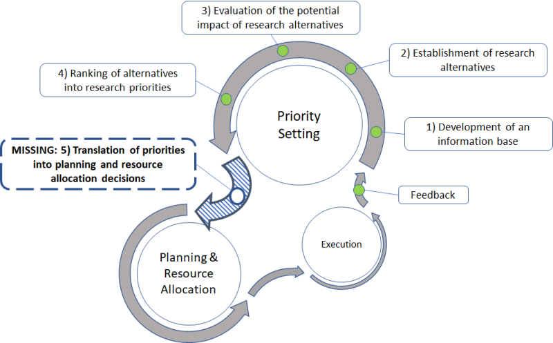

  <!-- Conventional agricultural research for development (AR4D) priority setting exercises have long been implemented to build insight and consensus around the strengths and weaknesses of individual agricultural research proposals in a given portfolio, but stop short of providing tools that can translate collective insights into optimal resource allocation shares. They also generally exclude from the allocation decision any rigorous accounting of the risk involved in each proposal, or of tradeoffs and synergies between proposals. These methodological lacunae have repeatedly exposed resource allocation processes to ad hoc, politically driven decisionmaking, thereby contributing to growing toxicity in donor-researcher relations. Here I explore the possibility of removing the methodological basis for this discord by introducing a rigorous allocation method, adapted from financial contexts, that allocates precise, optimal budget shares to each proposal based on its expected scalability, risk, and synergies/tradeoffs with the other proposals in the portfolio. -->

```{r setup, include=FALSE}
knitr::opts_chunk$set(echo = FALSE,
                      message = FALSE,
                      warning = FALSE)
#devtools::install_github("thomasp85/patchwork")
library(plyr)
library(tidyverse)
# library(zoo)
# library(tidyquant)
library(patchwork)
library(kableExtra)
library(pracma)

label_size <- 2.5
smallLabel_size <- 2
title_size <- 8
subtitle_size <- 7
legendText_size <- 7
axisText_size <- 6
axisTitle_size <- 7
facetTitle_size <- 7
cellText_size <- 3
#==============================================================
# Define function to plot covariance/correlation matrices
plot_covmat <- function(covmat, fig_title = "Covariance Matrix", round_to = 2, graph_on = T, legend_position = NULL, num_size = NULL){
  covmat[upper.tri(covmat)] <- NA
  df_plot <- covmat %>% tbl_df()
  these_levels <- colnames(df_plot)
  df_plot$ItemX <- colnames(df_plot)
  gathercols <- colnames(df_plot)[-ncol(df_plot)]
  df_plot <- df_plot %>% gather_("ItemY", "Value", gathercols)
  df_plot$ItemX <- factor(df_plot$ItemX, levels = these_levels)
  df_plot$ItemY <- factor(df_plot$ItemY, levels = these_levels)
  
  #midpoint <- min(covmat) + (max(covmat) - min(covmat)) / 2
  midpoint <- 0
  gg <- ggplot(df_plot, aes((ItemX), (ItemY)))
  gg <- gg + geom_tile(aes(fill = Value))#, width = 4, height = 4)
  if(!is.null(num_size)){
    gg <- gg + geom_text(aes(label = round(Value, round_to)), size = num_size)
  }else{
    gg <- gg + geom_text(aes(label = round(Value, round_to)), size = 2.5)
  }
  if(!is.null(fig_title)){
    gg <- gg + labs(title = fig_title)
  }
  gg <- gg + theme_bw()
  gg <- gg + theme(axis.text.x = element_text(size = 7, angle = 60, hjust = 1),
                   axis.text.y = element_text(size = 7),
                   axis.title = element_blank(),
                   legend.title = element_blank(),
                   plot.title = element_text(face = "bold", size = 8))
  if(!is.null(legend_position)){
    gg <- gg + theme(legend.position = legend_position)
  }
  gg <- gg + scale_fill_gradient2(low = "magenta", mid = "khaki", high = "cyan", midpoint, na.value = "white")
  if(graph_on){print(gg)}
  return(gg)
  
}
#===============================================================
# End function definition
#===============================================================


```

# Introduction

For several decades, efforts to improve quantitative foresight and decision support in agricultural research for development (AR4D) have focused on the development of models to assess the potential impacts of individual research projects under a range of future climate and socioeconomic scenarios. However, if the ultimate aim of such exercises is to determine an optimal allocation of research funds across the projects under assessment, then a portfolio level tool is also required in order to translate research impact assessments into optimal budget allocations.

Mills clearly identified and articulated the need for such a tool long ago [-@Mills1998], [emeritus scientists at the International Center for Tropical Agriculture recall implementing  informally in risk-return space...[@JCock_perscomm; @lynam2017forever]] and yet work in this direction has not yet begun in earnest. Instead of portfolio optimization, AR4D institutions hold "priority setting" exercises, whereby research programs are ranked in order of importance based on their respective impact assessments. These rankings are then translated into research budget allocations in a subjective and ad hoc manner.

The priority setting process takes little or no account of the risk associated with individual research programs, much less of the synergies and tradeoffs (i.e. correlations) that may arise between programs. Research portfolios based on this approach are thus unbalanced, and hence quite risky relative to a properly balanced portfolio. Stated conversely, by neglecting research correlations, the priority setting method misses out on an opportunity to hedge research portfolio risk by balancing positive and negative correlations against each other.

[In addition to exposing the investor to higher-than-necessary levels of risk, the ps approach leaves a great deal up to subjective...vulnerable to political pressures...bad blood. led to frustrations...]

A key challenge hindering work in this direction is the lack of data by which to calculate research correlations. In a previous article, I redress this problem by developing a method to deduce research correlation matrices based solely on expert opinion [-@schiek2021reverse]. Here I build upon that work to devise an AR4D risk-adjusted, multi-objective portfolio optimization workflow.

The proposed method solves for the impact maximizing budget allocation subject to a risk constraint calculated using the deduced correlation matrix. A budget constraint is not explicitly included, but can be arbitrarily enforced, post solution. The method rests on two novel methodological propositions. Firstly, I define impact in terms of a quantity analogous to kinetic energy in physics, which I label the "vis viva". This effectively results in a quadratic definition of program impact, which in turn results in a correspondence between optimal budget allocations and the eigenvectors of the research covariance matrix.

Secondly, I model the project funding cycle in terms of rotations in the complex plane. While this may seem outlandish at first, I argue that it is more realistic than the conventional notion of project value as something which is always positive. It also provides a meaningful framework by which to interpret the negative values that often turn up in the optimal budget allocation, and by which to transform them into positive values.
<!-- solves for the risk-minimizing (i.e. optimally hedged) research budget allocation, subject to a portfolio impact constraint. -->

Because of the correspondence between solutions and eigenvectors, the proposed method offers not one, but rather a menu of optimal budget allocations. I show that each budget allocation on this menu corresponds to a different risk tolerance. Building on my earlier work [], I also show how each solution may be interpreted as corresponding to a particular strategic objective or policy. (In the financial context, the eigenvectors correspond to market sectors [@Gopishka, @schiek].) The proposed method thus allows the investor to choose, from a menu of solutions, the budget allocation that best matches their risk tolerance and/or strategic focus for the funding cycle.

Alternatively, I show how the investor can construct a multi-objective solution as a linear combination of the individual solutions on the menu. 

...spectral reduction...

The proposed workflow is partly inspired by the portfolio optimization method originally devised in the financial context [markowitz, merton], but differs from that convention in a few key respects, especially the two just mentioned above. In passing, it is interesting to note that many financial practitioners have found "eigenportfolios" (i.e., portfolios balanced in accordance with one of the covariance matrix eigenvectors) give the best results, even though such budget allocations are generally not solutions to the financial portfolio optimization problem []. The question of why this should be so remains an open, active area of research in the financial context []. Those involved in that conversation may thus find the method presented here---which links eigenportfolios with optimal solutions---of interest.

...Financial theorists are in the process of developing their own method of guaranteeing strictly positive budget shares in the optimal portfolio based on an extension of the Perron-Frobenius theorem [], but this is limited to the leading eigenvector of the .... which does not allow the investor to consider the other risk tolerance levels and strategic objectives (sectors, in the financial context) associated with the other eigenvectors, must less allow for multi-objective optimization.  The approach to negative budget shares proposed here may be applied to any of the solutions  ...may be interpreted in terms of short selling, but are nonetheless also problematic---


I begin with a brief explanation of the motivation behind this work.


Here I redress this gap by developing a portfolio optimization method that solves for the risk minimizing budget allocation [subject to a vis viva constraint]. More specifically, the method outputs a menu of optimal budget allocations corresponding to a range of investor risk tolerances. I show how each of the optimal budget allocations on this menu may be interpreted as a research portfolio optimally focused on a particular policy or strategic objective.

Since most donors and/or research directors are interested in optimizing across multiple strategic objectives, I introduce a subsequent step to optimize the budget allocation across these optimally focused portfolios. The resulting multi-objective optimal budget allocation is thus a linear combination of the optimally focused portfolios determined in the first step. I also present a novel technique to ensure that budget allocations are positive.

Finally, I present a hypothetical use case to better illustrate the sequence of steps in the portfolio optimization workflow.

The development of this method rests upon a novel ... * gBm

* vis viva


While AR4D is the motivating context for the present work, the method can be used in any portfolio optimization workflow.

Finally, I present a hypothetical use case in the AR4D context.

I begin with a literature review focusing on the motivation behind the present work and on the relevant analogous work in the financial context.


* Ensuring positive budget allocations

## Mills' missing fifth step

Many years ago, Bradford Mills articulated the four steps of priority setting in agricultural research for development (AR4D) as follows [-@Mills1998]:

>Step one is the development of an information base. Step two is the establishment of research alternatives. Step three is the evaluation of the potential impact of research alternatives. Step four, often considered the final output of a priority-setting exercise, is the ranking of alternatives into research priorities.

However, he went on to observe that these steps were insufficient. An as of yet non-existent

>fifth step, the development of guidelines for translating priorities into planning and resource allocation decisions, is necessary to establish direct links with planning and resource allocation activities [@Mills1998].

<!-- Mills identified this lacuna at a time when AR4D centers were just beginning to come under pressure from public and private donors to "do a lot more with a lot less" [@Alston1995]. Methodological work in response to this pressure focused on Steps 1-4. In hindsight, Mills' concern was well founded. Budgetary pressure on AR4D centers to "prove their relevance" [@Braunschweig2000], "show value for money" [@yet2016bayesian], and otherwise demonstrate "more efficient spending of resources" [@petsakos2018comparing] has only increased. -->
<!-- The development and refinement of ex-ante impact assessment models for the evaluation of individual research alternatives under different plausible future scenarios, in particular, is remarkable (see, for example, @Alston1995; @Antle1999; @Antle2015; Mills, 1998; and @nelson2014modeling). However, work has still not begun on Mills' missing fifth step. -->

```{r, fig.show = 'hold', out.width="10cm", fig.cap="\\label{fig:mills_missing_step}The AR4D priority setting workflow, adapted from Mills (1998).", fig.align='center'}



```

Between Step 4 and the final allocation of funds, stakeholder politics, institutional inertia, ad hoc procedures and criteria, and other subjective forces have repeatedly undercut any careful, objective rigor occurring in Steps 1-4 [@Birner2016; @mccalla2014cgiar]. In 2011, for example...
An historic effort begun in 2011 to restructure CGIAR financing around a "portfolio" model proved emblematic of this "limited success", when the results of an extensive priority setting exercise were rejected out of hand in favor of an ad hoc budget allocation. The end result thereby 

This inconsistency, opacity, and subjectivity in resource allocation decisions has, in turn, aggravated scientists' already longstanding distrust of budget allocation mechanisms. It is only natural, under such circumstances, to see research programs growing increasingly entrenched in their respective silos, and relations between donors and research programs deteriorating to historic levels of toxicity [@Birner2016; @leeuwis2018reforming; @mccalla2014cgiar].
Resource allocation procedures are, as a result, viewed by many scientists as something of a bureaucratic existential threat, and duly condemned as "development at the expense of research" [@Birner2016], or even the "Balkanization" of research [@Petsko2011]. "One of the geniuses" of the CG centers is said to be their ability to consistently attract "aid funding of long-term research" while keeping "aid professionals from setting research agendas" [@mccalla2014cgiar].

It's about rules

integrating risk too ...Alston and Norton acknowledged in 1995 that the treatment of risk in impact assessment models was "rudimentary and in need of further refinement" [-@Alston1995]. Unfortunately, this remains true today.

The task of deciding how to optimally allocate a limited budget across a portfolio of research proposals that are all, in one way or another, vitally important, is never an easy one. However, the problem articulated by Mills over twenty years ago at once suggests its solution: An impartial, transparent resource allocation mechanism, at the portfolio level, could substantially reduce the pain involved in such decisions. In this paper, I explore the possibility of developing such a tool based on risk-adjusted portfolio optimization techniques developed in the financial context.


Repeated efforts to reform the CGIAR have made some progress in getting researchers to think carefully about the the "theory of change" surrounding their research, but no progress on the portfolio front... tend to reinforce the very institutional inertia that the reform effort had intended to disrupt (Birner &amp; Byerlee, 2016). The aim of the present paper is to reduce the methodological basis for such failures as much as possible.

discussion/motivation:

in the absence of such tool, much of the hard work in the individual impact assessment has been repeatedly undercut by politically driven. this is about establishing rules, protocols. the example of bigwigs throwing out the impact assessment conclusions...The continued breaking of rules, failure to honor agreements, moving of goal posts, leads to what is known in game theory as a credible commitment problem, receding into silos. ... the process becomes indistinguishable from rent-seeking.
risk
scale invariant
can be thought of as multi objective


<!-- However, methodological limitations have  leave plenty of room for politics etc. to shape the decision... An historic effort begun in 2011 to restructure CGIAR financing around a "portfolio" model proved emblematic of this "limited success", when the results of an extensive priority setting exercise were rejected out of hand in favor of an ad hoc budget allocation. The end result thereby reinforced the very institutional inertia that the effort had intended to disrupt (Birner &amp; Byerlee, 2016). The aim of the present paper is to reduce the methodological basis for such failures as much as possible.   The methodological limitations of conventional priority setting are more to blame than any set of persons... Mill's missing fifth step... My aim is to improve methodological rigor and objectivity ...such that research conglomerates genuinely seeking to optimize resource allocation will have the tools required to achieve this. this is an issue faced across many fields [@physics, @medicine]   Scientists respond with ultimatums of their own, demanding a return to the days of "more stable funding" and "budget autonomy" [@leeuwis2018reforming]. -->

program level, consisting of numerous research projects and complementary activities at various stages of execution.
The reader is encouraged to replace "project" with "program", as appropriate.

The conventional approach to such problems, pioneered in the financial context,
is...

\begin{equation}
\min_{\mathbf{w}}\: \sigma^2 \:\:\:\:s.t. \:\:\: C = \bar{C} \:, \:\:\: X = \bar{X}
\end{equation}

However, this ...numerous problems even in its native context...documented, for example, by ... [@]... In motivating context of the present article, there is also the issue of negative budget weights. Many authors have rejected the conventional approach in favor of "eigen-portfolios", i.e. budget allocations that are equal to one of the eigenvectors of the covariance matrix. Efforts to demonstrate that these eigenvectors are solutions to a portfolio optimization problem are somewhat strained, ultimately requiring that the return gradient be summarily/arbitrarily replaced by eigenvectors or a linear combination thereof [@Boyle].   ...Moreover, the conventional approach neglects the dynamic dimension of the problem. Here I present a dynamically explicit optimization model. I show that, when the model is dynamic, it makes sense to replace the cost and return constraints with a single "energy" constraint reflecting the finite effort available to elevate the net present value of a benefit stream to some desired level above its status quo value. The budget constraint is trivially enforced by including it in the formulation of energy. An energy constraint as opposed to a budget constraint and return target constraint. Keeping the dynamic part explicit has several benefits -- the optimal budget allocation is guaranteed to be positive... and the solution is rigorous, as opposed to arbitrarily insisting that the return gradient be ignored, and replaced by an eigenvector--which is tantamount to insisting that the return gradient is equal to the optimal budget allocation.

In the conventional formulation of the risk-adjusted portfolio optimization problem, the return and cost constraints are static, ignoring the dynamic dimension of the problem.


The Perron-Frobenius theorem guarantees that the leading eigenvector of a symmetric matrix with only  has strictly positive elements.

Since the matrix $K$ is symmetric, then its leading eigenvector generally has, or can be modified to have, only positive entries [@noutsos2006perron].

Tricks for modifying the covariance matrix so that it is effectively coerced into being an eventually positive matrix.

Transformations of covmat [@carrasco2011optimal; ledoit2004well]


# Modeling the evolution of program NPV as a geometric Brownian movement

Ex-ante impact assessment and scenario analysis are designed to quantify research project impacts at a specific point in time, usually in terms of net present value (NPV), based on assumptions about the future trajectory of numerous random processes, both research and non-research related. (To facilitate the process, assumptions regarding non-research random processes, particularly future climate and socioeconomic processes, have been conveniently packaged in a set Representative Carbon Pathways (RCPs) and Shared Socioeconomic Pathways (SSPs) [@].)

Because it is a function of numerous random processes, project NPV is itself a stochastic variable. The first step in portfolio analysis is to select a reasonable model of the stochastic evolution of project NPV between now (the time of the funding decision) and the end of the funding cycle. In other contexts, this choice is often aided by the availability of time series data. In the AR4D context, project NPV time series generally do not exist; and so the choice must be made based on certain assumed characteristics of the unobserved data. In particular, one must assume a certain size distribution of changes in the stochastic variable. That is to say, one must assume a distribution for the change in program NPV $\Delta x$ with respect to a judiciously small increment in time $\Delta t$. If the change $\Delta x / \Delta t$ over a judiciously small time step is normally distributed, then the stochastic process is accurately modeled by a geometric Brownian movement, defined as follows.

\begin{equation}
\begin{split}
\Delta x &= x(t + \Delta t) - x(t) \\
&= x(t) m \Delta t + x(t) s \epsilon \sqrt{\Delta t}
\end{split}
\label{eq:gbmEq}
\end{equation}

Where $\epsilon$ is a normally distributed random variable with mean $0$ and variance $1$, such that

\begin{equation}
\begin{split}
m \Delta t &= E \left[\frac{\Delta x(T)}{x(T)} \right] \\
s^2 \Delta t &= Var \left[\frac{\Delta x(T)}{x(T)} \right]
\end{split}
\end{equation}
<!-- and $m_k$ is the expected growth rate; that is to say $m_k = E[\Delta x_k/x_k(\hat{t})]; \:\:\: \Delta x_k = x_k(\hat{t} + \Delta t) - x_k(\hat{t})$ -->

(For a reference, see Hull [@].)

Technically, $\Delta t$ is an instantaneous or infinitesimal time interval and hence $m$ is the expected instantaneous growth rate. In practice, it is acceptable to treat $\Delta t$ as a finitely small, but judicious, time step. The time step should be as small as possible while still ensuring that changes in $x$ occur in every time step. In the present context, it is reasonable to assume that random research and/or non-research related changes in project NPV occur at least once per annual quarter. The time step $\Delta t$ at the project level may thus be judiciously defined as an annual quarter, and $m$ may be interpreted as the expected quarterly growth rate.
<!-- This selection must be made on the basis of both realism and expedience. Periods of a few substantial changes interspersed by relatively longer periods of many small changes. Geometric Brownian motion expedient and versatile  -->

By definition, project NPV appreciates over time at the quarterly discount rate $r$. Conversely put, a program growth rate different from $r$ implies that the program $NPV$ is inaccurately calculated. Therefore, by assuming that project NPV is accurately calculated, one assumes that the growth rate $m$ equals $r$.

## Expected value, variance, and covariance of program NPVs

Given the assumption that program NPV follows a geometric Brownian movement, and assuming that program NPVs are accurately calculated, the expected value of the $k^{th}$ program NPV at the end of the funding cycle ($x_k(T)$) is

\begin{equation}
E[x_k(T)]\bigr|_{t = \hat{t}} = x_k(\hat{t}) e^{r \tau_k}
\label{eq:ExTraw}
\end{equation}

Where $\hat{t}$ is the time of evaluation, $\tau = T - \hat{t}$.
<!-- In many AR4D fund allocation decisions, the focus is on programs rather than projects. A program generally consists of several projects and complementary activities in different stages of implementation. At the program level, a monthly time step is probably justified, with $m_k$ thus representing the expected monthly growth rate. -->
<!-- ...focus here is on program level...which simplifies things...can be extended to project portfolios -->
<!-- Research-related factors concern the expected effectiveness of the researched technology at experiment stations. Non-research related changes in project value occur as a result of changes in the political, socio-economic, and institutional enabling environments where the new technology is to be released. Such changes may include, for example, abrupt changes in government policies, commodity price swings, changes in seed systems and other value chain mechanisms, changes in the security environment, and so forth. -->

The variance of $x_k(T)$ is

\begin{equation}
Var[x_k(T)]\bigr|_{t = \hat{t}} = \mu_k^2 (e^{s_k^2 \tau} - 1)
\label{eq:xVarRaw}
\end{equation}

<!-- $s_k = \sqrt{Var[\Delta x_k / x_k(\hat{t})]}$ -->
Where the shorthand $\mu_k = E[x_k(T)]\bigr|_{t = \hat{t}}$ has been introduced. This may be interpreted as a measure of the project risk. Note that this equation can be rearranged into an expression for the coefficient of variation $c_k$, as follows.

\begin{equation}
c_k = \frac{\sigma_k}{|\mu_k|} = \mu_k \sqrt{e^{s_k^2 \tau} - 1}
\end{equation}

Where the shorthand $\sigma_k = \sqrt{Var[x_k(T)]\bigr|_{t = \hat{t}}}$ has been introduced. The covariance between two project NPVs $x_k$ and $x_j$, meanwhile, is

\begin{equation}
Cov[x_k(T), x_j(T)]\bigr|_{t = \hat{t}} = \mu_k \mu_j (e^s_{kj} \tau} - 1)
\label{eq:xCovRaw}
\end{equation}

Where the shorthand $s_{kj} = Cov[\Delta x_k/x_k(\hat{t}), \Delta x_j/x_j(\hat{t})]$ has been introduced. Note that this may be rearranged into a natural extension of the coefficient of variation $c_{kj}$, as follows.

\begin{equation}
c_{kj} = \sqrt{\frac{\sigma_{kj}}{\mu_k \mu_j}} = \sqrt{e^{\rho_{i, j} s_k s_j \tau} - 1}
\end{equation}

This is a "coefficient of covariation", analogous to the correlation coefficient in the following sense: Whereas the correlation coefficient is the covariance normalized by the product of the respective standard deviations, the coefficient of covariation is the covariance normalized by the product of the respective means.
<!-- Expected portfolio NPV $\mu(\hat{t})$  is then just the sum of the individual expected project NPVs. -->
<!-- \begin{equation} -->
<!-- \mu(\hat{t}) = \Sigma_k \mu_k(\hat{t}) -->
<!-- \end{equation} -->

The portfolio variance, it follows, can be expressed

<!-- = Var[X(T)]\bigr|_{t = \hat{t}} -->
\begin{equation}
\begin{split}
\sigma(\hat{t})^2 &= \mathbf{1} ' \Sigma_{x, x} \mathbf{1} \\
&= \boldsymbol{\mu}(\hat{t})' G_{x,x} \boldsymbol{\mu}(\hat{t})
\end{split}
\end{equation}

Where $G_{x,x}$ is the "coefficient of covariation matrix", i.e. the matrix whose elements are $c_{kj}$, where $c_{kk} = c_k^2$. Note that $G_{x, x}$ is just the covariance matrix left and right multiplied by a diagonal matrix of the inverse project means.
 <!--whose elements are the squared coefficients of variation $c_k^2$, and whose off-diagonal elements are the cross coefficients of variation -->

\begin{equation}
G_{x, x} = D(\boldsymbol{\mu})^{-1} \Sigma_{x, x} D(\boldsymbol{\mu})^{-1}
\end{equation}

(Where the notation $D(\mathbf{y})$ means, for any vector $\mathbf{y}$, a diagonal matrix whose diagonal elements are the elements of the vector $\mathbf{y}$.)

Alternatively, $G_{x, x}$ can be expressed in terms of the correlation matrix ($K_{x, x}$).

\begin{equation}
G_{x, x} = D(\mathbf{c}) K_{x, x} D(\mathbf{c})
\end{equation}

It follows that $G_{x, x}$ has the same eigenvalues as $K_{x, x}$ and $\Sigma_{x, x}$; and that the eigenvectors of $G_{x, x}$ are just the eigenvectors of $K_{x, x}$ premultiplied by $D(\mathbf{c})$. That is to say, if the eigendecompositions of $G_{x, x}$ and $K_{x, x}$ are denoted, respectively,

\begin{equation}
G_{x, x} = Q \Gamma Q'
\end{equation}

and

\begin{equation}
K_{x, x} = P \Gamma P'
\end{equation}

Then the eigenvectors of $G_{x, x}$ and $K_{x, x}$ are related as follows.

\begin{equation}
Q = D(\mathbf{c}) P
\end{equation}

## Modeling diminishing returns to investment

Generally speaking, project NPV scales with investment. That is to say, beyond a certain minimum level of funding required to generate, release, and support the diffusion and uptake of the project's research product(s) on a pilot level, further increments in project investment have the effect of broadening the scope of impact---i.e. extending the size and number of populations or markets where the research product is released and has an impact. For reasons well known to economists, this scaling is not linear, but rather marginally diminishing. Project NPV at the start of the funding cycle ($x_k(0)$) may thus be expressed as a marginally diminishing function of the funding allocation $w_k$, as follows.

\begin{equation}
x_k(0) = \tilde{x}_k(0) \left(\frac{w_k}{C} \right)^{\alpha_k}
\label{eq:npvFnW}
\end{equation}

Where $C$ is the portfolio budget, $\tilde{x}_k(0)$ is the maximum financially feasible NPV---i.e., the NPV if the entire budget were invested in the project (the case where $w_k = C$)---and the exponent $\alpha_k$ is the elasticity of project NPV with respect to funding. That is,

\begin{equation}
\frac{\partial \ln(x_k(0))}{\partial \ln(w_k)} = \alpha_k
\end{equation}

And $\alpha_k$ lies between $0$ and $1$, reflecting marginally diminishing returns to investment.

[not the only marginally diminishing fn form, may also want to experiment with $\tilde{x}_k(0) e^{-C/w_k}$---which includes an area of marginally increasing returns before they turn decreasing]

Substituting this into equation \ref{eq:ExTraw}, program NPV at the start of the funding cycle can now be rewritten as a function of funding level.

\begin{equation}
\mu_k(0) = \tilde{x}_k(0) \left( \frac{w_k}{C} \right)^{\alpha_k} e^{r T_k}
\label{eq:muFnw}
\end{equation}
<!-- ... -->
<!-- This may be rearranged into an instructive expression... -->
<!-- \begin{equation} -->
<!-- \frac{\mu_k(\hat{t})}{\tilde{x}_k(\hat{t})} =  \left(\frac{w_k}{C} \right)^{\alpha_k} e^{r \tau} -->
<!-- \end{equation} -->
<!-- ...the expected program value as a fraction of its full (fiscally feasible) potential value...pctg of potentiality realized -->
<!-- or -->
<!-- \begin{equation} -->
<!-- \frac{x_k(\hat{t})}{\tilde{x}_k(\hat{t})} =  \left(\frac{w_k}{C} \right)^{\alpha_k} -->
<!-- \end{equation} -->

## Deducing program NPV means, variances, and covariances \label{sec:volEst}
<!-- ## Deducing the program correlation matrix in minimum data contexts -->

It is all very well to theorize and deduce formal expressions, but how are these things to be estimated in practice? In the financial context, means, variances, and covariances can be estimated from time series data in a straightforward manner. As mentioned earlier, however, no analogous data exists in the AR4D context.

Program NPV ($\tilde{x}_k(0)$) can be estimated at the start of the funding cycle based on ex-ante impact assessment. Given values for $\alpha_k$, $r$, $T_k$, and $C$, it is then possible to calculate $\mu_k(0)$. Estimation of the program NPV coefficients of variation $c_k$ and covariation $c_{kj}$ depends upon estimation of program NPV variances $\sigma_k^2$ and covariances $\sigma_{kj}$, which in turn hinges upon estimation of the logged program NPV variances $s_k^2 \tau_k$ and covariances $s_{kj} \tau_k$

While it may be difficult to develop an intuitive grasp of the value of $s_k$, research managers (and/or stakeholders and/or the foresight economists conducting the program appraisal) generally have some idea of the uncertainty surrounding NPV estimates, such that they can be asked to quantify minimum and maximum bounds on the NPV. For example, they can say that NPV is $\tilde{x}_k(0)$, but that it might be three times that amount, or half that amount. (Or they may give the same information in terms of magnitude, which is then easily transformed into percentage terms.)

These upper and lower percentage errors may then be interpreted as the upper and lower bounds on the $95\%$ confidence interval about the expected percentage change in project NPV between the start and end of the project. Another phrase for "percentage change" is "arithmetic return" (call this $\mathscr{R}_k$), which may then be converted to a log return ($\ell_k = \ln(x_k(T) / x_k(\hat{t}))$) by the formula $\ell_k = \ln(\mathscr{R}_k + 1)$. Now, since $\tilde{x}_k(t)$ is assumed to follow a geometric Brownian motion, the log return may also be expressed

\begin{equation}
\ell_k = \left(r - \frac{s_k^2}{2} \right) + s_k \epsilon \sqrt{\tau}
\end{equation}

With mean and variance

\begin{equation}
\begin{split}
\mu_k = E[\ell] \bigr|_{t = \hat{t}} &= \left(r - \frac{s_k^2}{2} \right) \tau \\
\sigma_k^2 = Var[\ell] \bigr|_{t = \hat{t}} &= s_k^2 \tau
\end{split}
\end{equation}

The upper and lower bounds on the log return, $\bar{\ell}_k$ and $\underline{\ell}_k$, may thus be expressed as follows.

\begin{equation}
\begin{split}
\bar{\ell}_k &= \mu_k + z \sigma_k \\
\underline{\ell}_k &= \mu_k - z \sigma_k
\end{split}
\end{equation}

Where $z = 1.96$ is the standard score corresponding to the $95\%$ confidence interval of a normally distributed random variable. (The standard score can of course be adjusted to match the practitioner's idea of a suitable confidence interval defined by the bounds $\bar{\ell}_k$ and $\underline{\ell}_k$.) Subtracting the second equation from the first and rearranging then gives an expression for the volatility parameter $s_k$ in terms of known parameters.

\begin{equation}
s_k = \frac{1}{2 \sqrt{\tau_k} z} (\bar{\ell}_k - \underline{\ell}_k)
\end{equation}

Given $s_k$ and $\mu_k$, it is then straightforward to compute the variances $\sigma_k^2$ and coefficients of variation $c_k$.

An approximate project correlation matrix $\tilde{K}_{x, x}$ can be deduced from expert opinion using a method developed by Schiek [-@]. The approximate covariance matrix $\tilde{\Sigma}_{x,x}$  and coefficient of covariation matrix $\tilde{G}_{x,x}$ can then be constructed as follows.

\begin{equation}
\tilde{\Sigma}_{x,x} = D(\boldsymbol{\sigma}) \tilde{K}_{x,x} D(\boldsymbol{\sigma})
\end{equation}

And

\begin{equation}
\tilde{G}_{x,x} = D(\mathbf{c}) \tilde{K}_{x,x} D(\mathbf{c})
\end{equation}

Respectively.
<!-- Finally, note that, in the process of deducing $s_k$, the expected log return and variance may also be calculated.  and that the expected project NPV at future times may be calculated by equation \ref{eq:ExT}. These calculations may serve as further checks on the plausibility of parameter values, project NPV estimates, and project NPV upper and lower bounds. -->

# Project kinematics and vis viva

In the broadest terms, a project may be said to intervene in, or operate upon, an existing net benefit stream $\Delta u/\Delta t$ with the aim of raising it to a higher value by the end of the project, such that

\begin{equation}
\frac{\Delta u}{\Delta t}\bigr_{t = T} > \frac{\Delta u}{\Delta t}\bigr_{t = 0}
\end{equation}

This implies an acceleration $\Delta^2 u / \Delta t^2$ which comes as a result of the skilled, concerted, applied efforts that comprise the project intervention. Letting $F$ stand for these applied efforts and $a$ for the acceleration, this axiomatic relation can be expressed $F \sim a$, or

\begin{equation}
F = \lambda a
\label{eq:Newt2}
\end{equation}

Where $\lambda$ is a proportionality constant to be defined based on context.

For sufficiently small time intervals $\Delta t$, it may be said that $F$ is effectively constant, resulting in a similarly constant acceleration of the net benefit stream. This is illustrated in Figure \ref{fig:kinema}, where the shorthand $v = \Delta u/\Delta t$ has been introduced to reduce clutter.

```{r, fig.show = "hold", fig.width = 3, fig.height=3, fig.align="center", fig.cap="\\label{fig:kinema}Generic example of an acceleration of a net benefit stream.", echo = FALSE}

t <- seq(0, 1, length.out = 10)
slope <- 1
yint <- 1 / 3
v <- slope * t + yint
df <- data.frame(t, v)
ymax <- max(v)

gg <- ggplot(df, aes(x = t, y = v))
gg <- gg + geom_line()
gg <- gg + geom_segment(aes(x = 0, xend = 1, y = yint, yend = yint), linetype = 2)
gg <- gg + geom_segment(aes(x = 0, xend = 1, y = ymax, yend = ymax), linetype = 2)
gg <- gg + geom_segment(aes(x = 1, xend = 1, y = 0, yend = ymax), linetype = 1)
gg <- gg + geom_segment(aes(x = 0, xend = 1.2, y = 0, yend = 0),
                        arrow=arrow(length=unit(0.2,"cm")), linetype = 1)
gg <- gg + geom_segment(aes(x = 0, xend = 0, y = 0, yend = 2),
                        arrow=arrow(length=unit(0.2,"cm")), linetype = 1)
gg <- gg + geom_ribbon(aes(ymin = yint, ymax = v), fill = "blue", alpha = .5)
gg <- gg + geom_ribbon(aes(ymin = 0, ymax = yint), fill = "orange", alpha = .5)
gg <- gg + annotate("text", x = 2 / 3, y = yint * 1.75,
                    label = expression(italic(Delta*A)))
gg <- gg + annotate("text", x = 2 / 3, y = yint * 0.5,
                    label = expression(italic(A["0"])))
gg <- gg + annotate("text", x = -0.06, y = yint,
                    label = expression(italic("v(t)")), size = label_size)
gg <- gg + annotate("text", x = -0.06, y = ymax,
                    label = expression(italic("v(t + "*Delta*t*")")), size = label_size)
gg <- gg + annotate("text", x = 0, y = -0.07,
                    label = "0", size = label_size)
gg <- gg + annotate("text", x = 1, y = -0.07,
                    label = expression(italic(T)), size = label_size)
#gg <- gg + coord_cartesian(ylim = c(0, 2))
# gg <- gg + labs(x = expression(Delta~t),
#                 y = expression(Delta*u~"/"~Delta*t))
gg <- gg + theme_bw()
gg <- gg + theme(axis.text = element_blank(),
                 axis.ticks = element_blank(),
                 axis.title = element_text(size = axisTitle_size))
gg


```

Note that the slope of the line in this plot is just the acceleration. That is,

\begin{equation}
\frac{\Delta v}{\Delta t} = \frac{\Delta^2 u}{\Delta t^2} = a
\end{equation}

Which can be rearranged as follows,

\begin{equation}
a \Delta t = v(T) - v(0)
\end{equation}

Note, moreover, that the cumulative net benefit over the life of the project ($\Delta u$) is the sum of the areas $A_0 + \Delta A$.

\begin{equation}
\begin{split}
\Delta u &= v(0) \Delta t + \int_0^T v dt \\
&= A_0 + \Delta A \\
&= \frac{1}{2} (v(T) + v(0)) \Delta t
\end{equation}

And a third "kinematic" expression, soon to come in handy, can be obtained by multiplying the previous two as follows.

\begin{equation}
\begin{split}
a \Delta t \Delta u &= \frac{1}{2} (v(T) - v(0)) (v(T) + v(0)) \Delta t \\
a \Delta u &= \frac{1}{2} (v(T)^2 - v(0)^2)
\end{split}
\label{eq:kinema3}
\end{equation}

<!-- Now, since the project has a limited budget, the amount of skilled, concerted, applied effort ($F$) it can exert along the net benefit displacement $\Delta u$ is also limited. That is, the quantity $F \Delta u$ is limited. Let this quantity be denoted $\mathcal{E}$. By equation \ref{eq:Newt2}, $\mathcal{E}$ can be rewritten as follows. -->
Now, consider that, for a given budget, the project aims to maximize the amount of skilled, concerted, applied effort ($F$) exerted by the project along the "displacement" $\Delta u$. That is to say, the aim is to maximize the quantity $F \Delta u$, (subject to constraints which will be addressed farther below). By equation \ref{eq:Newt2}, $\mathcal{E}$ can be rewritten as follows.
<!-- maximize bang for buck -->

\begin{equation}
\mathcal{E} = \lambda a \Delta u 
\end{equation}

But, by equation \ref{eq:kinema3}, this may again be rewritten

\begin{equation}
\mathcal{E} = \frac{\lambda}{2} (v(T)^2 - v(0)^2)
\label{eq:Eraw}
\end{equation}

Finally, note that the same analysis can be reformulated in terms of project NPV---that is to say, in terms of the difference between the net benefit stream _with_ the project intervention versus the net benefit stream _without_ it (the counter-factual). Formally, this means $v$ is redefined

\begin{equation}
v = \frac{\Delta u}{\Delta t}\bigr_{*} - \frac{\Delta u}{\Delta t}
\end{equation}

(Where the "$*$" indicates the "with project intervention" scenario.)

Then $v(0) = 0$, and so equation \ref{eq:Eraw} becomes

\begin{equation}
\mathcal{E} = \frac{\lambda}{2} v(T)^2
\label{eq:Enpv}
\end{equation}

In physics, this is analogous to the expression for the kinetic energy of a moving object with mass $\lambda$, where the $u$ stands for a spatial dimension. To discourage practitioners from getting too cozy with this analogy, $\mathcal{E}$ is henceforth referred to using Gottfried Leibniz's more archaic, and now largely abandoned, term "vis viva" (which means "living force" in Latin). Pragmatically, the vis viva may be interpreted as a quadratic expression of expected program impact.

In the motivating context of the present article, the displacement $\Delta u_k$ corresponds to the $k^{th}$ expected project NPV at $t = \hat{t}$. More precisely,

\begin{equation}
\begin{split}
\Delta u_k = \int_{\hat{t}}^T v_k dt &= u_k(\tau)|_{*} - u_k(\tau) \\
&= E[x_k(T)]\bigr|_{t = \hat{t}}
\end{split}
\end{equation}

Assuming $x_k(t)$ follows a gBm,

\begin{equation}
\Delta u_k |_{t = \hat{t}} = \mu_k(\hat{t}) = x_k(\hat{t}) e^{r \tau} \bigr|_{t = \hat{t}}
\end{equation}

The corresponding velocity thus works out to

\begin{equation}
\frac{\Delta u_k}{\Delta t} \bigr|_{t = \hat{t}} = -r x_k(\hat{t}) e^{r \tau}
\end{equation}

With starting and finishing values of

\begin{equation}
\frac{\Delta u_k}{\Delta t} \bigr|_{t = 0} = -r x_k(0) e^{r \tau}
\end{equation}

and

\begin{equation}
\frac{\Delta u_k}{\Delta t} \bigr|_{t = T} = -r x_k(T)
\end{equation}

The velocity is negative because time progression in the definition of $\mu_k$ is expressed not in terms of the number of time steps transpired, but rather in terms of the number of time steps that have yet to transpire until the time horizon $T$. Nonetheless, the velocity is monotonically increasing in time (Figure \ref{fig:kinema2}).

```{r, fig.show = "hold", fig.width = 3, fig.height=3, fig.align="center", fig.cap="\\label{fig:kinema2}Acceleration of a net benefit stream.", echo = FALSE}

t <- seq(0, 1, length.out = 10)
slope <- 1
yint <- -4 / 3
v <- slope * t + yint
df <- data.frame(t, v)
ymax <- max(v)
ymin <- min(v)

gg <- ggplot(df, aes(x = t, y = v))
gg <- gg + geom_line()
gg <- gg + geom_segment(aes(x = 0, xend = 1, y = ymax, yend = ymax), linetype = 1)
# gg <- gg + geom_segment(aes(x = 0, xend = 1, y = ymax, yend = ymax), linetype = 2)
gg <- gg + geom_segment(aes(x = 1, xend = 1, y = ymax, yend = 0), linetype = 2)
gg <- gg + geom_segment(aes(x = 0, xend = 1.2, y = 0, yend = 0),
                        arrow=arrow(length=unit(0.2,"cm")), linetype = 1)
gg <- gg + geom_segment(aes(x = 0, xend = 0, y = 0, yend = -2),
                        arrow=arrow(length=unit(0.2,"cm")), linetype = 1)
gg <- gg + geom_ribbon(aes(ymin = v, ymax = ymax), fill = "blue", alpha = .5)
# gg <- gg + geom_ribbon(aes(ymin = 0, ymax = yint), fill = "orange", alpha = .5)
gg <- gg + annotate("text", x = 1 / 3, y = yint * 0.5,
                    label = expression(italic(Delta*A)))
# gg <- gg + annotate("text", x = 2 / 3, y = yint * 0.5,
#                     label = expression(italic(A["0"])))
gg <- gg + annotate("text", x = -0.06, y = yint,
                    label = expression(italic("v(t)")), size = label_size)
gg <- gg + annotate("text", x = -0.06, y = ymax,
                    label = expression(italic("v(t + "*Delta*t*")")), size = label_size)
gg <- gg + annotate("text", x = 0, y = 0.07,
                    label = "t", size = label_size)
gg <- gg + annotate("text", x = 1, y = 0.07,
                    label = expression(italic("t + "*Delta*t)), size = label_size)
#gg <- gg + coord_cartesian(ylim = c(0, 2))
# gg <- gg + labs(x = expression(Delta~t),
#                 y = expression(Delta*u~"/"~Delta*t))
gg <- gg + theme_bw()
gg <- gg + theme(axis.text = element_blank(),
                 axis.ticks = element_blank(),
                 axis.title = element_text(size = axisTitle_size))
gg


```

The vis viva, meanwhile, works out to

\begin{equation}
\begin{split}
\mathcal{E}_k(\hat{t}) &= \frac{\lambda}{2} r^2 x_k(\hat{t})^2 e^{2r \tau} \\
&= \frac{\lambda}{2} r e^{r \tau} \mu_k(\hat{t})^2
\end{split}
\end{equation}

The velocity and vis viva of an entire portfolio may be expressed

\begin{equation}
\begin{split}
v_p = \sqrt{\Sigma_k \left( \frac{\Delta u_k}{\Delta t}} \right)^2 &= r \sqrt{ \Sigma_k \mu_k^2} \\
&= r \sqrt{\boldsymbol{\mu} ' \boldsymbol{\mu}} \\
\end{split}
\end{equation}

and

\begin{equation}
\mathcal{E} = \frac{v_p^2}{2} = \frac{r^2}{2} \boldsymbol{\mu} ' \boldsymbol{\mu}
\end{equation}

<!-- Note, finally, that the vis viva per unit project expenditure may be expressed -->

<!-- \begin{equation} -->
<!-- \begin{split} -->
<!-- \frac{\mathcal{E}_k}{w_k} &= r^2 x_k(\hat{t})^2 e^{2r \tau} \\ -->
<!-- &= r^2 k_k^2 \left( \frac{w_k}{C} \right)^{2 (\alpha_k - 1)} e^{2r \tau} -->
<!-- \end{split} -->
<!-- \end{equation} -->

<!-- ...at portfolio level: -->

<!-- \begin{equation} -->
<!-- \begin{split} -->
<!-- \mathbf{\mathcal{E}} ' \mathbf{w}^{-1} &= r^2 x_k(\hat{t})^2 e^{2r \tau} \\ -->
<!-- &= r^2 k_k^2 \left( \frac{w_k^{\alpha_k - 1}}{C} \right)^2 e^{2r \tau} -->
<!-- \end{split} -->
<!-- \end{equation} -->

# Cyclically real expected project NPV \label{sec:cycReal}

## The funding cycle

The project funding cycle may be broadly defined as the process by which value is transformed from one tangibly or demonstrably real form to another. More specifically, in the AR4D context, it is the process by which a certain amount of funds is transformed into measurable project impacts. Project impacts at the end of a funding cycle may take the form of a demonstrable change in key development indicators; or they may be tangible impacts of a more intermediate nature, such as completed experiments, pilot implementations, proofs of concept, and/or empirical studies that resolve a prerequisite research question---with a view to demonstrable changes in key development indicators farther down the road, at the end of subsequent funding cycles.

## Project time horizons are measured in terms of funding cycles

The duration of a funding cycle is thus, by definition, the time elapsed between the disbursement of funds and the transformation of those funds into the realization of an agreed upon, tangible set of project impacts or "deliverables". Projects are usually designed so that this transformation occurs in a specific period of time. Let $T$ stand for the duration of the funding cycle expressed in terms of the judiciously chosen time step $\Delta t$. A typical AR4D funding cycle currently lasts 1-5 years. For the sake of argument, say it is 3 years. If the judicious time step $\Delta t$ is defined as an annual quarter, then, $T = 4$, in this case.

Assuming that projects cannot begin or end in the middle of a funding cycle, it follows that AR4D project time horizons must be measured as a positive integer multiple of $T$. That is, $T_k = T\nu_k \;;\;\; \nu_k \in \mathbb{Z}^+$.

## Project NPV is cyclically real

In the course of the funding cycle, project funds are productively consumed to generate project deliverables. During this process of transformation from one tangible form to another, the "project value" that undergoes the transformation exists in a limbo state where it is a complex amalgam of sunk cost, deliverables in formation, and funds not yet spent, still in their monetary form.

In other words, the value of the investment during the transformative process is not real, at least not in any immediately tangible or demonstrable sense. One speaks of "project value" at any point in the funding cycle, but one understands that this refers not to any palpable value the project might have at that point, but rather _either_ the value of the monetary investment at the start of the cycle, _or_ the expected value of project deliverables at the end of the cycle.

In this sense, project NPV is "cyclically real". That is, it is cyclically tangible or demonstrable, particularly at the start and end of funding cycles. One may also discern a sunk cost point, where the value is real but negative. At other points in the cycle, project NPV exists, but not in a way that intersects with our reality in any tangible or demonstrable sense. Mathematically, this means that the NPV model in equation \ref{eq:muFnw} is effectively restricted to the domain of $\hat{t}$ that are integer multiples of $T$.

## Modeling project NPV in the complex plane

The same can be said of complex numbers. Recall that a complex number $e^{i \theta}$ is defined

\begin{equation}
e^{i \theta} = \cos(\theta) + i \sin(\theta)
\label{eq:compNum}
\end{equation}

Where $i = \sqrt{-1}$ and $\theta \in (0, 2\kappa \pi)$ for any positive integer $\kappa$. Complex numbers are thus cyclically real---at $\theta = \kappa \pi$. Elsewhere, they have no physically meaningful interpretation (leave quantum mechanics aside for now), but nonetheless may be expressed in terms of a real part, $\cos(\theta)$, and an imaginary part, $i\sin(\theta)$. The complex plane thus presents a framework by which to extend $\mu_k(\hat{t})$ (Eq \ref{eq:muFnw}) to time points between the integer multiples of the funding cycle $T$.

To build up to this extension intuitively, note first of all that expected project NPV evaluated at the start of the funding cycle---that is to say $\mu_k(0) = x_k(0)e^{r T \nu_k}$---has the following equivalent expression in the complex plane.

\begin{equation}
\mu_k(0) = x_k(0) e^{2 \nu_k \pi \omega}
\end{equation}

Where the funding cycle duration $T$ is mapped to $2 \pi$, so that $\omega 2 \pi = r T$; and the time step $\Delta t$ maps to $\Delta \theta$ such that $\Delta \theta = 2 \pi / T$. Now, consider that, by Eq \ref{eq:compNum}, $e^{2i \pi} = 1$. Hence, $\mu_k(0)$ may also be written

\begin{equation}
\mu_k(0) = x_k(0) e^{2 \nu_k \pi (\omega + i)}
\end{equation}

Extension to all angles $\theta \in (0, 2 \kappa \pi)$ in the complex plane then results in the following expression.

\begin{equation}
\begin{split}
\mu_k(\theta) &= x_k(\theta) e^{(2 \nu_k \pi - \theta)(\omega + i)} \\
&= \tilde{x}_k(\theta) \left(\frac{w_k}{C} \right)^{\alpha_k} e^{(T_k - \theta)(\omega + i)}
\label{eq:muFnwComp}
\end{equation}
<!-- [graphic? $\mu_k(\hat{\theta}) / x_k(\hat{\theta})$ decay---ratio of E[x(T)]|_t / x(t)] -->

## Negative or complex valued project NPVs and phase corrections

This extension of expected project NPV to the complex plane encompasses the sunk cost point occurring halfway through the funding cycle ($\theta = (2 \kappa - 1) \pi$), when the investment is real valued, but negative.

\begin{equation}
\begin{split}
\mu_k((2\kappa - 1) \pi) &= x_k((2\kappa - 1) \pi) e^{(2 \nu_k \pi - (2\kappa - 1) \pi) (\omega + i)} \\
&= -x_k((2\kappa - 1) \pi) e^{(2 (\nu_k - \kappa) + 1) \pi \omega}
\end{split}
\end{equation}

By definition, the funding cycle begins and ends on a positive real value. A project investment that is negative at the start of the funding cycle thus implies that it is out of phase with the funding cycle by an odd integer multiple of $\pi$. Without loss of generality, consideration may be limited to the case where the odd integer multiple is $1$. That is, if $\mu_k(0) < 0$, this implies

\begin{equation}
\begin{split}
\mu_k(0) &= -x_k(0) e^{T_k (\omega + i)} \;\;\;;\;\; T_k = 2 \pi \nu_k \\
&= x_k(0) e^{T_k (\omega + i) \pm i \pi}
\end{split}
\end{equation}

In other words, a negative valued $\mu_k(0)$ is out of phase with the funding cycle by one half cycle. More generally,

\begin{equation}
\mu_k(0) = x_k(0) e^{T_k (\omega + i) \pm i \rho_k \pi}
\end{equation}

Where $0 \leq \rho_k \leq 1$, such that the project is in phase with the funding cycle if $\rho_k = 0$, and is otherwise out of phase by a fraction $\rho_k / 2$ of the cycle.

It follows that projects with $\rho_k > 0$ can be brought into phase by extending or shortening the time horizon by $\rho_k \pi$ of a cycle. To see this, replace $T_k$ with $T_k \mp \rho_k \pi$.

\begin{equation}
\begin{split}
\mu_k(0) &= x_k(0) e^{(T_k \mp \rho_k \pi) (\omega + i) \pm i \rho_k \pi} \\
&= x_k(0) e^{2 \pi \left(\nu_k \mp \frac{1}{2} \rho_k \right) (\omega + i) \pm i \rho_k \pi} \\
&= x_k(0) e^{2 \pi \omega \left(\nu_k \mp \frac{1}{2} \rho_k \right)} e^{2 \pi i \left(\nu_k \mp \frac{1}{2} \rho_k \right) \pm i \rho_k \pi} \\
&= x_k(0) e^{2 \pi \omega \left(\nu_k \mp \frac{1}{2} \rho_k \right)} e^{2 \pi i \nu_k} e^{\mp \rho_k \pi i \pm \rho_k \pi i} \\
&= x_k(0) e^{2 \pi \omega \left(\nu_k \mp \frac{1}{2} \rho_k \right)}
\end{equation}

To ensure that starting expected NPV is always in phase with the funding cycle, and thus real valued and positive, the time horizon is henceforth redefined

\begin{equation}
T_k = 2 \pi \left(\nu_k \mp \frac{1}{2} \rho_k \right)
\label{eq:Tk}
\end{equation}

Such that a phase corecting time horizon adjustment is automatically triggered if $\mu_k(0)$ is negative or complex valued at the start of the funding cycle. This redefinition of the project time horizon is particularly important for avoiding complex valued budget allocations. An expression for the project budget allocation is obtained by solving Eq \ref{eq:muFnwComp} for $w_k$ at $\theta = 0$.

\begin{equation}
w_k = C \left( \frac{\mu_k(0)}{\tilde{x}_k(0)} e^{-T_k (\omega + i)} \right)^{\frac{1}{\alpha_k}}
\label{eq:wFnmuComp}
\end{equation}

Whereby it is evident that $w_k$ is complex valued if $\rho_k > 0$ and $T_k = 2 \pi \nu_k$. But, if the modified definition of $T_k$ in Eq \ref{eq:Tk} is introduced, then it is evident that $w_k$ is always real valued and positive.

The decision of whether the phase correcting adjustment be an extension or a shortening of the project time horizon is made by the investor and/or research project managers. By Eq \ref{eq:wFnmuComp} it is clear that shortening the time horizon increases the budget allocation, while an extension has the opposite effect. Some project proponents may thus be biased towards a shortening of the time horizon. Either way, the time horizons of most AR4D projects imply that $\nu_k$ is considerably larger than $\rho_k$, such that the effect of the phase correcting time horizon adjustment on the budget allocation is probably small in most cases.
<!-- In this modified definition of the time horizon, a half cycle phase correction is automatically triggered if expected project NPV is negative at the start of the funding cycle. The phase correction amounts to a half cycle extension or contraction of the project time horizon. The decision of whether to extend or contract the horizon is made by the investor and/or research project managers. If extending, then $\kappa_k$ is set to $1$. If contracting, then $\kappa_k = 0$. Either way, this horizon adjustment brings the project into phase with the funding cycle, such that $\mu_k(0) > 0$. If expected project NPV is positive to begin with (and thus already in phase), then $\kappa_k$ defaults to $1 / 2$, such that no phase adjustment is made. -->
<!-- \begin{equation} -->
<!-- \begin{split} -->
<!-- \mu_k(0) &= -x_k(0) e^{(2 \nu_k \pi \pm \pi) (\omega + i)} \\ -->
<!-- &= -x_k(0) e^{(2 \nu_k \pi \pm \pi) \omega} e^{(2 \nu_k \pm 1) i \pi} \\ -->
<!-- &= -x_k(0) e^{(2 \nu_k \pi \pm \pi) \omega} (-1)^{2 \nu_k \pm 1} \\ -->
<!-- &= x_k(0) e^{2 \pi \omega \left(\nu_k \pm \frac{1}{2} \right)} -->
<!-- \end{split} -->
<!-- \end{equation} -->
<!-- \begin{equation} -->
<!-- \begin{split} -->
<!-- \mu_k(0) &= e^{i \rho_k } x_k(0) e^{(2 \nu_k \pi \pm \pi) (\omega + i)} \\ -->
<!-- &= -x_k(0) e^{(2 \nu_k \pi \pm \pi) \omega} e^{(2 \nu_k \pm 1) i \pi} \\ -->
<!-- &= -x_k(0) e^{(2 \nu_k \pi \pm \pi) \omega} (-1)^{2 \nu_k \pm 1} \\ -->
<!-- &= x_k(0) e^{2 \pi \omega \left(\nu_k \pm \frac{1}{2} \right)} -->
<!-- \end{split} -->
<!-- \end{equation} -->
<!-- In fact, adjustment by any odd integer multiple of $\pi$ will bring the project into phase. -->
<!-- \begin{equation} -->
<!-- \begin{split} -->
<!-- \mu_k(0) &= -x_k(0) e^{(2 \nu_k \pi \pm (2 \kappa - 1) \pi) (\omega + i)} \\ -->
<!-- &= -x_k(0) e^{2 \pi \omega \left(\nu_k \pm \kappa - \frac{1}{2} \right)} e^{(2 (\nu_k \pm \kappa) - 1) i \pi} \\ -->
<!-- &= -x_k(0) e^{2 \pi \omega \left(\nu_k \pm \kappa - \frac{1}{2} \right)} (-1)^{2 (\nu_k \pm \kappa) - 1} \\ -->
<!-- &= x_k(0) e^{2 \pi \omega \left(\nu_k \pm \kappa - \frac{1}{2} \right)} -->
<!-- \end{split} -->
<!-- \end{equation} -->
<!-- This suggests the introduction of an automatic phase correction parameter $\kappa_k$ in the definition of the time horizon $T_k$. -->
<!-- \begin{equation} -->
<!-- T_k = T (\nu_k \pm \kappa_k) -->
<!-- \label{eq:Tk} -->
<!-- \end{equation} -->
<!-- Or, in the complex plane, -->
<!-- \begin{equation} -->
<!-- T_k = 2 \pi \left(\nu_k + \kappa_k - \frac{1}{2} \right) -->
<!-- \label{eq:Tk} -->
<!-- \end{equation} -->
<!-- Where -->
<!-- \begin{equation} -->
<!-- \kappa_k = -->
<!-- \begin{cases} -->
<!-- \frac{1}{2}, & \text{if $\mu_k(0) > 0$} \\ -->
<!-- 0 \text{or } 1, & \text{if $\mu_k(0) < 0$} -->
<!-- \end{cases} -->
<!-- \end{equation} -->
<!-- Note, moreover, that $\tilde{x}_k(0)$ must always be non-negative, and so $w_k$ is always real and non-negative. -->
<!-- (Note that this decision implies no change to the project budget, just to the amount of time in which budget must be spent.)  -->
<!-- Negative expected NPV at the start of the funding cycle is problematic for budget allocation. 
<!-- (\mu_k(0), \tilde{x}_k(0), r, T) -->
<!-- However, in the complex plane, this becomes -->
<!-- \begin{equation} -->
<!-- w_k(\mu_k(0), \tilde{x}_k(0), \omega, 2 \pi) = C \left( \frac{\mu_k(0)}{\tilde{x}_k(0)} e^{-2 \pi (\omega + i)} \right)^{\frac{1}{\alpha_k}} -->
<!-- \end{equation} -->
<!-- [## Dealing with complex valued budget allocations] -->
<!-- In this representation of the program funding cycle, then, a negative program NPV may be interpreted as program NPV evaluated at the sunk cost point in the complex plane. Solving Eq \ref{eq:muFnw} for $w_k$ at $\hat{t} = 0$, this means that if program NPV is negative at the start of the funding cycle---that is, if $\mu_k(0) < 0$---then the budget allocation is complex valued. -->
<!-- \begin{equation} -->
<!-- w_k(\mu_k(0), \tilde{x}_k(0), r, T) = C \left( \frac{\mu_k(0)}{\tilde{x}_k(0)} e^{-r T} \right)^{\frac{1}{\alpha_k}} -->
<!-- \label{eq:wFnmu} -->
<!-- \end{equation} -->
<!-- However, in the complex plane, this becomes -->
<!-- \begin{equation} -->
<!-- w_k(\mu_k(0), \tilde{x}_k(0), \omega, 2 \pi) = C \left( \frac{\mu_k(0)}{\tilde{x}_k(0)} e^{-2 \pi (\omega + i)} \right)^{\frac{1}{\alpha_k}} -->
<!-- \end{equation} -->
<!-- Such that the budget allocation can be made real valued again if the program's time horizon is extended by one half cycle (i.e., by $\pi$). To see this, note that the half cycle extension may formalized as follows. -->
<!-- \begin{equation} -->
<!-- \begin{split} -->
<!-- w_k(\mu_k(0), \tilde{x}_k(0), \omega, 3 \pi) &= C \left( \frac{\mu_k(0)}{\tilde{x}_k(0)} e^{-3 \pi (\omega + i) } \right)^{\frac{1}{\alpha_k}} \\ -->
<!-- &= C \left( \frac{\mu_k(0)}{\tilde{x}_k(0)} e^{-3 \omega  \pi} e^{-3 i \pi} \right)^{\frac{1}{\alpha_k}} -->
<!-- \end{split} -->
<!-- \end{equation} -->
<!-- But recall that, by Euler's identity, $e^{(2 \kappa - 1) i \pi} = -1$ for any integer $\kappa$. Therefore, the $e^{3 i \pi}$ in this expression may be replaced with a $-1$. -->
<!-- \begin{equation} -->
<!-- \begin{split} -->
<!-- w_k(\mu_k(0), \tilde{x}_k(0), \omega, 3 \pi) &= C \left( \frac{\mu_k(0)}{\tilde{x}_k(0)} e^{-3 \omega  \pi} (-1) \right)^{\frac{1}{\alpha_k}} \\ -->
<!-- &= C \left( -\frac{\mu_k(0)}{\tilde{x}_k(0)} e^{-3 \omega \pi} \right)^{\frac{1}{\alpha_k}} -->
<!-- \end{split} -->
<!-- \end{equation} -->
<!-- Extending the time horizon by one half cycle ($\pi$) thus results in the appearance of $-\mu_k(0)$, which is positive when $\mu_k(0) < 0$, thereby making the budget allocation $w_k$ real valued when $\mu_k(0) < 0$. Note that the same result is achieved by applying any odd integer multiple of $\pi$. -->
<!-- \begin{equation} -->
<!-- \begin{split} -->
<!-- w_k(\mu_k(0), \tilde{x}_k(0), \omega, 2 \pi + (2 \kappa - 1) \pi) &= C \left( \frac{\mu_k(0)}{\tilde{x}_k(0)} e^{-(2 \pi + (2 \kappa - 1) \pi) (\omega + i)} \right)^{\frac{1}{\alpha_k}} \\ -->
<!-- &= C \left( \frac{\mu_k(0)}{\tilde{x}_k(0)} e^{-\omega \pi \left(2 \kappa + 1 \right) - i \pi \left(2 \kappa + 1 \right)} \right)^{\frac{1}{\alpha_k}} \\ -->
<!-- &= C \left( \frac{\mu_k(0)}{\tilde{x}_k(0)} e^{-\omega \pi \left(2 \kappa + 1 \right)} + e^{-i \pi \left(2 \kappa + 1 \right)} \right)^{\frac{1}{\alpha_k}} \\ -->
<!-- &= C \left( \frac{\mu_k(0)}{\tilde{x}_k(0)} e^{- \omega \pi \left(2 \kappa + 1 \right)} (-1)^{2 \kappa + 1} -->
<!-- \right)^{\frac{1}{\alpha_k}} \\ -->
<!-- &= C \left( -\frac{\mu_k(0)}{\tilde{x}_k(0)} e^{- 2 \omega \pi \left(\kappa + \frac{1}{2} \right)} -->
<!-- \right)^{\frac{1}{\alpha_k}} -->
<!-- \end{equation} -->
<!-- [Note, moreover, that the adjustment made to the time horizon may either be an extension ($\kappa > 0$) or a contraction ($\kappa \leq 0$). -- negative kappa imply extending the time horizon backward to a point before $\hat{t} = 0$ ?] -->
<!-- Alternatively, the same result is achieved through a complex transformation of the discount parameter $\omega$. -->
<!-- \begin{equation} -->
<!-- w_k(\mu_k(0), \tilde{x}_k(0), \omega, 2 \pi + (2 \kappa - 1) \pi) = w_k(\mu_k(0), \tilde{x}_k(0), \omega (\kappa + 1 / 2) + i (\kappa - 1 / 2), 2 \pi) -->
<!-- \end{equation} -->
<!-- This approach leaves the time horizon unchanged, but requires a theory of complex valued discount rates (which will not be attempted here). -->
<!-- To guarantee real valued $w_k$, then, it is useful to introduce the parameter $\kappa_k$ into the definition of $w_k$, as follows. -->
<!-- \begin{equation} -->
<!-- \begin{split} -->
<!-- w_k &= C \left( \frac{\mu_k(0)}{\tilde{x}_k(0)} e^{-2 \pi \left(\kappa_k + \frac{1}{2} \right) (\omega + i)} \right)^{\frac{1}{\alpha_k}} \\ -->
<!-- &= \left( \frac{\mu_k(0)}{\tilde{x}_k(0)} (-1)^{2 \kappa_k + 1} e^{-2 \omega \pi \left(\kappa_k + \frac{1}{2} \right)} \right)^{\frac{1}{\alpha_k}} \\ -->
<!-- &= \left( \frac{\mu_k(0)}{\tilde{x}_k(0)} (-1)^{2 \kappa_k + 1} e^{-r T \left(\kappa_k + \frac{1}{2} \right)} \right)^{\frac{1}{\alpha_k}} -->
<!-- \end{split} -->
<!-- \end{equation} -->
<!-- Where -->
<!-- \begin{equation} -->
<!-- \kappa_k -->
<!-- \begin{cases} -->
<!-- = \frac{1}{2}, & \text{if $\mu_k(0) \geq 0$} \\ -->
<!-- \in \mathbb{Z}, & \text{if $\mu_k(0) < 0$} -->
<!-- \end{cases} -->
<!-- \end{equation} -->
<!-- ## Defining project time horizons in terms of funding cycles -->
<!-- The foregoing discussion in passing glosses over and important point...Note that the true project time horizon, that is to say, the actual duration of the $k^{th}$ project, may be expressed in terms of funding cycles $T$, as follows. -->
<!-- \begin{equation} -->
<!-- \begin{split} -->
<!-- T_k &= \left(T + \left(2 \kappa_k - 1 \right) \frac{T}{2} \right) \\ -->
<!-- &= T \left(\kappa_k + \frac{1}{2} \right) -->
<!-- \end{split} -->
<!-- \end{equation} -->
<!-- A more compact and intelligible expression for $w_k$ thus results by replacing $\kappa_k$ with the equivalent form in terms of $T_k$ and $T$. -->
<!-- \begin{equation} -->
<!-- w_k = \left( \frac{\mu_k(0)}{\tilde{x}_k(0)} (-1)^{2 \frac{T_k}{T}} e^{-r T_k} \right)^{\frac{1}{\alpha_k}} -->
<!-- \label{eq:wFnmuKap} -->
<!-- \end{equation} -->
<!-- By making this change of variables, the focus is shifted from the rather abstract parameter $\kappa_k$ to the more palpable project time horizon $T_k$, and its relation to the funding cycle $T$. This, in turn, forces us to define project time horizons not in terms of years, but in terms of funding cycles. -->
<!-- If the funding cycle is $3$ years, then a project with a time horizon of $15$ years is a $5$ cycle project. If the cycle ends at a sunk cost point, such that the budget allocation is complex valued, then donors may extend or shorten the time horizon by a half cycle ($1.5$ years) in order to obtain a real valued budget allocation. -->
<!-- Recalling equation \ref{eq:npvFnW}, the previous equation can be rearranged as follows. -->
<!-- \begin{equation} -->
<!-- \frac{\mu_k(\theta)}{\tilde{x}_k(\theta)} = \left(\frac{w_k}{C} \right)^{\alpha_k} e^{(\omega + i) (2 \pi - \theta)} -->
<!-- \end{equation} -->
<!-- log spiral Fig \ref{...} ... -->
<!-- does not change much, such that $x_k(\theta) \approx x_k(0)$, then this  -->
<!-- # ```{r, fig.show = "hold", fig.width = 6, fig.height=3, fig.align="center", fig.cap="\\label{fig:logSpiral}Log spiral in (left) polar and (right) complex coordinates over 0 \\geq \\theta \\geq 2 \\pi.", echo = FALSE} -->
<!-- theta <- seq(0, 2 * pi, length.out = 50) -->
<!-- r <- 0.01 -->
<!-- Tt <- 40 -->
<!-- omega <- r * Tt / (2 * pi) -->
<!-- a <- 1 -->
<!-- x <- a * exp(omega * theta) * cos(theta) -->
<!-- y <- a * exp(omega * theta) * sin(theta) -->
<!-- df_plot <- data.frame(x, y) -->
<!-- thisTheta <- pi / 3 -->
<!-- thisX <- a * exp(omega * thisTheta) * cos(thisTheta) -->
<!-- thisY <- a * exp(omega * thisTheta) * sin(thisTheta) -->
<!-- theta <- seq(0, thisTheta, length.out = 15) -->
<!-- x <- 0.25 * cos(theta) -->
<!-- y <- 0.25 * sin(theta) -->
<!-- df_angle <- data.frame(x, y) -->
<!-- gg <- ggplot() -->
<!-- gg <- gg + geom_path(data = df_plot, aes(x, y, group = 1)) -->
<!-- gg <- gg + geom_point(data = data.frame(x = thisX, y = thisY), -->
<!--                       aes(x, y), size = 2) -->
<!-- gg <- gg + geom_segment(aes(x = 0, xend = thisX, y = 0, yend = thisY)) -->
<!-- gg <- gg + geom_path(data = df_angle, aes(x, y, group = 1)) -->
<!-- gg <- gg + geom_hline(yintercept = 0) -->
<!-- gg <- gg + geom_vline(xintercept = 0) -->
<!--                         # arrow=arrow(length=unit(0.2,"cm")), linetype = 1) -->
<!-- gg <- gg + annotate( -->
<!--     geom = "text", x = thisX, y = thisY,  -->
<!--     label = expression(italic(mu(theta)==x(0)~e^{omega*theta})), hjust = -0.1, vjust = -0.1, size = 3.5 -->
<!--   ) -->
<!-- gg <- gg + annotate( -->
<!--     geom = "text", x = -0.1, y = 1.7,  -->
<!--     label = expression(italic(y)), size = 4 -->
<!--   ) -->
<!-- gg <- gg + annotate( -->
<!--     geom = "text", x = 1.7, y = -0.1,  -->
<!--     label = expression(italic(x)), size = 4 -->
<!--   ) -->
<!-- gg <- gg + annotate( -->
<!--     geom = "text", x = 0.15, y = 0.1,  -->
<!--     label = expression(theta), size = 3.5 -->
<!--   ) -->
<!-- gg <- gg + coord_cartesian(ylim = c(-1.7, 1.7), xlim = c(-1.7, 1.7)) -->
<!-- gg <- gg + theme_bw() -->
<!-- gg <- gg + theme(axis.title = element_blank(), -->
<!--                  axis.text = element_blank(), -->
<!--                  axis.ticks = element_blank(), -->
<!--                  panel.grid = element_blank()) -->
<!-- ggPolar <- gg -->
<!-- gg <- ggplot() -->
<!-- gg <- gg + geom_path(data = df_plot, aes(x, y, group = 1)) -->
<!-- gg <- gg + geom_point(data = data.frame(x = thisX, y = thisY), -->
<!--                       aes(x, y), size = 2) -->
<!-- gg <- gg + geom_segment(aes(x = 0, xend = thisX, y = 0, yend = thisY)) -->
<!-- gg <- gg + geom_path(data = df_angle, aes(x, y, group = 1)) -->
<!-- gg <- gg + geom_hline(yintercept = 0) -->
<!-- gg <- gg + geom_vline(xintercept = 0) -->
<!--                         # arrow=arrow(length=unit(0.2,"cm")), linetype = 1) -->
<!-- gg <- gg + annotate( -->
<!--     geom = "text", x = thisX, y = thisY,  -->
<!--     label = expression(mu==x(0)~e^{(omega+i)*theta}), hjust = -0.1, vjust = -0.1, size = 3.5 -->
<!--   ) -->
<!-- gg <- gg + annotate( -->
<!--     geom = "text", x = -0.1, y = 1.7,  -->
<!--     label = expression(italic(iy)), size = 4 -->
<!--   ) -->
<!-- gg <- gg + annotate( -->
<!--     geom = "text", x = 1.7, y = -0.1,  -->
<!--     label = expression(italic(x)), size = 4 -->
<!--   ) -->
<!-- gg <- gg + annotate( -->
<!--     geom = "text", x = 0.15, y = 0.1,  -->
<!--     label = expression(theta), size = 3.5 -->
<!--   ) -->
<!-- gg <- gg + coord_cartesian(ylim = c(-1.7, 1.7), xlim = c(-1.7, 1.7)) -->
<!-- gg <- gg + theme_bw() -->
<!-- gg <- gg + theme(axis.title = element_blank(), -->
<!--                  axis.text = element_blank(), -->
<!--                  axis.ticks = element_blank(), -->
<!--                  panel.grid = element_blank()) -->
<!-- ggComp <- gg -->
<!-- ggPolar + ggComp + plot_layout(ncol = 2) -->
<!-- ``` -->

# Risk adjusted portfolio optimization in terms of vis viva

## First order conditions

With the groundwork laid above, the portfolio optimization problem may now be formulated and solved in terms of vis viva maximization subject to a risk tolerance threshold.

\begin{equation}
\max_{\mathbf{w}}{\mathcal{E}} \:\:\: s.t. \:\:\: \sigma = \overline{\sigma}
\end{equation}

Where the portfolio risk $\sigma$ is defined as follows.

\begin{equation}
\sigma = \mathbf{1} ' \Sigma_{x, x} \mathbf{1} = \boldsymbol{\mu} ' G_{x, x} \boldsymbol{\mu}
\end{equation}

<!-- Because $\mu_k(w_k)$ is monotonically increasing in $w_k$ -->
With negligible loss of generality, the control variables $\mathbf{w}$ may be swapped for $\boldsymbol{\mu}$.

\begin{equation}
\max_{\boldsymbol{\mu}}{\mathcal{E}} \:\:\: s.t. \:\:\: \sigma = \overline{\sigma}
\label{eq:probStat}
\end{equation}

Note that this formulation of the portfolio optimization problem does not include a budget constraint. Nonetheless, it will soon become clear that solutions to this problem are valid up to scaling, such that the budget constraint may be arbitrarily enforced.

The objective function or lagrangian is

\begin{equation}
\begin{split}
\mathcal{L} &= \mathcal{E} + \lambda (\sigma - \overline{\sigma}) \\
&= \frac{r^2}{2} \boldsymbol{\mu} ' \boldsymbol{\mu} - \lambda (\sqrt{\boldsymbol{\mu} ' G \boldsymbol{\mu}} - \overline{\sigma})
\end{split}
\end{equation}

The lagrangian multiplier $\lambda$ may be interpreted as the risk shadow price, that is to say, the marginal cost of a marginal increment in risk above the tolerance threshold $\bar{\sigma}$. Formally,

\begin{equation}
\frac{\partial \mathcal{L}}{\partial (\sigma - \overline{\sigma})} = \lambda
\end{equation}

Alternatively, $\lambda$ can be thought of as the marginal benefit of a marginal decrease in risk below the tolerance threshold $\overline{\sigma}$.

The first order conditions with respect to $\boldsymbol{\mu}$ are
<!-- [The project vis viva is proportional to the risk gradient.] -->

\begin{equation}
\nabla_{\boldsymbol{\mu}} \mathcal{L} = r^2 \boldsymbol{\mu} - \frac{\lambda}{\sigma} G \boldsymbol{\mu} = \mathbf{0}
\end{equation}

Where $\mathbf{0}$ is a vector of zeros. This can then be rearranged as follows.

\begin{equation}
G \boldsymbol{\mu} - \frac{r^2 \sigma}{\lambda} \boldsymbol{\mu} = \mathbf{0}
\end{equation}

The program NPV vector $\boldsymbol{\mu}^*$ satisfying the first order conditions is thus given by any of the eigenvectors of $G$, with corresponding risk shadow price given in terms of the respective eigenvalue.
<!-- More specifically, [letting $\mathbf{q}_j$ and $\gamma_j$ stand for the $j^{th}$ eigenvector and eigenvalue of $G$, respectively, then] the $j^{th}$ solution $\boldsymbol{\mu}_j^*$ can be written -->
<!-- $\frac{r^2 \sigma}{\gamma_j}$ $\lambda$ given by the inverse of the respective eigenvalues, scaled by $r^2$.]  -->

\begin{equation}
\boldsymbol{\mu}_j^* = \mathbf{q}_j
\label{eq:NPVstar}
\end{equation}

With risk shadow price $\lambda_j$

\begin{equation}
\lambda_j = r^2 \frac{\sigma_j^*}{\gamma_j}
\end{equation}

Where $\sigma_j^*$ is the portfolio risk corresponding to the $j^{th}$ solution,

\begin{equation}
\begin{split}
\sigma_j^* &= \mathbf{q}_j ' G_{x, x} \mathbf{q}_j \\
&= \gamma_j
\end{split}
\end{equation}

Such that $\lambda_j$ reduces to

\begin{equation}
\lambda_j = \frac{r^2}{\sqrt{\gamma_j}} = \frac{r^2}{\sigma_j^*}
\end{equation}

The risk shadow price is thus inversely proportional to portfolio risk. As risk increases, the marginal benefit of additional increments in risk decrease.

### Candidate optimal budget allocations

The budget allocations satisfying the first order conditions ($w_{kj}^*$) are given by Eq \ref{eq:wFnmu} evaluated at $\mu_{kj}^*$.

\begin{equation}
\mathbf{w}_{kj}^* = C \left(\frac{\mu_{kj}^*}{\tilde{x_k(0)}}e^{- r T_k } \right)^{\frac{1}{\alpha_k}}
\end{equation}

But recall that this has the following equivalent expression in the complex plane.

\begin{equation}
\mathbf{w}_{kj}^* = C \left(\frac{\mu_{kj}^*}{\tilde{x_k(0)}}e^{- T_k (\omega + i)} \right)^{\frac{1}{\alpha_k}}
\label{eq:wStar}
\end{equation}
<!-- \begin{equation} -->
<!-- \mathbf{w}_{kj}^* = C \left(\frac{q_{kj}}{\tilde{x_k(0)}} (-1)^{2 \kappa_k + 1} e^{-r T_k} \right)^{\frac{1}{\alpha_k}} -->
<!-- \label{eq:wStar} -->
<!-- \end{equation} -->

Generally speaking, the eigenvectors $\mathbf{q}_j$ may include negative elements, which in turn implies negative project NPV $\mu_{kj}^*$. As explained in \ref{sec:cycReal}, a negative expected NPV at the start of the funding cycle means the project is out of phase with the funding cycle. The project time horizon $T_k$ is defined in Eq \ref{eq:Tk} so as to automatically bring such projects into phase by extending or contracting the time horizon by half a funding cycle. This adjustment, in turn, ensures that $\mathbf{w}_{kj}^*$ is real valued. Note, moreover, that all of the terms in Eq \ref{eq:wStar} are positive, whereby it is guaranteed that $\mathbf{w}_{kj}^*$ is also positive.
<!-- And in vector notation, -->
<!-- \begin{equation} -->
<!-- \hat{\mathbf{w}}_j^* = \Sigma_{j = 1}^m C_j (D(\tilde{\mathbf{x}}(0))^{-1} \mathbf{q}_j (-1)^{2 \kappa - 1} e^{-r T \left(\frac{1}{2} + \kappa \right)})^{\frac{1}{\boldsymbol{\alpha}}} -->
<!-- \label{eq:wStarPolicy} -->
<!-- \end{equation} -->
<!-- \begin{equation} -->
<!-- \hat{\boldsymbol{\mu}}_j^* = (-1)^{1 - 2 \kappa} e^{rT \left(\kappa - \frac{1}{2}\right)} \beta_j \mathbf{q}_j -->
<!-- \end{equation} -->

### Scaling the solution to enforce constraints

Because eigenvectors are defined up to scaling, the optimal solution can be arbitrarily scaled in accordance with any portfolio impact, risk, or budget target/constraint. The budget constraint is usually the most binding of these three. In order to arbitrarily enforce the budget constraint $C$, then, note that the candidate optimal budget allocations may be rewritten

\begin{equation}
\mathbf{w}_{kj}^* = C \left(\frac{\beta_j \mu_{kj}^*}{\tilde{x_k(0)}} e^{-T_k (\omega + i)} \right)^{\frac{1}{\alpha_k}}
\label{eq:wStarPolicy}
\end{equation}
<!-- \begin{equation} -->
<!-- \hat{\mathbf{w}}_j^* = \Sigma_{j = 1}^m C_j (D(\tilde{\mathbf{x}}(0))^{-1} \beta_j \mathbf{q}_j (-1)^{2 \kappa - 1} e^{-r T \left(\frac{1}{2} + \kappa \right)})^{\frac{1}{\boldsymbol{\alpha}}} -->
<!-- \label{eq:wStarPolicy} -->
<!-- \end{equation} -->

Where $\mathbf{q}_j {'} \mathbf{q}_j = 1$ and $\beta_j$ is an arbitrary scaling constant, which may be chosen such that $\hat{\mathbf{w}}_j^* {'} \mathbf{1} = C$.

When choosing the scaling constant $\beta_j$ to enforce the budget constraint, the corresponding expected portfolio impact $\hat{\mathcal{E}}_j^*$ and risk $\hat{\sigma}_j^*$ are also defined in the process.

\begin{equation}
\begin{split}
\hat{\mathcal{E}}_j^* &= \frac{1}{2} \hat{\mathbf{v}}_j^* ' \hat{\mathbf{v}}_j^* = \frac{r^2}{2} \hat{\boldsymbol{\mu}}_j^* ' \hat{\boldsymbol{\mu}}_j^* \\
&= \frac{r^2}{2} \beta_j \mathbf{q}_j ' \beta_j \mathbf{q}_j = \frac{r^2}{2} \beta_j^2 \\
\sigma_j^* &= \sqrt{\boldsymbol{\mu}_j^* ' G_{x, x} \boldsymbol{\mu}_j^*} = \sqrt{(\beta_j \mathbf{q}_j) ' G_{x, x} (\beta_j \mathbf{q}_j}) \\
&= \beta_j \sqrt{\gamma_j}
\end{split}
\end{equation}

## Second order condition \label{sec:soc}

The second order condition guaranteeing that the solution is a maximizer of $\mathcal{L}$ is

\begin{equation}
\mathbf{a} ' H \mathbf{a} < 0 \:|\: \mathbf{a} ' \nabla \mathcal{E} = 0
\label{eq:soc}
\end{equation}

Where $H$ is the Hessian of $\mathcal{L}$ evaluated at the solution $\boldsymbol{\mu}^*$, that is,

\begin{equation}
H = \nabla_{\boldsymbol{\mu}}^2 \mathcal{L}|_{\boldsymbol{\mu}^*}
\end{equation}

And $a$ is any nonzero, real valued vector in the null space of the constraint gradient evaluated at the solution, i.e. $\nabla_{\boldsymbol{\mu}} \sigma |_{\boldsymbol{\mu} = \boldsymbol{\mu}^*}$.

In other words, the second order condition is fulfilled if and only if $H$ is negative definite.

To resolve this condition into a more intelligible form, note that $\mathbf{a}$ can be rewritten in terms of any arbitrary, nonzero, real valued vector $\mathbf{y}$ multiplied by a basis $Z$ whose columns are in the null space of $\nabla_{\boldsymbol{\mu}} \sigma |_{\boldsymbol{\mu} = \boldsymbol{\mu}^*}$.

\begin{equation}
Z \mathbf{y} = \mathbf{a} \:|\: \nabla_{\boldsymbol{\mu}} \sigma |_{\boldsymbol{\mu} = \boldsymbol{\mu}^*} ' Z = \mathbf{0}
\end{equation}

Since $\nabla_{\boldsymbol{\mu}} \sigma |_{\boldsymbol{\mu} = \boldsymbol{\mu}^*}$ is any eigenvector of $G$, say the $j^{th}$ eigenvector, then the other eigenvectors constitute a valid basis $Z$. Letting the notation $Q_j$ stand for the eigenvectors of $G$ excluding the $j^{th}$ column, then $Z = Q_j$. The second order condition can thus be rewritten

\begin{equation}
\mathbf{y} ' H_j \mathbf{y} &> 0
\end{equation}

Where $H_j$ is the "projected" Hessian of $\mathcal{L}$ evaluated at the $j^{th}$ solution $\boldsymbol{\mu}_j^*$.

\begin{equation}
H_j = Q_j ' \nabla_{\boldsymbol{\mu}}^2 \mathcal{L}|_{\boldsymbol{\mu}^ = \boldsymbol{\mu}} Q_j
\end{equation}

The second order condition is thus fulfilled if and only if $H_j$ is negative definite. This is easy to determine since $H_j$ is a diagonal matrix.

\begin{equation}
\begin{split}
H_j &= Q_j ' (r^2 \boldsymbol{\mu}_j^* - \frac{\lambda_j}{\sigma} G \boldsymbol{\mu}_j^*) Q_j \\
&= Q_j ' (r^2 \mathbf{q}_j - \frac{r^2}{\gamma_j} G \mathbf{q}_j) Q_j \\
&= r^2 (I - \frac{1}{\gamma_j} \Gamma_j)
\end{split}
\end{equation}

Where $\Gamma_j$ is the diagonal matrix of eigenvalues of $G$ excluding the $j^{th}$ eigenvalue. Since $G$ is positive definite, its eigenvalues are positive. And since $\gamma_1 > \gamma_2 > ... > \gamma_n$ for a portfolio of $n$ items, it is straightforward to see that $H_1$ is negative definite, $H_n$ is positive definite, and the matrices $H_{1 < k < n}$ are indefinite.
<!-- (i.e., the case where $\boldsymbol{\mu}^*$ equals the leading eigenvector of $K$) -->
<!-- (i.e., the case where \boldsymbol{\mu}^* equals the trailing eigenvector of $G$) -->

The leading eigenvector $\mathbf{q}_1$ is thus the solution that satisfies the second order condition (Eq \ref{eq:soc}), and thus maximizes $\mathcal{L}$. By the same token, the trailing eigenvector of $\mathbf{q}_n$ is the solution that minimizes $\mathcal{L}$, and the intermediate eigenvectors $(1 < k < n)$ represent saddle point solutions of $\mathcal{L}$ between these two extremes.

## Keeping only meaningful solutions
<!-- ## Spectrally reduced covariance matrix -->

The trailing eigenvectors of a covariance matrix tend to represent noise in the data. The budget allocations associated with these eigenvectors are thus effectively random, and should be discarded from the menu of eligible solutions. To ensure that solutions are meaningful, only the leading $m$ eigenvectors required to explain a high fraction of total portfolio variance should be retained.

The percentage of portfolio variance explained by any given eigenvector $q_j$ (call this $k_j$) is the corresponding eigenvalue $\gamma_j$ divided by the sum of all the eigenvalues (See Abdi [-@] for details).
<!-- associated principle component's variance divided by the sum of all principle component variances. Recalling from Eq \ref{eq:covmat_SS} that a signal's variance is just the corresponding eigenvalue $\gamma_k$ extracted from $\Sigma_{XX}$, this is expressed -->

\begin{equation}
k_j = \frac{\gamma_j}{\sum_{k = 1}^n \gamma_k}
\end{equation}

The cumulative variance captured by a group of $m < n$ leading eigenvectors is then

\begin{equation}
c_m = \sum_{j=1}^m k_j
\end{equation}

Such that $c_n = 1$.

The exact value of the integer $m$ is subjective. A rule of thumb often followed in practice is to retain the $m$ leading eigenvectors required to explain at least $90\%$ of the portfolio variance (i.e., such that $c_m \geq 0.9$). This is tantamount to the "spectral cut-off" method used in the financial context [@guo2018eigen; @carrasco2011optimal].

## A menu of solutions catering to a range of risk appetites

The "optimal" solution ($\boldsymbol{\mu}_1^*$) is optimal in the sense that it maximizes expected portfolio impact subject to a risk constraint. However, this is the solution that also corresponds to the highest eigenvalue ($\gamma_1$), and is hence also the riskiest of the candidate solutions (recall equation \ref{eq:gammaRisk}). The other candidate solutions ($\boldsymbol{\mu}_1^*, \boldsymbol{\mu}_2^*,\dots, \boldsymbol{\mu}_n^*$) may correspond to lower expected impacts, but also successively decreasing eigenvalues ($\gamma_2, \gamma_3, \dots, \gamma_n$), and hence successively decreasing risk levels.

AR4D donors and institutions are thus presented not with a single optimal solution, but an optimal menu of solutions corresponding to a range of risk tolerances. Typically, AR4D donors are guided by a pro-poor mandate which requires them to operate in the gaps left by market failures, and hence to incline towards ambitious research portfolios. Ambition implies risk, which in turn implies that AR4D donors should endeavor to select from among the riskier solutions on the optimal menu. It should be kept in mind, moreover, that higher portfolio risk is not unambiguously bad, as it exposes the investor to an increased probability of both lower and higher portfolio return.
<!-- The leading eigenvector of $G$ is the portfolio budget allocation that maximizes portfolio impact subject to a risk constraint. $\overline{\mathcal{E}}$. The other solutions are not necessarily sub-optimal, but rather correspond to lower investor risk tolerances. Here it is important to keep in mind that higher portfolio risk is not unambiguously bad, but rather a matter of ambition. Higher risk exposes the investor to an increased probability of both lower and higher portfolio return. Moreover, if the portfolio items follow a gBm, as assumed here, then returns are lognormally distributed; and so the risk is primarily upside. Moreover, let's not forget that AR4D institutions have a pro-poor mandate to redress market failures; and this can often mean taking on ambitious, higher risk portfolios. -->
<!-- Note that this is reflected in the corresponding eigenvalues. The leading eigenvalue---which corresponds to the risk maximizing solution---is the largest, indicating the highest risk for a given vis viva target $\overline{\mathcal{E}}$ (recall equation \ref{eq:lambDef}), while the remaining eigenvalues are successively smaller, indicating successively lower risk levels. -->

## A menu of solutions catering to a range of strategic objectives

Generally speaking, each of the $m$ leading eigenvectors of a covariance matrix of a complex system of variables encode information about a specific aspect of the system. In the financial context, for example, Gopikrishnan et al. [-@gopik2001quant] show that each of the leading eigenvectors of a covariance matrix of hundreds of stock price series is associated with movements in a particular industry or sector, such that each element in the eigenvectors reflects a particular stock's contribution to, or participation in, movements in the respective sector.
<!-- [The authors even suggest this method might be used to classify firms into industries.] -->

Schiek extends the logic of Gopikrishnan et al.'s analysis to AR4D correlation matrices [-@schiek2021reverse]. In that extension, Schiek shows that the collective movements associated with each eigenvector may be interpreted as the AR4D institution's (and/or donor's) strategic objectives or policies, such that the elements of the eigenvectors may be interpreted as reflecting each research program's contribution towards the respective policy.

In technical language, this association between macro and micro level movements results because empirical collective movements (for e.g., sectorial movements) tend to align with the leading principal components of the system. The leading eigenvectors reflect the participation of individual variables (for e.g., stocks) in a particular collective movement because they are very nearly the covariances of variables ($X$) with leading principal components ($S$). The exact covariances of variables with leading principal components ($\tilde{\Sigma}_{X, S}$) are given by

\begin{equation}
\tilde{\Sigma}_{X, S} = \tilde{P} \tilde{\Gamma}
\end{equation}

(Where the tilde "~" indicates that the expression is restricted to the $m$ leading eigenvector-eigenvalue pairs.)

Correlations between variables and leading principal components ($K_{X, S}$), it follows, are given by 

\begin{equation}
K_{X, S} = \tilde{P} \tilde{\Gamma}^{\frac{1}{2}}
\end{equation}

(See Schiek [-@schiek2021reverse] or Abdi [-@] for details.)

Pre-multiplying the correlations by an orthonormal (typically varimax) rotation matrix $B$ can be useful in clarifying which variables are associated with which collective movements.
<!-- (Note that this is done without loss of generality, since covariance matrices are defined up to an orthonormal rotation of their eigenvectors.) -->

\begin{equation}
K_{X, S}^{\circlearrowright} = B \tilde{P} \tilde{\Gamma}^{\frac{1}{2}}
\label{eq:Lrot}
\end{equation}

In the AR4D context, this may be interpreted as the matrix of correlations between projects and policies, and elicited from expert opinion as such [@schiek2021reverse]. This matrix will become very useful in the next section.

Because eigenvectors are associated with strategic objectives, by selecting a particular portfolio solution from the optimal menu, the investor effectively commits themselves to a particular strategic objective for the funding cycle. When selecting a budget allocation from the optimal menu, then, the investor must consider not only their risk tolerance, but also the strategic objective they wish to focus on for the funding cycle.

## Multi-objective portfolio optimization

Alternatively, the investor may want to optimize across multiple strategic objectives. In other words, they may want an optimal linear combination of the solution menu.

\begin{equation}
\boldsymbol{\mu}^* = Q \boldsymbol{\beta}^*
\end{equation}

Where the optimal scaling parameters $\beta_j^*$ are defined as those which maximize policy impact subject to a policy risk tolerance. Formally, this problem can be stated as follows.
<!-- $\mathcal{E}^p = r^2/2\; \boldsymbol{\mu} {'} \boldsymbol{\mu}$ -->
<!-- $\sigma^p = \sqrt{\boldsymbol{\mu}^p ' G_{p,p} \boldsymbol{\mu}^p}$ -->
<!-- Which can then be solved for the optimal multi-objective budget allocation.  -->

\begin{equation}
\max_{\boldsymbol{\beta}} \mathcal{E}^p \:\:\:\:s.t.\:\:\: \sigma^p = \bar{\sigma}^p
\end{equation}

Where $\mathcal{E}^p$ and $\sigma^p$ are the policy vis viva and risk, defined as the policy level aggregation of the project level solution menu.

\begin{equation}
\begin{split}
\mathcal{E}^p &= \Sigma_{j = 1}^m \mathcal{E}_j^* \;\;;\;\;\; \mathcal{E}_j^* = \frac{1}{2} \mathbf{v}_j^* ' \mathbf{v}_j^* = \frac{r^2}{2} \boldsymbol{\mu}_j^* ' \boldsymbol{\mu}_j^* =  \frac{r^2}{2} \beta_j^2 \\
&= \frac{r^2}{2} \boldsymbol{\beta} ' \boldsymbol{\beta} \\
\sigma^p &= \mathbf{1} ' \Sigma_{S,S} \mathbf{1} = \boldsymbol{\beta} ' G_{S,S} \boldsymbol{\beta}
\end{split}
\end{equation}

Where $G_{S,S}$ is the policy coefficient of covariation matrix, which can be deduced from the policy NPV covariance matrix $\Sigma_{S,S}$, which in turn is obtained as the inner product of the crowdsourced project-policy correlation matrix (Eq \ref{eq:Lrot}) with itself (see Schiek [-@schiek2021reverse] for details).

\begin{equation}
\begin{split}
K_{X, S}^{\circlearrowright} ' K_{X, S}^{\circlearrowright} &= B \tilde{\Gamma} B ' \\
&= \Sigma_{S,S}
\end{split}
\label{eq:SigSSeig}
\end{equation}
<!-- , and where the control variables $\boldsymbol{\mu}^p$ are the expected policy NPVs, whose elements are defined -->
<!-- \begin{equation} -->
<!-- \mu_j^p = \boldsymbol{\mu}_j^* ' \mathbf{1} -->
<!-- \end{equation} -->
<!-- But note that, since $\boldsymbol{\mu}_j^* = \mathbf{q}_j$, then $\boldsymbol{\mu}_j^* {'} \mathbf{1}$ equals the eigenvalue scaling constant $\beta_j$ (recall equation \ref{eq:wStarScaled}). Therefore, the control variables can be rewritten -->
<!-- \begin{equation} -->
<!-- \boldsymbol{\mu}^p = \boldsymbol{\beta} -->
<!-- \end{equation} -->
<!-- And so the policy optimization problem can be rewritten -->
<!-- \begin{equation} -->
<!-- \max_{\boldsymbol{\beta}} \mathcal{E}^p \:\:\:\:s.t.\:\:\: \sigma^p = \bar{\sigma}^p -->
<!-- \end{equation} -->
<!-- Where -->
<!-- \begin{equation} -->
<!-- \begin{split} -->
<!-- \mathcal{E}^p &= \frac{r^2}{2} \boldsymbol{\beta} ' \boldsymbol{\beta} \\ -->
<!-- \sigma^p &= \boldsymbol{\beta} ' G_{p,p} \boldsymbol{\beta} -->
<!-- \end{split} -->
<!-- \end{equation} -->
<!-- $K_{X, S}^{\circlearrowright} K_{X, S}^{\circlearrowright}{'}$ gives the approximate program correlation matrix $\tilde{K}_{x, x}$, while the inner product  gives the policy covariance matrix (call this $\Sigma_{S, S}^{\circlearrowright}$). In the absence of time series data by which to estimate program and policy correlations, then, the matrix $K_{X, S}^{\circlearrowright} = B \tilde{P}$ provides a means of deducing them from expert opinion. (See Schiek [-@schiek2021reverse] for details.) -->

This is just the project portfolio problem (equation \ref{eq:probStat}) stated at the policy level. The corresponding lagrangian is then

\begin{equation}
\begin{split}
\mathcal{L} &= \mathcal{E}^p - \lambda^p (\sigma^p - \bar{\sigma}^p) \\
&= \frac{r^2}{2} \boldsymbol{\beta} ' \boldsymbol{\beta} - \lambda^p (\boldsymbol{\beta} ' G_{S,S} \boldsymbol{\beta} - \bar{\sigma}^p)
\end{split}
\end{equation}

And the first order conditions then follow as

\begin{equation}
\nabla_{\boldsymbol{\beta}} \mathcal{L} = r^2 \boldsymbol{\beta} - \frac{\lambda^p}{\sigma^p} G_{S, S} \boldsymbol{\beta} = \mathbf{0}
\label{eq:focS}
\end{equation}
<!-- Which can be rearranged -->
<!-- \begin{equation} -->
<!-- \boldsymbol{\beta} - \frac{\lambda^S}{r^2 \sigma^S} G_{S, S} \boldsymbol{\beta} = \mathbf{0} -->
<!-- \end{equation} -->

The candidate solution $\boldsymbol{\beta}^*$ may thus be any of the eigenvectors of $G_{S, S}$, with corresponding policy risk shadow price ($\lambda^p$) given in terms of the respective eigenvalue. Note from equation \ref{eq:SigSSeig} that the matrix of eigenvectors of $\Sigma_{S,S}$ is just the orthonormal rotation matrix $B$ that is applied to clarify project-policy correlations; and the respective eigenvalues are just the $m$ leading eigenvalues of the project correlation matrix $K_{x, x}$ (or coefficient of covariation matrix $G_{x, x}$). (See Schiek [-@schiek2021reverse] for details.)

By definition, $G_{S, S} = D(\boldsymbol{\beta})^{-1} \Sigma_{S, S} D(\boldsymbol{\beta})^{-1}$; and so it follows that the eigenvalues of $G_{S, S}$ are likewise $\tilde{\Gamma}$. Combining this information with the first order conditions (equation \ref{eq:focS}), it follows that $\sigma_j^{p*} = \sqrt{\gamma_j} = \sigma_j^*$, and

\begin{equation}
\begin{split}
\lambda^p_j &= r^2 \frac{\sigma_j^{S*}}{\gamma_j} \\
&= \frac{r^2}{\sqrt{\gamma_j}}
&= \lambda_j
\end{split}
\end{equation}

That is, the optimal policy portfolio risk and risk shadow price are equal to the optimal project portfolio risk and risk shadow price.

Moreover, the eigenvectors of $G_{S, S}$ and $\Sigma_{S, S}$ are trivially related as follows. Letting $\boldsymbol{\varepsilon}_j$ and $\mathbf{b}_j$ stand for the $j^{th}$ eigenvectors of $G_{S, S}$ and $\Sigma_{S, S}^{\circlearrowright}$, respectively,

\begin{equation}
\boldsymbol{\varepsilon}_j = D(\boldsymbol{\beta})^{-1} \mathbf{b}_j
\end{equation}

But, when evaluated at the $j^{th}$ solution $\boldsymbol{\beta}_j^* = \boldsymbol{\varepsilon}_j$, this becomes

\begin{equation}
\boldsymbol{\varepsilon}_j = \mathbf{b}_j^{\frac{1}{2}}
\end{equation}

The $\ell^{th}$ candidate policy budget allocation $\boldsymbol{\beta}_{\ell}^*$ is thus given by

\begin{equation}
\boldsymbol{\beta}_{\ell}^* = \mathbf{b}_{\ell}^{\frac{1}{2}} \:\:;\:\:\: \ell \in (1, m)
\end{equation}

To avoid complex valued elements in $\boldsymbol{\beta}_{\ell}^*$, recall that negative elements in $\mathbf{b}_{\ell}$ can be made positive by adjusting the program time horizon, as explained in section \ref{sec:cycReal}.

Deduction of the second order condition for a maximum follows the same procedure as in the project level problem (section \ref{sec:soc}), and results in an analogous conclusion: the investor is presented not with a single optimal linear combination, but with an optimal menu of linear combinations, each corresponding to a particular portfolio risk tolerance (\sqrt{\gamma_{\ell}}). The investor should choose the solution $\boldsymbol{\beta}_{\ell}^*$ with the risk shadow price $\lambda_{\ell}$ that best matches their risk tolerance.

With the optimal policy weights ($\boldsymbol{\beta}_{\ell}^*$) in hand, the optimal multi-objective impact $\mathcal{E}_{\ell}^{p*}$ then follows as

\begin{equation}
\begin{split}
\mathcal{E}_{\ell}^{p*} &= \frac{r^2}{2} \boldsymbol{\beta}_{\ell}^* ' \boldsymbol{\beta}_{\ell}^* \\
&= \mathbf{b}_{\ell}^{\frac{1}{2}} ' \mathbf{b}_{\ell}^{\frac{1}{2}}
\end{split}
\end{equation}
<!-- &= \frac{r^2}{2} \boldsymbol{\mu}_{\ell}^* ' \boldsymbol{\mu}_{\ell}^* \\ -->
<!-- &= \frac{r^2}{2} \boldsymbol{\beta}_{\ell}^* Q ' Q \boldsymbol{\beta}_{\ell}^* \\ -->

The optimal multi-objective project NPV vector $\boldsymbol{\mu}_{\ell}^*$ follows as the optimal linear combination of the optimal project NPV menu.

\begin{equation}
\begin{split}
\boldsymbol{\mu}_{\ell}^* &= \Sigma_{j = 1}^m \mu_j^* \beta_{j \ell}^* \\
\boldsymbol{\mu}_{\ell}^* &= Q \boldsymbol{\beta}_{\ell}^* \\
&= D(\tilde{\mathbf{c}}) \tilde{P} \boldsymbol{\beta}_{\ell}^*
\end{split}
\end{equation}

And the optimal multi-objective budget allocation is

\begin{equation}
\mathbf{w}_{\ell}^* = C (D(\tilde{\mathbf{x}}(0))^{-1} D(e^{-r \mathbf{T}}) \boldsymbol{\mu}_{\ell}^* )^{\frac{1}{\boldsymbol{\alpha}}}
\label{eq:wStarPolicy}
\end{equation}

Again, the elements in $\mathbf{T}$ are so defined that... (recall Eq \ref{eq:Tk}), complex valued budget allocations, negative elements in $\boldsymbol{\mu}_{\ell}^*$ can be made positive by adjusting the program time horizon, as explained in section \ref{sec:cycReal}. To enforce the budget constraint, the eigenvector matrix $B$ may be scaled by a parameter $\chi_{\ell}$ such that $\mathbf{w}_{\ell}^* {'} \mathbf{1} = C$. The 

\begin{equation}
\boldsymbol{\mu}_{\ell}^* = \chi_{\ell} D(\tilde{\mathbf{c}}) \tilde{P} \boldsymbol{\beta}_{\ell}^*
\end{equation}

Note that adjustments to $\chi_{\ell}$ also scale the optimal policy portfolio risk $\sigma^p$ and impact $\mathcal{E}^p$.
<!-- I reconstructed the analysis, working with the loadings $L$ instead of the eigenvectors -->
<!-- ---because the loadings have a more straightforward interpretation as the correlation between an item and the collective movement associated with the eigenvector--- -->
<!-- and I observed that a varimax rotation of $L$ greatly clarifies the contributions of items to collective movements [-@schiek2021reverse]. I also  -->
<!-- the correlation matrix is reconstructed from the $m < n$ leading eigenvectors of $\Sigma$ as follows. -->
<!-- $\tilde{\Sigma}$ -->
<!-- \begin{equation} -->
<!-- \tilde{\Sigma} = L L ' -->
<!-- \label{eq:LL} -->
<!-- \end{equation} -->
<!-- Where -->
<!-- \begin{equation} -->
<!-- L = \tilde{P} \tilde{\Gamma}^{\frac{1}{2}} -->
<!-- \end{equation} -->
<!-- And $\tilde{U}$, $\tilde{\Gamma}$ refer to the matrix of $m$ retained, leading eigenvectors and the corresponding (diagonal) matrix of retained eigenvalues of $\Sigma$, respectively. (See Schiek [-@schiek2021reverse] for an application in the AR4D context.) -->
<!-- By construction, then, the spectrally reduced covariance matrix has just $m$ nonzero eigenvalues, with the remaining $n - m$ eigenvalues equal to zero. This removal of trailing eigenvectors has a signal strengthening effect (or, conversely, a noise attenuating effect), such that $\tilde{\Sigma}$ typically approximates $\Sigma$, but may also be considered more accurate than $\Sigma$ with respect to the "true process" that generates the underlying data, to the extent that the data are contaminated by noise. All of the eigenvectors of $\tilde{\Sigma}$ with nonzero eigenvalues encode meaningful information about the portfolio items and their interactions. The optimal solution $\boldsymbol{\mu}^*$ corresponding to the smallest nonzero eigenvalue of $\tilde{\Sigma}$ is thus likewise meaningful. -->
<!-- The individual and cumulative portions of variance explained by each signal in the financial dataset are plotted in Fig \ref{fig:varExplained_barchart}. Customarily, researchers like to retain signals such that at least 90% of the variance in the original data is explained. The horizontal dashed line in the plot marks this subjective threshold. -->
<!-- # ```{r, fig.show = 'hold', fig.width=5, fig.height=2, fig.align='left', fig.cap="\\label{fig:varExplained_barchart}Plot of the individual and cumulative portions of variance explained by each signal in the financial dataset.", echo=F} -->
<!-- c_vec <- eig_values / sum(eig_values) -->
<!-- ck_vec <- cumsum(c_vec) -->
<!-- df_plot <- data.frame(Signal = paste("Signal", 1:length(eig_values)), Portion_explained = c_vec, Portion_explained_cumul = ck_vec) -->
<!-- colnames(df_plot)[2:3] <- c("Individually", "Cumulatively") -->
<!-- gathercols <- colnames(df_plot)[2:3] -->
<!-- df_plot <- gather_(df_plot, "Portion explained", "Value", gathercols) -->
<!-- df_plot$Signal <- factor(df_plot$Signal, -->
<!--                          levels = unique(df_plot$Signal), -->
<!--                          ordered = T) -->
<!-- gg <- ggplot(df_plot, aes(x = Signal, y = Value, fill = `Portion explained`)) -->
<!-- gg <- gg + geom_bar(stat = "identity", color = "black", position = "dodge") -->
<!-- gg <- gg + scale_fill_manual(values = c("wheat3", "paleturquoise")) -->
<!-- gg <- gg + geom_hline(yintercept = 0.9, color = "coral", size = 1, linetype = "dashed") -->
<!-- gg <- gg + theme(axis.text.y = element_text(size = 7), -->
<!--                  axis.text.x = element_text(size = 7, angle = 60, hjust = 1), -->
<!--                  axis.title = element_blank(), -->
<!--                  legend.title = element_text(size = 8), -->
<!--                  legend.text = element_text(size = 8)) -->
<!-- gg -->
<!-- ggsave("Fig 4.tiff") -->
<!-- #==================================================== -->
<!-- n_signals <- which(ck_vec > 0.9)[1] -->
<!-- mat_S <- mat_S_all[, 1:n_signals] -->
<!-- mat_L <- cormat_XS[, 1:n_signals] -->
<!-- eig_values_sigs <- eig_values[1:n_signals] -->
<!-- #==================================================== -->
<!-- ``` -->
<!-- **Fig 4. Plot of the individual and cumulative portions of variance** explained by each signal in the financial dataset. -->
<!-- &nbsp; -->
<!-- The plot shows that, for the financial data set, the leading `r n_signals` signals are sufficient to meet this criterion. -->
<!-- [Of course, the appearance of zero-valued eigenvalues makes the projected Hessian (equation \ref{eq:...}) semi-definite as opposed to definite. But this does not matter since this is by design, and the solutions with zero-valued eigenvalues are likewise ignored by design. In other words, the projected Hessian remains definite over the set of solutions that are of any interest to the investor.] -->
<!-- ## Policy portfolio optimization -->
<!-- In relation to the portfolio optimization method presented above, this implies that each of the $m$ program portfolio solutions $\boldsymbol{\mu}^*$ is tied to a specific strategic objective. Selection of any one of these solutions thus implies an exclusive focus on a particular strategic objective, and neglect of the rest. This may suit institutions that like to focus on a specific theme each funding cycle. However, it is problematic for AR4D institutions and donors that prefer to optimize budget allocations across multiple strategic objectives at once. [They want to pursue, for example, nutritional security, economic growth, and smallholder resilience, all at once, and not one at a time, in a piecemeal fashion. Moreover, such objectives usually go hand in hand, and cannot be pursued in isolation from each other.] -->

# Hypothetical example

To illustrate the portfolio optimization workflow presented above, here I walk through a step-by-step example of how the method might be applied in an AR4D fund allocation decision.

In this hypothetical example, a donor wants to know the optimal distribution of limited funds over a five year funding cycle across a portfolio of eight AR4D programs. The programs might be defined in terms of major commodity categories (cereals, roots & tubers, legumes, livestock, fruit & vegetables, fish, etc.); or they might be organized around thematic areas (climate smart agriculture, smallholder resilience, digital agriculture, etc.); or they might be some combination thereof. The donor wants to maximize impact for a given risk tolerance ...such that risk is minimized for a given impact target (as represented by the vis viva). As explained in section ..., there are $m$ possible budget allocations that solve the problem, corresponding to the $m$ leading eigenvectors of the program cross coefficient of variation matrix $G$. Each of these 

The $m$ leading eigenvectors of the project correlation matrix $K_{X, X}$ can be deduced from the crowdsourced rotated project-policy correlation matrix $K_{X,S}^{\circlearrowright}$ as follows.

\begin{equation}
\tilde{P} = K_{X,S}^{\circlearrowright} B ' \tilde{Gamma}^{-\frac{1}{2}}
\end{equation}

(See Schiek [-@] for details.)

\ref{fig:rotCorrXSnParams}

$\tilde{K}$ -> $\tilde{G}$

the exected program NPVs and their corresponding variances are estimated following the method described in section \ref{sec:volEst}

...may want to focus on a specific strategic objective for the funding cycle.

...multi-objective... 

<!-- [so as to minimize risk while maximizing impact across three strategic objectives.] The eight programs are listed vertically in Fig ..., while the three strategic objectives appear across the top of the figure. As usual in the AR4D context, there are no program NPV time series data by which to calculate variances and covariances  The bars in Fig ... represent each program's correlation with each strategic objective, elicited from a survey of experts and stakeholders. -->

<!--  each of the form -->

<!-- \begin{equation} -->
<!-- \mathbf{w}_j^* = C (D(\tilde{\mathbf{x}})^{-1} \mathbf{p}_j e^{-rT})^{\frac{1}{\boldsymbol{\alpha}}} \:\:;\:\:\: j \in (1, 2,..., m) -->
<!-- \end{equation} -->


where $m$ is the number of leading eigenvectors sufficient to explain $90\%$ of the variation in the program NPV. of the cross coefficient of variation matrix $G$.  corresponding to   set of possible budget allocations that solve the portfolio optimization problem are the eigenvectors of the cross coefficient of variation matrix $G$

Following the method explained in section ..., these correlations are interpreted as the leading, orthonormally rotated loadings $L_{\circlearrowleft}$ explaining $90\%$ of variation in the program NPV time series. The spectrally reduced correlation matrix can be calculated as the outer product $\tilde{K} = L_{\circlearrowleft} L_{\circlearrowleft}'$. The leading eigenvectors of this matrix $\tilde{P}$ 

The matrix of leading eigenvectors of the project correlation matrix $\tilde{P}$ is deduced from equation ... Schiek [-@].

The strategic objective covariance matrix can be calculated as the inner product $\Sigma_{SS}^{\circlearrowleft} = L_{\circlearrowleft} ' L_{\circlearrowleft}$. This, in turn, has the eigendecompsition $\Sigma_{SS}^{\circlearrowleft} = B \tilde{\Gamma} B'$, where $B$ is the orthonormal rotation matrix. The eigenvectors of $\tilde{K}$ can then be  can thus be deduced from the elicited information $L_{\circlearrowleft}$.

```{r, fig.show = 'hold', fig.width=5, fig.height=3, fig.align='left', fig.cap="\\label{fig:rotCorrXSnParams}(Left) Bar chart of hypothetical project-policy correlations, (right) table of hypothetical project parameters."}

#====================================================================
# Define function(s)
# Barchart of variable-signal correlations
plot_corrXS_barchart <- function(mat_L, group_info = NULL, xAxis_title = NULL, sigNames = NULL){
  
  n_signals <- ncol(mat_L)
  df_plot <- data.frame(Item = row.names(mat_L), mat_L)
  df_plot$Item <- as.character(df_plot$Item)
  #-------------------------------------------------------
  if(is.null(sigNames)){
    signal_id <- paste("Signal", 1:n_signals)
  }else{
    #signal_id <- paste("Signal", 1:n_signals, "\n", sigNames)
    signal_id <- sigNames
  }
  colnames(df_plot)[2:(n_signals + 1)] <- signal_id
  #-------------------------------------------------------
  gathercols <- as.character(signal_id) 
  df_plot <- gather_(df_plot, "Signal", "Correlation", gathercols)
  df_plot <- transform(df_plot,
                       Signal = factor(Signal, levels = gathercols))
  
  if(!is.null(group_info)){
    outlist <- group_fn(group_info)
    cols_ordered_by_group <- outlist[[1]]
    group_color_vec <- outlist[[2]]
    group_vec_ordered <- outlist[[3]]
    df_match_group <- data.frame(Item = cols_ordered_by_group, Group = group_vec_ordered)
    df_plot <- merge(df_plot, df_match_group, by = "Item")
    df_plot <- df_plot[order(df_plot$Group), ]
    df_plot$Item <- factor(df_plot$Item, levels = unique(df_plot$Item))
    gg <- ggplot(df_plot, aes(x = Item, y = Correlation, fill = Group))
    gg <- gg + scale_fill_manual(values = unique(group_color_vec))
  }else{
    df_plot$Item <- factor(df_plot$Item,
                           levels = rev(unique(df_plot$Item)))
    gg <- ggplot(df_plot, aes(x = Item, y = Correlation))
  }
  gg <- gg + geom_bar(stat = "identity", color = "black", position = "dodge")
  gg <- gg + ylim(limits = c(-1, 1))
  gg <- gg + facet_wrap(~ Signal, nrow = 1)
  if(!is.null(xAxis_title)){
    gg <- gg + labs(y = xAxis_title)
  }
  gg <- gg + theme(axis.text = element_text(size = 7),
                   axis.title.x = element_text(size = 7),
                   axis.title.y = element_blank(),
                   legend.title = element_blank(),
                   legend.text = element_text(size = 7),
                   strip.text = element_text(size = 7))
  gg <- gg + coord_equal()
  gg <- gg + coord_flip()
  gg
  
}

#====================================================================
prop_CSA <- c("Heat Tolerant\nBeans", "Coffee\nAgroforestry", "Digital\nAgriculture", "Low Emission\nSilvopastoral")
econGrowth_CSA <- c(0.11, 0.38, 0.4, -0.35)
econEquality_CSA <- c(0.7, 0.32, 0.71, 0.27)
envSust_CSA <- c(0.6, 0.42, 0.6, 0.8)
nutrition_CSA <- c(0.65, 0.06, 0.01, 0.04)
#---------------------------------------------
# prop_socialCap <- c("Micro Finance\nand Insurance", "Multi-stakeholder\nPlatforms", "Market Access")
# econGrowth_socialCap <- c(0.2, 0.45, 0.34)
# econEquality_socialCap <- c(0.87, 0.62, 0.79)
# envSust_socialCap <- c(0.1, 0.1, 0)
#---------------------------------------------
prop_smallHolder <- c("Cassava for\nBio-ethanol", "Triple Purpose\nSweet Potato", "Dairy\nCooperative", "Multi-stakeholder\nPlatforms")
econGrowth_smallHolder <- c(0.67, -0.31, 0.15, 0.4)
econEquality_smallHolder <- c(0.6, 0.75, 0.83, 0.81)
envSust_smallHolder <- c(0.32, 0.4, -0.52, 0.1)
nutrition_smallHolder <- c(0, 0.76, 0.67, 0.11)
#---------------------------------------------
prop_highYcommod <- c("Mega Maize", "Hyper Rice", "Ultra Cow")#, "Uber Palm")
econGrowth_highYcommod <- c(0.82, 0.86, 0.76)#, 0.88)
econEquality_highYcommod <- c(-0.34, -0.42, -0.63)#, -0.58)
envSust_highYcommod <- c(-0.6, -0.52, -0.67)#, -0.83)
nutrition_highYcommod <- c(0.4, 0.45, 0.53)
#---------------------------------------------
df_CSA <- data.frame(Proposal = prop_CSA, `Economic Growth` = econGrowth_CSA, `Economic Equality` = econEquality_CSA, `Environmental Sustainability` = envSust_CSA, `Nutritional Security` = nutrition_CSA, Group = "Climate Smart\nAgriculture")

# df_socialCap <- data.frame(Proposal = prop_socialCap, `Economic Growth` = econGrowth_socialCap, `Economic Equality` = econEquality_socialCap, `Environmental Sustainability` = envSust_socialCap, Group = "Social Capital")

df_smallHolder <- data.frame(Proposal = prop_smallHolder, `Economic Growth` = econGrowth_smallHolder, `Economic Equality` = econEquality_smallHolder, `Environmental Sustainability` = envSust_smallHolder, `Nutritional Security` = nutrition_smallHolder, Group = "Smallholder\nResilience")

df_highYcommod <- data.frame(Proposal = prop_highYcommod, `Economic Growth` = econGrowth_highYcommod, `Economic Equality` = econEquality_highYcommod, `Environmental Sustainability` = envSust_highYcommod, `Nutritional Security` = nutrition_highYcommod, Group = "High Value Yield\nEnhancement")

list_df <- list(df_highYcommod, df_smallHolder, df_CSA)#, df_socialCap)

df_Lrot <- as.data.frame(do.call(rbind, list_df))
colnames(df_Lrot)[2:5] <- gsub("\\.", " ", colnames(df_Lrot)[2:(ncol(df_Lrot) - 1)])

df_table <- df_Lrot[, c("Proposal", "Group")]
colnames(df_table)[1] <- "Project"

df_table$Project <- gsub("\n", " ", df_table$Project)
df_table$Group <- gsub("\n", " ", df_table$Group)
#========================================================================
#========================================================================
# Have to turn off table to fit PLOS ONE submission guidelines? Otherwise, turn back on.
# kable(df_table,
#       format = "pandoc",
#       caption = "**Hypothetical list of AR4D projects**\\label{tab:exampLoadings}") %>%
#   kable_styling(bootstrap_options = c("striped", "hover", "condensed", "responsive"))
#========================================================================
#========================================================================
#========================================================================
group_names <- as.character(unique(df_Lrot$Group))
n_groups <- length(group_names)
bag_of_colors <- randomcoloR::distinctColorPalette(k = 2 * n_groups)
group_colors_arb <- sample(bag_of_colors, n_groups)
# 
# # Randomly assign an expected pct. return to each AR4D proposal
# n_prop <- nrow(df_Lrot)
# n_signals <- ncol(df_Lrot) - 2
# # inv_scalability_ar4d <- exp(rnorm(n_prop))
# # inv_scalability_ar4d <- round(inv_scalability_ar4d / sum(inv_scalability_ar4d), 3) * 100
# #inv_scalability_ar4d <- runif(n_prop)
# inv_scalability_ar4d <- 10^-2 * c(15.9, 12.7, 17.6, 8.8, 7.4 , 9.0, 10.7, 10.8, 7.8 , 6.8, 9.4) # per unit investment
# #inv_scalability_ar4d <- 1 / scalability_ar4d 
# #nab_decRet_ar4d <- 10^-2 * inv_scalability_ar4d
# #inv_scalability_ar4d <- round(inv_scalability_ar4d / sum(inv_scalability_ar4d), 3) * 100
# #inv_scalability_ar4d <- 10^-2 * c(15.9, 12.7, 17.6, 8.8, 7.4 , 9.0, 10.7, 10.8, 7.8 , 6.8, 9.4)
# scalability_ar4d <- 1 / inv_scalability_ar4d
# #sdX_vec <- 1 / 2 * c(abs(as.matrix(inv_scalability_ar4d) + 2 * as.matrix(rnorm(n_prop))))
# #sdX_vec <- 1.61 * c(abs(as.matrix(inv_scalability_ar4d) * as.matrix(runif(n_prop))))
# sdX_vec <- 10^-2 * c(21.2785349, 9.5972656, 18.4114015, 9.4742876, 2.7923296, 0.6912369, 5.9851785, 12.0813232, 7.0012194, 6.2880289, 7.1941543)
# #sdX_vec <- 1 / 2 * c(12.868125, 12.490252, 11.344356, 11.007095, 4.783202, 10.734870, 9.144469, 8.444207, 5.876558, 7.155542, 12.647645)
# df_pctRet <- data.frame(inv_scalability_ar4d, Item = df_Lrot$Proposal, Group = df_Lrot$Group)
# names(inv_scalability_ar4d) <- df_Lrot$Proposal
# # Plot expected returns for each AR4D proposal
# group_colors <- group_colors_arb
# #plot_returns_barchart(df_pctRet, group_colors)
# list_graph_options <- list()
# list_graph_options[["fig_title"]] <- "AR4D project expected return"
# list_graph_options[["ylab"]] <- NULL
# list_graph_options[["legend_position"]] <- "none"
# list_graph_options[["axisTextX_off"]] <- T
# gg_perRet <- plot_returns_barchart(df_pctRet, group_colors, list_graph_options, graph_on = F)
# 
# df_sd <- data.frame(sdX_vec, Item = df_Lrot$Proposal, Group = df_Lrot$Group)
# list_graph_options[["fig_title"]] <- "Risk (standard deviation)"
# list_graph_options[["legend_position"]] <- NULL
# list_graph_options[["axisTextX_off"]] <- NULL
# 
# gg_perSd <- plot_returns_barchart(df_sd, group_colors, list_graph_options, graph_on = F)
# 
# gg_perRet / gg_perSd
#==============================================================
#==============================================================
#==============================================================
#==============================================================
df_x <- df_Lrot
df_x$Group <- NULL
prop_col <- df_x$Proposal
df_x$Proposal <- NULL
mat_Lrot <- as.matrix(df_x)
rownames(mat_Lrot) <- prop_col
list_groups <- list(prop_highYcommod, prop_smallHolder, prop_CSA)
n_groups <- length(list_groups)
bag_of_colors <- randomcoloR::distinctColorPalette(k = 5 * n_groups)
group_colors <- sample(bag_of_colors, n_groups)
group_info <- list(list_groups, group_names, group_colors)
sigNames <- c("GDP Growth", "Economic\nEquality", "Environmental\nSustainability", "Nutritional\nSecurity")
n_signals <- length(sigNames)
sigNames <- paste("Policy", 1:n_signals, "\n", sigNames)
xAxis_title <- "Rotated Correlations"
# gg_bar <- plot_corrXS_barchart(mat_Lrot, group_info, xAxis_title, sigNames)
# ggsave("Fig 6.tiff")
#--------------------------------------------------------------
# Project params
alpha <- c(0.6, 0.65, 0.6, 0.75, 0.65, 0.6, 0.65, 0.8, 0.7, 0.75, 0.8)
xTilde <- 100 * runif(nrow(df_x)) #exp(rnorm(nr))
xTilde <- round(xTilde, 4)
tStep <- 4 #T step per year
TvecYrs <- c(18, 14, 8, 15, 12, 14, 10, 5, 4, 7, 12)
TvecTstep <- TvecYrs * tStep
tFundCyc <- 3 * tStep # Say 3 year funding cycle
#-----
# Deduce project risk
# Arithmetic return upper and lower bounds (95% conf interval)
nProj <- nrow(df_table)
yMaxA <- exp(rnorm(nProj, 0.25, 0.75))
yMinA <- -runif(nProj)
# Convert to log return upper and lower bounds
yMax <- round(log(1 + yMaxA), 2)
yMin <- round(log(1 + yMinA), 2)
# Deduce s
zBound <- 1.96
sVec <- (yMax - yMin) / (2 * zBound * sqrt(TvecTstep))
sVec <- round(sVec, 3)
cvVec <- sqrt(exp(sVec^2 * TvecTstep) - 1)
#-----
projNames <- df_table$Project
df_param <- data.frame(proj = projNames, alpha, xTilde,
                       Tyrs = TvecYrs, Tt = TvecTstep, c = cvVec)
df_param <- df_param %>% gather(var, val, alpha:Tt)
#df_param$val <- factor(df_param$val)
cNames <- c(expression(alpha),
            expression(tilde(x)),
            "Time horizon\n(Years)",
            "Time horizon\n(Quarters)",
            "Coef. of variation")
gg <- ggplot(df_param, aes(x = var, y = proj,
                           label = val))
gg <- gg + geom_tile(alpha = 0)
gg <- gg + scale_x_discrete("var", labels = cNames, position = "top")
gg <- gg + geom_text(size = cellText_size)
gg <- gg + theme_bw()
gg <- gg + theme(axis.title = element_blank(),
                 axis.text.y = element_blank(),
                 axis.text.x = element_text(size = axisText_size),
                 panel.grid = element_blank())
gg_tab <- gg
#--------------------------------------------------------------
#gg_bar + gg_tab + plot_layout()
#--------------------------------------------------------------

```


\ref{fig:wStarVecs}

```{r, fig.show = "hold", fig.width = 5, fig.height=3, fig.align="center", fig.cap="\\label{fig:wStarVecs}Optimal budget allocations for each policy/risk tolerance level.", echo = FALSE}
# D_sdX <- diag(10^2 * sdX_vec)
#D_sdX <- diag(1/sdX_vec)
# mat_Lrot <- as.matrix(df_Lrot[, c(2:5)])
# mat_Q <- mat_Lrot
# eig_decomp_QQ <- eigen(t(mat_Q) %*% mat_Q)
# eig_values_QQ <- eig_decomp_QQ$values
# mat_G <- diag(eig_values_QQ)
# covmat_SS <- mat_G
# 
# eig_vecs_QQ <- eig_decomp_QQ$vectors

#--------------------------------------------------------
# Get mat_P
# mat_G_sqrt_knv <- diag(1 / sqrt(eig_values_QQ))
# mat_B <- t(eig_vecs_QQ) # Orthogonal Rotation Matrix
# mat_P <- mat_Q %*% t(mat_B) %*% mat_G_sqrt_knv

# **Fig 6. Hypothetical results of a survey** eliciting policy-project correlations from experts and stakeholders.
# 
# &nbsp;

#==============================================================
#==============================================================
#==============================================================
#==============================================================
# #D_sdX <- diag(sdX_vec)
# cormat_XX_derived <- mat_Lrot %*% t(mat_Lrot)
# D_sdCorrect <- diag(1 / sqrt(diag(cormat_XX_derived)))
# cormat_XX_derived <- D_sdCorrect %*% cormat_XX_derived %*% D_sdCorrect
# colnames(cormat_XX_derived) <- row.names(mat_Lrot)
# # fig_title <- "Reverse engineered approximate AR4D project correlation matrix"
# # plot_covmat(cormat_XX_derived, fig_title, round_to = 2, graph_on = F)
#eMatProj <- eigen(cormat_XX_derived)$vectors[, 1:n_signals]
# cormatXXtilde <- mat_Lrot %*% t(mat_Lrot)
# cormatXXtilde <- diag(1 / sqrt(diag(cormatXXtilde))) %*% cormatXXtilde %*% diag(1 / sqrt(diag(cormatXXtilde)))
# eValP <- eigen(cormatXXtilde)$values
# eVecp <- eigen(cormatSSderived)$vectors
covmatSSderived <- t(mat_Lrot) %*% mat_Lrot
diag((mat_Lrot) %*% t(mat_Lrot))
eValp <- eigen(covmatSSderived)$values
eVecp <- eigen(covmatSSderived)$vectors
L <- mat_Lrot %*% (eVecp)
Ptilde <- L %*% diag(1 / sqrt(eValp))
#--------------------------------------------------------------------
rYrly_discrete <- 0.08 #0.035
r_discrete <- (1 + rYrly_discrete)^(1 / tStep) - 1
# Convert discrete discount rate to continuous discount rate
r <- round(log(1 + r_discrete), 3)
#--------------------------------------------------------------------
# Single objective optimal budget allocation
ind <- which(Ptilde < 0)
PtildeStar <- Ptilde
PtildeStar[ind] <- - exp(- r * tFundCyc / 2) * PtildeStar[ind]
QtildeStar <- diag(cvVec) %*% PtildeStar
mat_woCstar <- (diag(exp(-r * TvecTstep)) %*% diag(1 / xTilde) %*% QtildeStar)^(1 / alpha)
mat_woCstar <- mat_woCstar %*% diag(1 / colSums(mat_woCstar))
colSums(mat_woCstar)
round(mat_woCstar, 4)
#--------------------------------------------------------------------
df_plot <- as.data.frame(mat_woCstar)
colnames(df_plot) <- sigNames
df_plot$Project <- projNames
gathercols <- sigNames
df_plot <- df_plot %>% gather_("Policy", "Budget share", gathercols)

gg <- ggplot(df_plot, aes(x = Project, y = `Budget share`))
gg <- gg + geom_bar(stat = "identity", color = "black", position = "dodge")
gg <- gg + ylim(limits = c(-1, 1))
gg <- gg + facet_wrap(~ Policy, nrow = 1)
#gg <- gg + labs(y = xAxis_title)
gg <- gg + theme(axis.text = element_text(size = 7),
                   axis.title.x = element_text(size = 7),
                   axis.title.y = element_blank(),
                   legend.title = element_blank(),
                   legend.text = element_text(size = 7),
                   strip.text = element_text(size = 7))
gg <- gg + coord_equal()
gg <- gg + coord_flip()
gg

```


\ref{fig:wStarVecMO}

```{r, fig.show = "hold", fig.width = 5, fig.height=3, fig.align="center", fig.cap="\\label{fig:wStarVecMO}Multi-objective optimal budget allocations corresponding to each risk tolerance.", echo = FALSE}

# Multi-objective optimal budget allocation
matWgtsSq <- eVecp[, 1]
ind <- which(matWgtsSq < 0)
matWgtsSq[ind] <- - exp(- r * tFundCyc / 2) * matWgtsSq[ind]
matWgts <- sqrt(matWgtsSq)
PtildeStarMO <- Ptilde %*% matWgts
ind <- which(PtildeStarMO < 0)
PtildeStarMO[ind] <- - exp(- r * tFundCyc / 2) * PtildeStarMO[ind]
QTildeStarMO <- diag(cvVec) %*% PtildeStarMO
woCstarMO <- (diag(exp(-r * TvecTstep)) %*%  diag(1 / xTilde) %*% QTildeStarMO)^(1 / alpha)
woCstarMO <- woCstarMO / sum(woCstarMO)
round(woCstar, 4)
#--------------------------------------------------------------------


# matWgts <- diag(eVecp[, 1])
# PtildeStar <- Ptilde %*% matWgts
# PtildeStar <- PtildeStar %*% matrix(1, ncol(PtildeStar), 1)
# ind <- which(PtildeStar < 0)
# PtildeStar[ind] <- - exp(- r * Tt / 2) * PtildeStar[ind]
# #----------------------
# woCstar <- (PtildeStar / xTilde)^(1 / alpha)
# woCstar <- woCstar / sum(woCstar)
# #colSums(matWoCstar)
# round(woCstar, 3)
# sum(woCstar)


# #=============================================================
# # Experiment
# nc <- 3
# nr <- 10
# randvec <- rnorm(nr * nc)
# #randvec <- runif(nr * nc)
# Lrot <- matrix(randvec, nr, nc)
# Lrot <- Lrot / max(abs(Lrot))
# Mp <- round(t(Lrot) %*% (Lrot), 4)
# eVecp <- eigen(Mp)$vectors
# eValp <- eigen(Mp)$values
# L <- Lrot %*% (eVecp)
# Ptilde <- L %*% diag(1 / sqrt(eValp))
# #----------------------
# yrs <- 5
# tStep <- 12 #T step per year
# Tt <- yrs * tStep
# rYrly_discrete <- 0.08 #0.035
# r_discrete <- (1 + rYrly_discrete)^(1 / tStep) - 1
# # Convert discrete discount rate to continuous discount rate
# r <- round(log(1 + r_discrete), 3)
# alpha <- runif(nr)
# xTilde <- 100 * runif(nr) #exp(rnorm(nr))
# #----------------------
# # ind <- which(Ptilde < 0)
# # Ptilde[ind] <- - exp(- r * Tt / 2) * Ptilde[ind]
# # woCstar <- (Ptilde / xTilde)^(1 / alpha)
# # woCstar <- woCstar %*% diag(1 / colSums(woCstar))
# # #colSums(woCstar)
# # round(woCstar, 2)
# #----------------------
# matWgts <- diag(eVecp[, 1])
# PtildeStar <- Ptilde %*% matWgts
# PtildeStar <- PtildeStar %*% matrix(1, nc, 1)
# ind <- which(PtildeStar < 0)
# PtildeStar[ind] <- - exp(- r * Tt / 2) * PtildeStar[ind]
# #----------------------
# woCstar <- (PtildeStar / xTilde)^(1 / alpha)
# woCstar <- woCstar / sum(woCstar)
# #colSums(matWoCstar)
# round(woCstar, 2)


# mat_Lrot <- varimax(mat_L)[[1]]
# mat_Lrot <- matrix(as.numeric(mat_Lrot),
#                    attributes(mat_Lrot)$dim,
#                    dimnames = attributes(mat_Lrot)$dimnames)
# mat_R <- varimax(mat_L)[[2]]
# mat_R <- matrix(as.numeric(mat_R),
#                 attributes(mat_R)$dim,
#                 dimnames = attributes(mat_R)$dimnames)
# 
# #=============================================================
# 
# # ggsave("Fig 7.tiff")
# 
# # ```{r, fig.show = 'hold', fig.width = 6, fig.height = 4, fig.align = "left", fig.cap = "\\label{fig:cormatProps}Approximate AR4D project correlation matrix calculated from the crowdsourced policy-project correlations."}
# 
# 
# # **Fig 7. Approximate AR4D project correlation matrix** calculated from the crowdsourced policy-project correlations.
# # 
# # &nbsp;


```


# Discussion and conclusion

* ...there was no straightforward explanation or expectation of/for conservation of vis viva (energy)...In an analogous development, financial analysts find that eigenvectors give the best solutions, even though the conventional theory does not .

The task of ... all of which are in one way or another vitally important, will never be an easy one. ...Here I have attempted to reduce the methodological basis for this limited success by introducing a portfolio optimization workflow.... not limited to the AR4D...but applicable to any multi-objective portfolio optimization workflow.

Above I have presented a novel portfolio optimization method which... offers a menu of budget allocations depending upon risk tolerance... multiple strategic objectives or policies ... novelty comes from the novel inclusion of the vis viva constraint....parallel development in physics...positive budget allocations.

* In physics one might also apply the naive budget constraint approach---can only move so far in the three spatial dimensions.---it was only through empirical observation that physicists realized that a much less intuitive constraint was the one they should pay attention to, that of energy, one which practitioners still puzzle over to this day.---In finance, the naive approach has been pretty useless, led mostly to frustration. Leibniz did not reason that the quantity $v^2$ was conserved, but rather arrived at this conclusion through empirical observation...even today the rationale is not clear---ask your local physicist what energy is. In a parallel manner, portfolio managers sense that the eigenvectors of the covariance matrix are the proper solutions to the portfolio optimization problem, and have moved ahead with this idea even though the rationale for doing so is not clear.

* Can also get these results using the Euler condition -> equations of motion. Acceleration is proportional to the gradient of the potential energy

\begin{equation}
\nabla_{\boldsymbol{\mu}} \mathcal{L} = \frac{d}{dt} \nabla_{\dot{\boldsymbol{\mu}}} \mathcal{L}
\end{equation}

\begin{equation}
\nabla \sigma = \lambda \ddot{\boldsymbol{\mu}}
\end{equation}

* Might also formulate as a synergy max problem (using correlation matrix)


* Negative weights problem. Different approaches: linear combination of portfolios; scaling of eigenvectors; shrinkage estimate; lastly, figure out a practical interpretation of negative weights (and/or get comfortable with complex weights).


* No problem if not invertible

* Connection with my PCA method of deducing eigenvectors

* Can explore $\Delta u / \Delta l$ or $\Delta u / \Delta(investment)$ instead of $\Delta u / \Delta t$

* "Imaginary" (cyclic) interest rate -- log spiral

* The data by which to calculate the covariance matrix are non-existent. Elsewhere I have shown how the leading eigenvectors of the project covariance matrix effectively encode each project's contribution to distinct policy objectives (the principle component scores); and how these can be deduced from expert knowledge when data are not available [@]. The approximate covariance matrix is approximate in the sense... but insofar as it filters out noise, may actually be more accurate with respect to the true process that generates the data. Better to call it the filtered covariance matrix, then.  The eigenvectors of $K$ are just the eigenvectors of the covariance matrix premultiplied by a diagonal matrix of the inverse means $\mu_k$. ...This also precludes the problem of using too small an eigenvalue. ...It would not be possible to use this approch in the conventional approach as that way involves inverting the covariance matrix, which would no be possible since the filtered covariance matrix has $n - m$ eigenvalues equal to zero. 

* If expected growth rates differ, then positive weights cannot be guaranteed. Likewise, time horizons can differ from project to project, but this may introduce negative budget allocations.


In financial contexts, the goal of MV Analysis is to find the optimal investment across a portfolio of risky assets such that risk is minimized for a given budget constraint and portfolio return target. More formally, this can be expressed

\begin{equation}
\max_{\mathbf{w}}\:R - C \:\:\:\:s.t. \:\:\: C=\bar{C} \:, \:\:\: \sigma^2 = \bar{\sigma}^2
\end{equation}

, $R$ is the expected portfolio return, defined $R = \mathbf{w} \cdot \boldsymbol{\mu}$, where $\boldsymbol{\mu}$ is the vector of expected returns of each asset; $C$ is the cost, defined $C = \mathbf{w} \cdot \mathbf{1}$, constrained to sum to the budget $\bar{C}$; and $\sigma^2$ is the portfolio variance (a measure of the portfolio risk), defined $\sigma^2 = \mathbf{w} \cdot \Sigma \cdot \mathbf{w}$, where $\Sigma$ is the asset covariance matrix; and $\sigma^2$ is constrained to equal a tolerance $\bar{\sigma}^2$ set by the investor.^[]

The Lagrangian is then

\begin{equation}
\mathcal{L} = R - C + \lambda_C(C - \bar{C}) + \lambda_{\sigma}(\sigma^2 - \bar{\sigma}^2)
\end{equation}

Since this is formulated as a minimization problem, the Lagrangian is essentially a cost function. The terms $\sigma^2$ and $C$ add to the cost, and hence carry positive signs, while the $R$ term offsets the cost, and thus carries a negative sign.

The first order conditions are

\begin{equation}
\nabla \mathcal{L} = \boldsymbol{\mu} - \gamma \mathbf{1} + 2 \lambda_{\sigma} \Sigma \cdot \mathbf{w} = \mathbf{0} \:\:;\:\:\: \gamma = 1-\lambda_C
\end{equation}

and second order conditions

\begin{equation}
\mathbf{w} \cdot \nabla^2 \mathcal{L} \cdot \mathbf{w} = 2 \lambda_{\sigma} \sigma^2 < 0
\end{equation}

where $\nabla^2 \mathcal{L}$ is the Hessian matrix of $\mathcal{L}$. Since $\Sigma$ is symmetric and variances are, by definition, positive, then $\Sigma$ is positive semi-definite. Hence, a maximum is guaranteed so long as $\lambda_{\sigma}$ is negative.

Dotting the first order conditions through by $\mathbf{w}$ gives the equation for the efficient frontier.

\begin{equation}
R^* = \lambda_C \bar{C} + 2 \lambda_{\sigma} \bar{\sigma}^2
\label{eq:rStar}
\end{equation}

where the asterisk on $R$ indicates that this is the maximum portfolio return given budget constraint $\bar{C}$ and risk tolerance $\bar{\sigma}^2$.

Note, in passing, that equation \ref{eq:rStar} implies that the risk shadow price is proportional to the expected reward to risk ratio.

\begin{equation}
\lambda_{\sigma} = \frac{\psi}{2\bar{\sigma}^2} \: ; \:\:\: \psi = R^* - \gamma \bar{C}
\end{equation}

where $\psi = R^* - \gamma \bar{C}$ is the expected reward, i.e., the expected net revenue, adjusted by the budget shadow price $\gamma$.

Now, dotting the first order conditions through by $\Sigma^{-1}$ and rearranging gives an equation for the optimal budget shares.

\begin{equation}
\mathbf{w}^* = -\frac{1}{2 \lambda_{\sigma}} \Sigma^{-1} \cdot \nabla \psi \: ; \:\:\: \nabla \psi = \boldsymbol{\mu} - \gamma \mathbf{1}
\label{eq:budgetShares}
\end{equation}

Note, in passing, that dotting this through by $\nabla \psi$ gives another instructive equation for $\lambda_{\sigma}$.

\begin{equation}
\lambda_{\sigma} = \frac{d_m^2}{2 \psi} \: ; \:\:\:\:d_m^2 = \nabla \psi \cdot \Sigma^{-1} \cdot \nabla \psi
\end{equation}

This says that the risk shadow price is inversely proportional to the ratio of the squared Mahalanobis distance ($d_m^2$) of the portfolio net reward gradient to the net reward. In this setting, the Mahalanobis distance reflects how improbable a given portfolio is. Note, then, that portfolio improbability goes to zero (and hence probability is greater) as $\nabla \psi = \mathbf{0}$, which occurs only when every component in the vector of asset returns ($\boldsymbol{\mu}$) equals the budget shadow price ($\gamma$). Moreover, note that this can be combined with the previous expression for $\lambda_{\sigma}$ to obtain

\begin{equation}
{1 \over d_m} = {\bar{\sigma} \over \psi}
\end{equation}

which says that the probability of the optimal portfolio equals its risk to reward ratio.

Returning to the task at hand, evaluation of the optimal budget shares or the frontier in equations \ref{eq:rStar} and \ref{eq:budgetShares}, requires first solving for the cost and risk shadow prices $\gamma$ and $\lambda_{\sigma}$.

To do this, first note that the budget shares equation can be rewritten as follows:
  
  \begin{equation}
\mathbf{w}^* = -\frac{1}{2 \lambda_{\sigma}} \Sigma^{-1} \cdot [\boldsymbol{\mu}, -\mathbf{1}] \left[\begin{matrix} 1 \\ \gamma \end{matrix} \right]
\end{equation}

Now, dotting through by $[\boldsymbol{\mu}, -\mathbf{1}]$ gives

\begin{equation}
\left[\begin{matrix}
       R \\
       -\bar{C} \\
       \end{matrix} \right]  = -\frac{1}{2 \lambda_{\sigma}} M\left[\begin{matrix}
                                                                     1 \\
                                                                     \gamma
                                                                     \end{matrix} \right]
\end{equation}

where $M$ has been introduced to stand for the matrix

\begin{equation}
M = [\boldsymbol{\mu}, \: -\mathbf{1}]' \cdot \Sigma^{-1} \cdot [\boldsymbol{\mu}, \: -\mathbf{1}]
\end{equation}

Let $M$ be called the "Merton matrix", after the author in whose footsteps I am now following [@merton1972analytic]. Pre-multiplying both sides of the previous equation by the inverse Merton matrix and rearranging gives the following expression: 

\begin{equation}
-2 M^{-1}\left[\begin{matrix}
R \\
-\bar{C} \\
\end{matrix} \right]  = \left[\begin{matrix}
1/\lambda_V \\
\gamma / \lambda_{\sigma} \\
\end{matrix} \right]
\end{equation}

For any given return target $R$ and budget $\bar{C}$, then, the cost and risk shadow prices are given by this equation. With values for $\gamma$ and $\lambda_{\sigma}$ in hand, the budget shares and risk associated with the chosen return target can be evaluated.

The portfolio with the minimum possible risk can be found by differentiating the frontier (\ref{eq:rStar}) with respect to expected return and then setting $\frac{\partial \sigma}{\partial R}=0$. This gives the expected return for the portfolio with minimum possible risk. This corresponds to the portfolio at the vertex of the frontier parabola.

\begin{equation}
R\Bigr|_{\sigma = \sigma_{min}} = {m_{12} \over m_{22}}C
\end{equation}


An example application of MV Analysis is presented below using daily financial data for `r ncol(mat_pctDiff_eg_train)` securities over the period `r train_start_date` to `r train_stop_date`, downloaded from yahoo finance using the R tidyquant package. These securities were chosen so as to be broadly representative of the U.S. economy. Details can be found in the appendix.

<!-- They are mostly exchange traded funds tracking broad categories of stocks, bonds, markets, and commodities, plus major currency pairs traded on the foreign exchange market. -->

<!-- [Table here detailing the ETF names, what they track, and my category name] -->

The expected returns $\boldsymbol{\mu}$ are calculated from the data as

$$
\mu_k = \frac{p_{iT} - p_{i1}}{p_{i1}}
$$
where $\mathbf{p}_k$ is the $k^{th}$ asset's price time series, and $T$ is the length of the time series. These period returns are presented in the bottom panel of Figure \ref{fig:hReturns}.

The covariance matrix $\Sigma$ is calculated from the data as

$$
  \Sigma=\frac{1}{1 - n} X'X \:\:; \:\:\:\:\:\:X_{it} = r_{it}-\bar{r} \:, \:\:\:\:\: \bar{r} = \frac{1}{T}\sum_{t=1}^Tr_{it}
$$
where $n$ is the number of assets, and $r_{it}$ is the $k^{th}$ asset's daily return, calculated
$$
  r_{it} = \frac{p_{it} - p_{it-1}}{p_{it-1}}
$$
  for any given day $t$ in the series. As a practical matter, note that the period returns can also be calculated from the daily returns as follows.
$$
  \mu_k = \prod_{t = 2}^T (1 + r_{it}) - 1
$$
  Application of MV Analysis to this data yields the optimal frontier and budget shares displayed in Figure \ref{fig:mvConv}.


\pagebreak


Note how the budget allocation changes with risk tolerance, and that some budget shares are negative. Negative budget shares mean that the investor should invest in the inverse of the corresponding asset. In the financial context, this is possible through short selling. Even so, many financial managers find negative shares to be something of a nuissance, since they imply borrowing, and thus effectively defeat the purpose of including a budget constraint in the first place ^[see Boyle]. Negative shares also present a somewhat misleading picture of portfolio returns. The high returns along the frontier in Figure \ref{fig:mvConv} are a result not so much of shrewd budget allocation as they are of leveraging. When expressed as a return _on investment_ (ROI), the outlook is more sobering (Figure \ref{fig:mvROI_levg_btest}, left panel).

```{r, fig.show = "hold", fig.width = 6, fig.height=3, fig.align='left', fig.cap="\\label{fig:mvROI_levg_btest}\\textit{(Left)} Optimal portfolio return on investment (ROI) frontier and leveraging; \\textit{(Right)} Backtest.", echo = FALSE}
df_frontier$Leveraging <- df_frontier$`Tot. investment` - 1

df_frontier_conv <- df_frontier
df_wStar_conv <- df_wStar

df_plot <- df_frontier_conv
gg <- ggplot(df_plot, aes(x = `Risk (standard deviation)`, y = `ROI target`))
gg <- gg + geom_point()
gg <- gg + theme(axis.title.x = element_blank(),
                 axis.text.x = element_blank())
gg_roi <- gg

gg <- ggplot(df_plot, aes(x = `Risk (standard deviation)`, y = Leveraging))
gg <- gg + geom_area(fill = "coral", alpha = 0.5)
gg_levg <- gg

gg_roiLevg <- gg_roi + gg_levg + plot_layout(ncol = 1, heights = c(2 / 3, 1 / 3))

gg <- ggplot(df_plot, aes(x = `Risk backtest`, y = `ROI backtest`))
gg <- gg + geom_point()
gg_backtest <- gg

gg_roiLevg | gg_backtest

```

Finally, note that the real ROI to the optimized portfolios over the investment period turn out to be much lower than that indicated by the efficient frontier (Figure \ref{fig:mvROI_levg_btest}, right panel). This is a common problem encountered in MV Analysis. Optimal solutions are highly sensitive to noise in the covariance matrix, often resulting in efficient frontiers that overstate returns and/or understate risk [@michaud1989markowitz].

For these reasons, MV Analysis is still a work in progress, even in its native financial context. The task of adaptation thus requires a degree of innovation in redressing longstanding issues.

# Adapting MV analysis to the AR4D context

From the exposition above, it is readily evident that a number of adjustments must be made to the method introduced above for it to be applicable in the AR4D context. To begin with, AR4D proposals do not generate data analogous to price time series found in the financial context. It is thus not possible to calculate an AR4D proposal variance-covariance matrix in a straightforward manner. Secondly, adjustments must be made to the portfolio return function $R$ in order to reflect the diminishing returns to investment in AR4D proposals. And, thirdly, budget shares must be positive in the AR4D context. (Finally, it would also be nice if the resulting solutions more closely resembled the real returns...)


```{r, fig.width=14, fig.height=14, fig.align='center', echo = FALSE, include = FALSE}
#options(warn = -1); options(scipen = 999)
spy_sector_symbs <- c("XLF", "XLC", "XLY", "XLP", "XLV", "XLK", "RWR",
                      "XLU", "XLI", "XBI", "IYT") #"TTEK"
spy_sector_detail <- c("Financials", "Communications", "Luxury goods", "Consumer\nGoods",
                       "Healthcare", "Technology", "Real estate", "Utilities", "Industrial",
                       "Biotechnology", "Transportation") #"Gov. foreign aid"
minerals_symbs <- c("GLD", "SLV", "PPLT", "JJC", "JJM") #"XME"
minerals_detail <- c("Gold", "Silver", "Platinum", "Copper", "Industrial metals") #"US metals and mining"
agriculture_symbs <- c("JJG", "BAL", "SOYB", "SGG", "JO", "NIB", "DBA")
agriculture_detail <- c("Grains", "Cotton", "Soybean", "Sugar", "Coffee", "Cacao", "General agriculture")
energy_symbs <- c("WTI", "FUE", "WOOD", "ICLN", "KOL", "UNG")
energy_detail <- c("Oil (W&T Offshore Inc.)", "Biofuels", "Timber", "Clean energy", "Coal", "US natural gas")
#currency_symbs <- c("EMLC", "UUP", "FXE", "FXY", "FXF", "FXC", "FXB", "FXA")
#currency_detail <- c("Emerging mkt currencies", "USD", "EUR", "JPY", "CHF", "CND", "GBP", "AUD")
currency_symbs <- c("EURUSD=X", "JPY=X", "CHF=X", "CAD=X",
                    "GBPUSD=X", "AUDUSD=X", "INR=X")
currency_detail <- c("EUR/USD", "USD/JPY",
                     "USD/CHF", "USD/CAD", "GBP/USD", "AUD/USD", "USD/INR")
emerg_mkt_symbs <- c("EMLC", "ELD", "BKF", "VWOB")
emerg_mkt_detail <- c("Emerg mkts debt", "Emerg mkts gov. bonds", "BRIC countries", "Emerging mkt currencies")
crypto_symbs <- c("BLOK", "LEGR", "BCNA")
crypto_detail <- c("Blockchain tech.", "Blockchain companies", "Blockchain in China")
Tbond_symbs <- c("IEI", "IEF", "TLT")#, "BIL"
Tbond_detail <- c("T-bond 3-7 yrs", "T-bond 7-10 yrs", "T-bond 20+ yrs") #"T-bond 1-3 months"

ts_symb_vec <- c(spy_sector_symbs, minerals_symbs, agriculture_symbs, energy_symbs,
                 currency_symbs, emerg_mkt_symbs, crypto_symbs, Tbond_symbs)
ts_detail_vec <- c(spy_sector_detail, minerals_detail, agriculture_detail, energy_detail,
                   currency_detail, emerg_mkt_detail, crypto_detail, Tbond_detail)
df_symb_detail <- data.frame(symbol = ts_symb_vec, detail = ts_detail_vec)
#--
#length(ts_symb_vec)
#--
# list_groups <- list(spy_sector_symbs, minerals_symbs, agriculture_symbs, energy_symbs,
#                      currency_symbs, emerg_mkt_symbs, crypto_symbs, Tbond_symbs)
#-------------------------------------------
# Create grouping info for plots (required input into functions)
list_groups <- list(spy_sector_detail, minerals_detail, agriculture_detail, energy_detail,
                    currency_detail, emerg_mkt_detail, Tbond_detail) #crypto_detail,
group_names <- c("US Sectors", "Minerals", "Agriculture", "Energy", "Major Currency Pairs",
                 "Emerging Markets", "T-Bonds") #"Cryptocurrencies/\nBlockchain"
n_groups <- length(list_groups)
#group_colors <- RColorBrewer::brewer.pal(n = n_groups, "Dark2")
# "Darjeeling"
# group_colors <- wesanderson::wes_palette("Darjeeling1", n = n_groups, type = "continuous")
bag_of_colors <- randomcoloR::distinctColorPalette(k = 5 * n_groups)
group_colors <- sample(bag_of_colors, n_groups)
#--------------------------------------------------------------
# Define function to order data by group
group_fn <- function(group_info){
  list_groups <- group_info[[1]]
  group_names <- group_info[[2]]
  group_colors <- group_info[[3]]
  varNames_ordered <- do.call(c, list_groups)
  n_groups <- length(group_names)
  n_ktems <- length(varNames_ordered)
  if(is.na(group_colors)){
    bag_of_colors <- randomcoloR::distinctColorPalette(k = 5 * n_groups)
    group_colors <- sample(bag_of_colors, n_groups)
    #group_colors <- viridis::viridis_pal(option = "D")(length(group_names))
  }
  #if(reverse_order){group_colors <- rev(group_colors)}
  #varNames_ordered <- colnames(mat_pctDiff)
  group_vec <- rep(NA, n_ktems)
  group_color_vec <- rep(NA, n_ktems)
  for(i in 1:n_groups){
    this_group_vec <- list_groups[[i]]
    this_group_name <- group_names[i]
    this_group_color <- group_colors[i]
    group_vec[which(varNames_ordered %in% this_group_vec)] <- this_group_name
    group_color_vec[which(varNames_ordered %in% this_group_vec)] <- this_group_color
  }
  ind_ordered_cols <- order(factor(group_vec))
  cols_ordered_by_group <- as.character(varNames_ordered[ind_ordered_cols])
  group_color_vec <- group_color_vec[ind_ordered_cols]
  group_vec_ordered <- group_vec[ind_ordered_cols]
  out_list <- list(cols_ordered_by_group, group_color_vec, group_vec_ordered, ind_ordered_cols, group_vec)
  return(out_list)
}
#--------------------------------------------------------------
group_info <- list(list_groups, group_names, group_colors)
outlist <- group_fn(group_info)
cols_ordered_by_group <- outlist[[1]]
group_color_vec <- outlist[[2]]
group_vec_ordered <- outlist[[3]]
ind_ordered_cols <- outlist[[4]]
df_match_group <- data.frame(Item = cols_ordered_by_group, Group = group_vec_ordered)
#--------------------------------------------------------------
#per_ema <- 13
#fromdate = Sys.Date() - 360
fromdate = "2018-06-20"
todate = "2019-08-09"
tbl_ohlcv <- tq_get(ts_symb_vec, get = "stock.prices", from = fromdate, to = todate)
df_ohlcv <- as.data.frame(tbl_ohlcv)
#write.csv(df_ohlcv, "Financial data backup.csv")
#--
# Crypto ts can have duplicate date entries sometimes (BTC-USD)
# Get rid of these duplicates, if any
# df_ohlcv <- as.data.frame(df_ohlcv %>% group_by(symbol) %>% mutate(dup = duplicated(date)))
# df_ohlcv <- subset(df_ohlcv, dup == F)
# df_ohlcv$dup <- NULL
#--

#df_ohlcv$p <- rowSums(df_ohlcv[, c(4:6)]) / 3
#--
#df <- df_ohlcv[, c("date", "symbol", "p")]
# df <- df_ohlcv %>% group_by(symbol) %>% tq_transmute(select = adjusted, 
#                      mutate_fun = periodReturn, 
#                      period     = "monthly")
#--
df <- df_ohlcv[, c("date", "symbol", "adjusted")]
df <- df %>% spread(symbol, adjusted)
ind_shift <- which(colnames(df) %in% currency_symbs)
df[, ind_shift] <- rbind(rep(NA, length(ind_shift)), df[-nrow(df), ind_shift])
df <- df[-c(1, nrow(df)), ]
date_vec <- df$date
mat_ts_dy <- na.approx(df[, -1])
row.names(mat_ts_dy) <- as.character(date_vec)
#o <- apply(mat_ts_dy, 2, function(x) length(which(is.na(x))))
#table(o)
#which(o==1)
#xts_ts_dy <- xts(mat_ts_dy, date_vec)
#date_vec <- index(xts_ts_dy)
#-----
mat_pctDiff_dy <- diff(mat_ts_dy) / mat_ts_dy[-nrow(mat_ts_dy), ] * 100
#mat_pctDiff_dy <- diff(log(mat_ts_dy))
row.names(mat_pctDiff_dy) <- as.character(date_vec[-1])
ts_avg_dy <- rowMeans(mat_pctDiff_dy)
mu_ret_dy <- colMeans(mat_pctDiff_dy)
sd_ret_dy <- apply(mat_pctDiff_dy, 2, sd)

mat_ts_wk <- to.weekly(xts(mat_ts_dy, date_vec), OHLC = F)
mat_pctDiff_wk <- diff(mat_ts_wk) / mat_ts_wk[-nrow(mat_ts_wk), ] * 100
mat_pctDiff_wk <- as.matrix(mat_pctDiff_wk[-1, ])
ts_avg_wk <- rowMeans(mat_pctDiff_wk)
mu_ret_wk <- colMeans(mat_pctDiff_wk)
sd_ret_wk <- apply(mat_pctDiff_wk, 2, sd)

mat_ts_mo <- to.monthly(xts(mat_ts_dy, date_vec), OHLC = F)
mat_pctDiff_mo <- diff(mat_ts_mo) / mat_ts_mo[-nrow(mat_ts_mo), ] * 100
mat_pctDiff_mo <- as.matrix(mat_pctDiff_mo[-1, ])
ts_avg_mo <- rowMeans(mat_pctDiff_mo)
mu_ret_mo <- colMeans(mat_pctDiff_mo)
sd_ret_mo <- apply(mat_pctDiff_mo, 2, sd)
#----------------------------------------------
# mu_pctRet <- apply(10^-2 * mat_pctDiff_dy, 2, function(x) prod(1 + x)) - 1
# mu_pctRet_check <- (mat_ts_dy[nrow(mat_ts_dy), ] - mat_ts_dy[1, ]) / mat_ts_dy[1, ]
# mu_pctRet / mu_pctRet_check
#----------------------------------------------
# Compare histograms of daily, weekly, and monthly returns
# df_plot <- data.frame(ts_kd = names(mu_ret_dy), mu_ret_dy, mu_ret_wk, mu_ret_mo)
# colnames(df_plot)[-1] <- c("Mean Daily Return", "Mean Weekly Return", "Mean Monthly Return")
# gathercols <- colnames(df_plot)[-1]
# df_plot <- df_plot %>% gather_("Return Type", "Value", gathercols)
# #gg <- ggplot(df_plot, aes(Value, fill = `Return Type`))
# gg <- ggplot(df_plot, aes(Value))
# gg <- gg + geom_density(alpha = 0.4)
# gg <- gg + facet_wrap(~`Return Type`, nrow = 1, scales = "free")
# #gg <- gg + coord_cartesian(xlim = c(-0.02, 0.02))
# gg
#----------------------------------------------
mat_ts <- mat_ts_dy
colnames(mat_ts) <- as.character(df_symb_detail$detail[order(df_symb_detail$symbol)])
#----------------------------------------------
mat_pctDiff <- mat_pctDiff_dy
#mat_pctDiff <- mat_pctDiff_wk
date_vec <- row.names(mat_pctDiff)
#length(date_vec)
row.names(mat_pctDiff) <- as.character(date_vec)
colnames(mat_pctDiff) <- as.character(df_symb_detail$detail[order(df_symb_detail$symbol)])
#----------------------------------------------
check_on_data <- F
if(check_on_data){
  df_plot <- as.data.frame(mat_pctDiff)
  gathercols <- colnames(df_plot)
  df_plot$Date <- date_vec
  df_plot <- df_plot %>% gather_("Security", "Weekly change (%)", gathercols)
  df_plot$Type <- NA
  df_plot$Type[which(df_plot$Security %in% spy_sector_detail)] <- "US Sectors"
  df_plot$Type[which(df_plot$Security %in% minerals_detail)] <- "Minerals"
  df_plot$Type[which(df_plot$Security %in% agriculture_detail)] <- "Agriculture"
  df_plot$Type[which(df_plot$Security %in% energy_detail)] <- "Energy"
  df_plot$Type[which(df_plot$Security %in% currency_detail)] <- "Major Currency Pairs"
  df_plot$Type[which(df_plot$Security %in% emerg_mkt_detail)] <- "Emerging Markets"
  df_plot$Type[which(df_plot$Security %in% crypto_detail)] <- "Cryptocurrencies/\nBlockchain"
  df_plot$Type[which(df_plot$Security %in% Tbond_detail)] <- "T-bonds"
  #------------------------------------------------------------
  # gg <- ggplot(df_plot, aes(x = Year, y = Value, group = Security, color = Security))
  # gg <- gg + geom_line()
  # gg <- gg + facet_wrap(~ Type, nrow = 3, scales = "free")
  # gg <- gg + theme(legend.position = "none")
  # gg
  #------------------------------------------------------------
  this_type <- "US Sectors"
  df_plot2 <- subset(df_plot, Type == this_type)
  gg <- ggplot(df_plot2, aes(x = Date, y = `Weekly change (%)`, group = Security, color = Security))
  gg <- gg + geom_line(lwd = 1.1)
  gg <- gg + geom_point(size = 2)
  gg <- gg + labs(title = this_type)
  gg
  this_type <- "Minerals"
  df_plot2 <- subset(df_plot, Type == this_type)
  gg <- ggplot(df_plot2, aes(x = Date, y = `Weekly change (%)`, group = Security, color = Security))
  gg <- gg + geom_line(lwd = 1.1)
  gg <- gg + geom_point(size = 2)
  gg <- gg + labs(title = this_type)
  gg
  this_type <- "Agriculture"
  df_plot2 <- subset(df_plot, Type == this_type)
  gg <- ggplot(df_plot2, aes(x = Date, y = `Weekly change (%)`, group = Security, color = Security))
  gg <- gg + geom_line(lwd = 1.1)
  gg <- gg + geom_point(size = 2)
  gg <- gg + labs(title = this_type)
  gg
  this_type <- "Energy"
  df_plot2 <- subset(df_plot, Type == this_type)
  gg <- ggplot(df_plot2, aes(x = Date, y = `Weekly change (%)`, group = Security, color = Security))
  gg <- gg + geom_line(lwd = 1.1)
  gg <- gg + geom_point(size = 2)
  gg <- gg + labs(title = this_type)
  gg
  this_type <- "Major Currency Pairs"
  df_plot2 <- subset(df_plot, Type == this_type)
  gg <- ggplot(df_plot2, aes(x = Date, y = `Weekly change (%)`, group = Security, color = Security))
  gg <- gg + geom_line(lwd = 1.1)
  gg <- gg + geom_point(size = 2)
  gg <- gg + labs(title = this_type)
  gg
  this_type <- "Emerging Markets"
  df_plot2 <- subset(df_plot, Type == this_type)
  gg <- ggplot(df_plot2, aes(x = Date, y = `Weekly change (%)`, group = Security, color = Security))
  gg <- gg + geom_line(lwd = 1.1)
  gg <- gg + geom_point(size = 2)
  gg <- gg + labs(title = this_type)
  gg
  this_type <- "Cryptocurrencies/Blockchain"
  df_plot2 <- subset(df_plot, Type == this_type)
  gg <- ggplot(df_plot2, aes(x = Date, y = `Weekly change (%)`, group = Security, color = Security))
  gg <- gg + geom_line(lwd = 1.1)
  gg <- gg + geom_point(size = 2)
  gg <- gg + labs(title = this_type)
  gg
  this_type <- "T-bonds"
  df_plot2 <- subset(df_plot, Type == this_type)
  gg <- ggplot(df_plot2, aes(x = Date, y = `Weekly change (%)`, group = Security, color = Security))
  gg <- gg + geom_line(lwd = 1.1)
  gg <- gg + geom_point(size = 2)
  gg <- gg + labs(title = this_type)
  gg
}

```


```{r, fig.show = 'hold', fig.cap="\\label{fig:hReturns}Historical (top) daily returns and (bottom) period return, financial data.", fig.width=6, fig.height=6, fig.align='left', echo=FALSE}
#=======================================================================
# Define function to plot period returns as barchart with colors
plot_returns_barchart <- function(df_pctRet, group_colors, list_graph_options, graph_on = T){
  if(is.null(list_graph_options)){
    fig_title <- NULL
    legend_position <- NULL
    ylab <- NULL
    axisTextX_off <- NULL
  }else{
    fig_title <- list_graph_options[["fig_title"]]
    legend_position <- list_graph_options[["legend_position"]]
    ylab <- list_graph_options[["ylab"]]
    axisTextX_off <- list_graph_options[["axisTextX_off"]]
  }
  
  if(is.null(group_colors)){
    n_groups <- length(unique(df_pctRet$Group))
    bag_of_colors <- randomcoloR::distinctColorPalette(k = 5 * n_groups)
    group_colors <- sample(bag_of_colors, n_groups)
  }
  
  colnames(df_pctRet)[1] <- "Period Return"
  df_plot <- df_pctRet
  gg <- ggplot(df_plot, aes(x = Item, y = `Period Return`, fill = Group))
  #gg <- gg + scale_color_brewer(palette = "Dark2")
  gg <- gg + scale_fill_manual(values = group_colors)
  gg <- gg + geom_bar(stat = "identity", color = "black", position = "dodge")
  if("Dataset" %in% colnames(df_plot)){
    gg <- gg + facet_wrap(~Dataset, ncol = 1)
  }
  if(!is.null(fig_title)){
    gg <- gg + labs(title = fig_title)
    gg <- gg + theme(plot.title = element_text(face = "bold", size = 9))
  }
  if(!is.null(ylab)){
    gg <- gg + labs(y = ylab)
  }else{
    gg <- gg + theme(axis.title.y = element_blank())
  }
  if(!is.null(legend_position)){
    gg <- gg + theme(legend.position = legend_position)
  }else{
    gg <- gg + theme(legend.position = "bottom")
  }
  if(!is.null(axisTextX_off)){
    gg <- gg + theme(axis.text.x = element_blank())
  }else{
    gg <- gg + theme(axis.text.x = element_text(size = 9, angle = 60, hjust = 1))
  }
  gg <- gg + theme(axis.title.x = element_blank(),
                   axis.text.y = element_text(size = 9),
                   #axis.title.y = element_text(size = 9),
                   legend.title = element_blank(),
                   legend.text = element_text(size = 9))
  #  gg <- gg + coord_equal()
  #  gg <- gg + coord_flip()
  if(graph_on){print(gg)}
  return(gg)
  
}

#=======================================================================
# Define function to plot daily returns box and whiskers chart 
# plot_boxchart <- function(df_pctDiff, group_colors, list_graph_options, graph_on = T){
#   if(is.null(list_graph_options)){
#     legend_position <- "right" #"none"
#     axis_titles <- "on" #"off"
#     axis_text <- "on" #"y only"
#     fig_title <- NULL
#   }else{
#     legend_position <- list_graph_options[["legend_position"]]
#     axis_titles <- list_graph_options[["axis_titles"]]
#     axis_text <- list_graph_options[["axis_text"]]
#     fig_title <- list_graph_options[["fig_title"]]
#   }
#   
#   df_plot <- df_pctDiff
#     gg <- ggplot(df_plot, aes(x = Item, y = `Daily Returns`, fill = Group))
#   #gg <- gg + scale_color_brewer(palette = "Dark2")
#   gg <- gg + scale_fill_manual(values = group_colors)
#   #gg <- gg + geom_bar(stat = "identity", color = "black", position = "dodge")
#   gg <- gg + geom_boxplot()
#   if("Dataset" %in% colnames(df_plot)){
#     gg <- gg + facet_wrap(~Dataset, ncol = 1)
#   }
#   if(!is.null(fig_title)){
#     gg <- gg + labs(title = fig_title)
#     gg <- gg + theme(plot.title = element_text(face = "bold", size = 9))
#   }
#   if(axis_titles == "off"){
#     gg <- gg + theme(axis.title = element_blank())
#   }
#   if(axis_text == "y only"){
#     gg <- gg + theme(axis.text.x = element_blank(),
#                      axis.text.y = element_text(size = 9))
#   }
#   if(axis_text == "on"){
#     gg <- gg + theme(axis.text.y = element_text(size = 9),
#                      axis.text.x = element_text(size = 9, angle = 60, hjust = 1))
#   }
#     gg <- gg + theme(legend.position = legend_position)
#     if(graph_on){print(gg)}
#     return(gg)
# 
# }
#=======================================================================
# Define function to order data frames by group for period returns barchart and daily returns box and whiskers plots
get_hist_dfs_ready <- function(mat_ts_kn, group_info){
  #------------------------------------------------------------
  # Group the vars according to provided group info
  #varNames_ordered <- do.call(c, group_info[[1]])
  outlist <- group_fn(group_info)
  cols_ordered_by_group <- outlist[[1]]
  group_color_vec <- outlist[[2]]
  group_vec_ordered <- outlist[[3]]
  ind_ordered_cols <- outlist[[4]]
  df_match_group <- data.frame(Item = cols_ordered_by_group, Group = group_vec_ordered)
  mat_ts_ordered <- mat_ts_kn[, cols_ordered_by_group]
  #------------------------------------------------------------
  # Get date info
  from_date <- row.names(mat_ts_ordered)[1]
  to_date <- row.names(mat_ts_ordered)[nrow(mat_ts_ordered)]
  from_date <- gsub("-", "/", from_date)
  to_date <- gsub("-", "/", to_date)
  date_knterval <- paste(from_date, to_date, sep = " - ")
  #------------------------------------------------------------
  # Get returns barchart df organized by group
  nab_pctRet <- 100 * (mat_ts_ordered[nrow(mat_ts_ordered), ] - mat_ts_ordered[1, ]) / mat_ts_ordered[1, ]
  #---
  # check
  mat_pctDiff <- 100 * diff(mat_ts) / mat_ts[-nrow(mat_ts), ]
  nab_pctRet_check <- 100 * apply(10^-2 * mat_pctDiff, 2, function(x) prod(1 + x)) - 1
  nab_pctRet / nab_pctRet_check
  #---
  df_pctRet <- data.frame(Returns = nab_pctRet)
  df_pctRet$Item <- row.names(df_pctRet)
  df_pctRet$Group <- factor(group_vec_ordered)
  df_pctRet$Item <- factor(df_pctRet$Item, levels = cols_ordered_by_group)
  #------------------------------------------------------------
  # Get boxplot df organized by group
  # df_pctDiff <- as.data.frame(mat_pctDiff_ordered)
  # df_pctDiff <- df_pctDiff %>% gather_("Item", "Daily Returns", colnames(df_pctDiff))
  # df_match_group <- data.frame(Item = cols_ordered_by_group, Group = group_vec_ordered)
  # df_pctDiff <- merge(df_pctDiff, df_match_group, by = "Item")
  # df_pctDiff$Item <- factor(df_pctDiff$Item, levels = cols_ordered_by_group)
  # df_pctDiff$Group <- factor(df_pctDiff$Group)
  #------------------------------------------------------------
  out_list <- list(df_pctRet, date_knterval)
  return(out_list)
}


#=======================================================================
# Define function to plot covariance/correlation matrices
plot_covmat <- function(covmat, fig_title = "Covariance Matrix", graph_on = T){
  covmat[upper.tri(covmat)] <- NA
  df_plot <- covmat %>% tbl_df()
  these_levels <- colnames(df_plot)
  df_plot$ItemX <- colnames(df_plot)
  gathercols <- colnames(df_plot)[-ncol(df_plot)]
  df_plot <- df_plot %>% gather_("ItemY", "Value", gathercols)
  df_plot$ItemX <- factor(df_plot$ItemX, levels = these_levels)
  df_plot$ItemY <- factor(df_plot$ItemY, levels = these_levels)
  
  #midpoint <- min(covmat) + (max(covmat) - min(covmat)) / 2
  midpoint <- 0
  gg <- ggplot(df_plot, aes((ItemX), (ItemY)))
  gg <- gg + geom_tile(aes(fill = Value))#, width = 4, height = 4)
  gg <- gg + geom_text(aes(label = round(Value, 2)), size = 3)
  if(!is.null(fig_title)){
    gg <- gg + labs(title = fig_title)
  }
  gg <- gg + theme_bw()
  gg <- gg + theme(axis.text.x = element_text(angle = 60, hjust = 1),
                   axis.title = element_blank(),
                   legend.title = element_blank(),
                   plot.title = element_text(face = "bold", size = 9))
  gg <- gg + scale_fill_gradient2(low = "khaki", mid = "cyan", high = "magenta", midpoint, na.value = "white")
  if(graph_on){print(gg)}
  return(gg)
  
}
#=======================================================================
# End function definition
#=======================================================================
# Separate out a reduced matrix for the basic MV Analysis demonstration
# group_names
demonstration_group <- c("US Sectors")
ind_group <- which(group_names %in% demonstration_group)
these_ktems <- do.call(c, list_groups[ind_group])
ind_keep <- which(colnames(mat_ts) %in% these_ktems)
mat_ts_eg <- mat_ts[, ind_keep]
#-----------------------------------------------------------------------
# For a good illustrative example of portfolio optimization, select a financial period over which the returns in the portfolio are as varied as possible yet with the minimum return being >= 2%. This can be achieved by adjusting "buffer". Also'd be nice to have all signal period returns > 0, but this does not seem possible in this data set.
#-----------------------------------------------------------------------
# ind_train <- 1:round(nrow(mat_pctDiff) * 1 / 2)
# ind_test <- setdiff(1:nrow(mat_pctDiff), ind_train)
length_Q <- 67 # Length of a financial quarter (3 months)
buffer <- 5#36 # Select to give high cv of returns but with min return >=1-2%
#------------------------------------------------------------
# min_pctRet <- c()
# cv_pctRet <- c()
# buffr <- c()
# n_negRet_sigs_train <- c()
# n_negRet_sigs_test <- c()
# for(i in 1:110){
# buffer <- 2+i
#------------------------------------------------------------
ind_train <- (nrow(mat_ts_eg) - 2 * length_Q - buffer + 1):(nrow(mat_ts_eg) -  length_Q - buffer)
ind_test <- (nrow(mat_ts_eg) - length_Q - buffer + 1):(nrow(mat_ts_eg) - buffer)
mat_ts_eg_train <- mat_ts_eg[ind_train, ]
mat_ts_eg_test <- mat_ts_eg[ind_test, ]
#------------------------------------------------------------
# Get returns barchart df organized by group
nab_decRet_eg_train <- (mat_ts_eg_train[nrow(mat_ts_eg_train), ] - mat_ts_eg_train[1, ]) / mat_ts_eg_train[1, ]
nab_decRet_eg_test <- (mat_ts_eg_test[nrow(mat_ts_eg_test), ] - mat_ts_eg_test[1, ]) / mat_ts_eg_test[1, ]
nab_pctRet_eg_train <- 100 * nab_decRet_eg_train
nab_pctRet_eg_test <- 100 * nab_decRet_eg_test
#---
# check
# mat_pctDiff <- 100 * diff(mat_ts_eg_train) / mat_ts_eg_train[-nrow(mat_ts_eg_train), ]
# nab_pctRet_check <- 100 * (apply(10^-2 * mat_pctDiff, 2, function(x) prod(1 + x)) - 1)
# nab_pctRet / nab_pctRet_check
#------------------------------------------------------------
mat_decDiff_eg_train <- diff(mat_ts_eg_train) / mat_ts_eg_train[-nrow(mat_ts_eg_train), ]
mat_decDiff_eg_test <- diff(mat_ts_eg_test) / mat_ts_eg_test[-nrow(mat_ts_eg_test), ]
mat_pctDiff_eg_train <- 100 * mat_decDiff_eg_train
mat_pctDiff_eg_test <- 100 * mat_decDiff_eg_test
covmat_decDiff_train <- cov(mat_decDiff_eg_train)
covmat_decDiff_test <- cov(mat_decDiff_eg_train)
covmat_pctDiff_train <- cov(mat_pctDiff_eg_train)
covmat_pctDiff_test <- cov(mat_pctDiff_eg_train)
#------------------------------------------------------------
# mat_P <- eigen(covmat_decDiff_train)$vectors
# mat_S <- mat_decDiff_eg_train %*% mat_P
# mat_P_test <- eigen(covmat_decDiff_test)$vectors
# mat_S_test <- mat_decDiff_eg_test %*% mat_P_test
# nab_decRet_sigs_train <- (apply(mat_S, 2, function(x) prod(1 + x)) - 1)
# nab_decRet_sigs_test <- (apply(mat_S_test, 2, function(x) prod(1 + x)) - 1)
# n_negRet_sigs_train[i] <- length(which(nab_decRet_sigs_train[1:4] < 0))
# n_negRet_sigs_test[i] <- length(which(nab_decRet_sigs_test[1:4] < 0))
# min_pctRet[i] <- min(nab_pctRet)
# cv_pctRet[i] <- sd(nab_pctRet) / mean(nab_pctRet)
# buffr[i] <- buffer
# }
# View(data.frame(buffr, min_pctRet, cv_pctRet, n_negRet_sigs_train, n_negRet_sigs_test))
#----------------------------------------------------------
train_start_date <- row.names(mat_pctDiff_eg_train)[1]
train_stop_date <- row.names(mat_pctDiff_eg_train)[nrow(mat_pctDiff_eg_train)]
test_start_date <- row.names(mat_pctDiff_eg_test)[1]
test_stop_date <- row.names(mat_pctDiff_eg_test)[nrow(mat_pctDiff_eg_test)]
#----------------------------------------------------------

```


```{r, fig.show = "hold", fig.width = 5, fig.height=5, fig.align='left', fig.cap="\\label{fig:mvConv}Optimal portfolio returns frontier and budget shares, financial data.", echo = FALSE}
#=======================================================================
# Define portfolio optimization function
optimize_portfolio <- function(M_knv, covmat_knv, covmat, mat_nab, targ_vec,
                               backtest_info = NULL){
  #print(M)
  lambdas <- -2 * M_knv %*% targ_vec
  # Return shadow price
  l_R <- lambdas[1]
  # Budget shadow price
  l_C <- lambdas[2]
  # Optimal budget shares
  wStar <- -1 / 2 * covmat_knv %*% mat_nab %*% lambdas
  #print(sum(wStar))
  # Portfolio variance
  Vtarg <- t(wStar) %*% covmat %*% wStar
  # Rtarg <- targ_vec[1]
  Rtarg <- t(wStar) %*% mat_nab[, 1]
  #----------------------------------------------------
  # check <- t(lambdas) %*% targ_vec + 2*l_V * V
  # print(check)
  #----------------------------------------------------
  sd_targ <- sqrt(Vtarg)
  #if(l_V > 0){wStar <- rep(NA, length(wStar))}
  #----------------------------------------------------
  if(!is.null(backtest_info)){
    nab_decRet_test <- backtest_info[["nab_decRet_test"]]
    covmat_test <- backtest_info[["covmat_test"]]
    Rtest <- t(wStar) %*% nab_decRet_test
    Vtest <- t(wStar) %*% covmat_test %*% wStar
    sd_test <- sqrt(Vtest)
  }else{
    Rtest <- NA
    Vtest <- NA
    sd_test <- NA
  }
  #----------------------------------------------------
  frontier_vec <- c(Rtarg, sd_targ, l_R, l_C, Rtest, sd_test)
  list_out <- list(wStar, frontier_vec)
  return(list_out)
}
#=======================================================================
# Define function for budget shares plot
plot_budgetShares <- function(df_wStar, group_small = NULL, color_vec = NULL, graph_on = T, list_graph_options = NULL){
  # Budget shares plot
  # Note df_w_kn should have just the target risk column (i.e. don't also include the backtest risk column). At any rate, the budget risk column should be the same as the one used in the frontier plot.
  #df_plot <- df_wStar_prop
  #------------------------------------
  if(!is.null(list_graph_options)){
    legend_position <- list_graph_options[["legend_position"]]
    fig_title <- list_graph_options[["fig_title"]]
    axis_titles <- list_graph_options[["axis_titles"]]
    Xaxis_numbers_off <- list_graph_options[["Xaxis_numbers_off"]]
  }else{
    legend_position = "bottom"
    fig_title = NULL
    axis_titles = "on"
    Xaxis_numbers_off = F
  }
  
  #------------------------------------
  df_plot <- df_wStar
  gathercols <- colnames(df_plot)[-1]
  #------------------------------------
  if(!is.null(group_small)){
    mat_plot <- as.matrix(df_plot[, -1])
    mu_vec <- apply(mat_plot, 2, mean)
    ind_group_small <- which(mu_vec < 10^-2)
    other_col <- rowSums(mat_plot[, ind_group_small])
    
    mat_plot <- mat_plot[, -ind_group_small]
    df_plot <- as.data.frame(mat_plot)
    df_plot$Other <- other_col
    df_plot$`Risk (standard deviation)` <- df_wStar$`Risk (standard deviation)`
    gathercols <- colnames(df_plot)[-ncol(df_plot)]
  }
  #------------------------------------
  df_plot$portfolio_kd <- 1:nrow(df_wStar)
  df_match_V <- df_plot[, c(grep("portfolio_kd", colnames(df_plot)), grep("Risk", colnames(df_plot)))]
  df_plot <- df_plot %>% gather_("Item", "Budget shares", gathercols)
  df_plot <- df_plot %>% group_by(Item) %>% 
    mutate(mu = median(`Budget shares`)) %>% 
    as.data.frame()
  df_plot <- df_plot[order(df_plot$mu, decreasing = T), ]
  #ind_order_mu <- order(df_plot$mu, df_plot$Item, decreasing = T)
  df_plot$Item <- factor(df_plot$Item,
                         levels = unique(df_plot$Item),
                         ordered = T)
  #------------------------------------
  if(is.null(color_vec)){
    # Randomly assign a color to each portfolio item if none assigned
    n_ktems <- ncol(df_wStar) - 1
    bag_of_colors <- randomcoloR::distinctColorPalette(k = 5 * n_ktems)
    color_vec <- sample(bag_of_colors, n_ktems)
  }
  #------------------------------------
  #  df_plot$`Risk (standard deviation)` <- as.factor(df_plot$`Risk (standard deviation)`)
  y_var <- paste0("`", colnames(df_plot)[grep("Budget shares", colnames(df_plot))], "`")
  x_var <- paste0("`", colnames(df_plot)[grep("Risk", colnames(df_plot))], "`")
  
  gg <- ggplot(df_plot, aes_string(x_var, y_var, fill = "`Item`"))
  #legend_position <- "right"
  gg <- gg + geom_area(position = "stack")
  # gg <- gg + geom_bar(stat = "identity")
  gg <- gg + scale_fill_manual(values = color_vec)
  
  gg <- gg + theme(legend.title = element_blank(),
                   legend.position = legend_position,
                   legend.text = element_text(size = 8),
                   axis.title = element_text(size = 8),
                   axis.text = element_text(size = 8)
  )
  if(axis_titles == "off"){
    gg <- gg + theme(axis.title = element_blank())
  }
  if(axis_titles == "x only"){
    gg <- gg + theme(axis.title.y = element_blank())
  }
  if(Xaxis_numbers_off){
    gg <- gg + theme(axis.text.x = element_blank())
  }
  if(!is.null(fig_title)){
    gg <- gg + labs(title = fig_title)
    gg <- gg + theme(plot.title = element_text(size = 8))
  }
  if(length(unique(df_plot$Item)) > 15){
    gg <- gg + theme(legend.position = "none")
  }
  gg_weights <- gg
  
  if(graph_on){print(gg)}
  
  return(gg_weights)
  
}
#=========================================================
plot_frontier <- function(df_frontier, ROI_basis = T, list_graph_options = NULL, graph_on = T){
  if(!is.null(list_graph_options)){
    fig_title <- list_graph_options[["fig_title"]]
  }else{
    fig_title <- NULL
  }
  
  df_plot <- df_frontier
  # if(ROI_basis){
  #   gg <- ggplot(df_plot, aes(x = `Risk (CV)`, y = `ROI target`))
  # }else{
  #   gg <- ggplot(df_plot, aes(x = `Risk (CV)`, y = `Return target`))
  # }
  y_var <- paste0("`", colnames(df_plot)[1], "`")
  x_var <- paste0("`", colnames(df_plot)[2], "`")
  gg <- ggplot(df_plot, aes_string(x_var, y_var))
  if(!is.null(fig_title)){
    gg <- gg + labs(title = fig_title)
    gg <- gg + theme(plot.title = element_text(face = "bold", size = 10))
  }
  gg <- gg + theme(axis.title.x = element_blank(),
                   axis.text.x = element_blank(),
                   axis.title.y = element_text(size = 8),
                   axis.text.y = element_text(size = 8))
  gg <- gg + geom_point()
  if(graph_on){print(gg)}
  return(gg)
}
#=======================================================================
get_optimal_frontier <- function(covmat, mat_nab,
                                 fun_env = NULL){
  #-------------------------------------------
  if(is.null(fun_env)){
    n_points_on_frontier = 50
    R_range = 0.3
    backtest_info = NULL
    C_targ = 1
    dimRet = F
  }else{
    n_points_on_frontier = fun_env[["n_points_on_frontier"]]
    R_range <- fun_env[["R_range"]]
    backtest_info = fun_env[["backtest_info"]]
    C_targ = fun_env[["C_targ"]]
    dimRet = fun_env[["dimRet"]]
  }
  #-------------------------------------------
  covmat_knv <- solve(covmat)
  M <- t(mat_nab) %*% covmat_knv %*% mat_nab # Merton matrix
  M_knv <- solve(M)
  R_at_minRisk <- M[1, 2] / M[2, 2] * C_targ
  #minRisk <- 
  Rtarg_vec <- seq(R_at_minRisk, R_at_minRisk + R_range, length.out = n_points_on_frontier)
  #-------------------------------------------
  list_wStar <- list()
  list_frontier <- list()
  for(i in 1:length(Rtarg_vec)){
    this_Rtarg <- Rtarg_vec[i]
    targ_vec <- c(this_Rtarg, C_targ)
    #-------------------------------------------
    list_out <- optimize_portfolio(M_knv, covmat_knv, covmat, mat_nab, targ_vec,
                                   backtest_info)
    #-------------------------------------------
    list_wStar[[i]] <- list_out[[1]]
    list_frontier[[i]] <- list_out[[2]]
  }
  #-------------------------------------------
  df_frontier <- data.frame(do.call(rbind, list_frontier))
  colnames(df_frontier) <- c("Return target",
                             "Risk (standard deviation)",
                             "Risk shadow price",
                             "Budget shadow price",
                             "Return backtest",
                             "Risk backtest")
  df_wStar <- data.frame(df_frontier$`Risk (standard deviation)`, t(do.call(cbind, list_wStar)))
  varNames_ordered <- row.names(mat_nab)
  colnames(df_wStar) <- c("Risk (standard deviation)", varNames_ordered)
  
  df_frontier$`Tot. investment` <- rowSums(abs(df_wStar[, -1]))
  df_frontier$`ROI target` <- df_frontier$`Return target` / df_frontier$`Tot. investment`
  df_frontier$`ROI backtest` <- df_frontier$`Return backtest` / df_frontier$`Tot. investment`
  #--------------------------------------
  list_out <- list(df_wStar, df_frontier, R_at_minRisk)
  return(list_out)
}
#=======================================================================
#=======================================================================
# End function definitions
#=======================================================================
#=======================================================================
# Conventional risk-reward frontier
n_ktems <- ncol(mat_ts_eg_train)
C_targ <- 1
nab_C <- rep(1, n_ktems)
utility_knterpretation <- F
#--------------------------------------------------------------
# Covariance matrix
covmat_train <- covmat_decDiff_train #diag(eigen(covmat_decDiff_train)$values)
covmat_test <- covmat_decDiff_test #diag(eigen(covmat_decDiff_test)$values)
#--------------------------------------------------------------
# Expected returns vector
nab_decRet_train <- nab_decRet_eg_train
nab_decRet_test <- nab_decRet_eg_test
#---
# check
# nab_decRet_train <- (mat_ts_eg_train[nrow(mat_ts_eg_train), ] - mat_ts_eg_train[1, ]) / mat_ts_eg_train[1, ]
# nab_decRet_test <- (mat_ts_eg_test[nrow(mat_ts_eg_test), ] - mat_ts_eg_test[1, ]) / mat_ts_eg_test[1, ]
# mat_pctDiff <- 100 * diff(mat_ts_eg_train) / mat_ts_eg_train[-nrow(mat_ts_eg_train), ]
# nab_pctRet_check <- 100 * (apply(10^-2 * mat_pctDiff, 2, function(x) prod(1 + x)) - 1)
# nab_pctRet / nab_pctRet_check
#--------------------------------------------------------------
mat_nab <- cbind(nab_decRet_train, nab_C)
n_points_on_frontier <- 50
R_range <- 0.05
backtest_info <- list()
backtest_info[["nab_decRet_test"]] <- nab_decRet_test
backtest_info[["covmat_test"]] <- covmat_test
#--------------------------------------------------------------
fun_env_getOptFront <- list()
fun_env_getOptFront[["n_points_on_frontier"]] <- n_points_on_frontier
fun_env_getOptFront[["R_range"]] <- R_range
fun_env_getOptFront[["backtest_info"]] <- backtest_info
fun_env_getOptFront[["C_targ"]] <- C_targ
fun_env_getOptFront[["dimRet"]] <- F
#--------------------------------------------------------------
list_out <- get_optimal_frontier(covmat_train, mat_nab,
                                 fun_env = fun_env_getOptFront)
df_wStar <- list_out[[1]]
df_frontier <- list_out[[2]]
R_at_minRisk <- list_out[[3]]
#--------------------------------------------------------------
gg_frontier <- plot_frontier(df_frontier, ROI_basis = F, list_graph_options = NULL, graph_on = F)
#--------------------------------------------------------------
# df_wStar_agg <- df_wStar %>% gather_("Item", "Budget Share", colnames(df_wStar)[-1])
# df_wStar_agg <- merge(df_wStar_agg, df_match_group, by = "Item")
# df_wStar_agg <- df_wStar_agg %>% group_by(`Risk (standard deviation)`, Group) %>% summarise(`Budget Share` = sum(`Budget Share`)) %>% spread(Group, `Budget Share`)
#gg_budget <- plot_budgetShares(df_wStar_agg, group_small = NULL, color_vec = group_colors, graph_on = F, list_graph_options = NULL)
n_ktems <- ncol(df_wStar) - 1
bag_of_colors <- randomcoloR::distinctColorPalette(k = 5 * n_ktems)
color_vec_mv_eg <- sample(bag_of_colors, n_ktems)
gg_budget <- plot_budgetShares(df_wStar, color_vec = color_vec_mv_eg, graph_on = F, list_graph_options = NULL)
#--------------------------------------------------------------
gg_frontier + gg_budget + plot_layout(ncol = 1)
#https://gotellilab.github.io/GotelliLabMeetingHacks/NickGotelli/ggplotPatchwork.html
#--------------------------------------------------------------

```


```{r, fig.show = 'hold', fig.cap="\\label{fig:hReturns}Historical (top) daily returns and (bottom) period return, financial data.", fig.width=6, fig.height=6, fig.align='left', echo=FALSE}
# Plot historical returns for period and items defined above
fig_title <- "Period Returns (%)"
list_graph_options <- list()
list_graph_options[["fig_title"]] <- fig_title
list_graph_options[["legend_position"]] <- "none"
list_graph_options[["ylab"]] <- NULL
df_pctRet <- data.frame(Value = nab_pctRet_eg_train, Item = names(nab_pctRet_eg_train), Group = demonstration_group)
gg_barchart <- plot_returns_barchart(df_pctRet, group_colors, list_graph_options, graph_on = F)
#----------------------------------------------------------
# Covariance matrix plot
gg_covmat <- plot_covmat(covmat_pctDiff_train, graph_on = F)
#----------------------------------------------------------
#gg_boxplot + gg_barchart + plot_layout(ncol = 1, heights = c(2, 1))
gg_barchart + gg_covmat + plot_layout(ncol = 1, heights = c(1, 2))
#----------------------------------------------------------

```


# Discussion and conclusion

The CGIAR is said to "have a long history of good intentions but limited success in developing appropriate approaches for priority setting" [@Birner2016]. In this paper, I have attempted to reduce, in some measure, the methodological premise for this "limited success" by adaptating financial risk-adjusted portfolio optimization to the AR4D context. The proposed method can also be viewed as an AR4D tradoff/synergy assessment tool.

The particular set of equations that constitute the proposed mechanism may vary considerably with assumptions regarding the shape of the AR4D impact probability density and the derivation of the diminishing returns function. One might also explore what happens to optimal solutions if the mean portfolio return is replaced by the mode of the portfolio return. The hypothetical example given above takes place at the program level, but could have also been given at the project, or some other, level, so long as the proposals are scaleable.

Further pursuit of this inquiry implies a more nuanced approach to the ex-ante impact evaluation of individual AR4D proposals in Step 3 of Mills' resource allocation workflow. In particular, to be of real use in risk adjusted optimization of resource allocations, ex-ante impact assessment methods must focus on how AR4D proposal impacts _scale_ with investment, rather than the impact they might have at a given level of funding. They must also include a mature risk assessment method.

The AR4D investor's budget and return shadow prices are revealed as a byproduct of the method proposed here. These shadow prices essentially constitute the investor's bid price for research capital and impact, respectively. If publicized, they could thus help guide investors in search of suitable partners. More broadly, they might also serve to lay some of the demand side groundwork for an AR4D marketplace. At the same time, however, it is important to keep in mind that research proposals are _not_ stocks and bonds. Adaptation of financial tools to the AR4D context requires an open mind, unconditioned by financial tropes.
<!-- *Exploration of the risk adjusted portfolio optimization apparatus introduced in this article suggests that the shape of the risk-reward frontier and budget allocation can vary widely from one set of input values to another. In the hypothetical example above, I arbitrarily set proposal risk to be more or less proportional to proposal return. The shape and extent of the solution frontier vary considerably when risk is assigned in a more random fashion. -->

<!-- In particular, I have introduced adjustments to the existing portfolio optimization method so as to accommodate the diminishing returns, lack of data, and strictly positive budget shares that distinguish the AR4D context from the financial context. -->


<!-- In AR4D resource allocation procedures there arises what is known in game theory as a "credible commitment problem" -->

<!-- The problem is not unique to the AR4D context. Researchers in physics and medicine, in particular,   is faced by research institutes across disciplines and scales. -->


<!-- * May not be exactly "accurate", but generates an optimal solution that is consistent with what we think we know about the domain. Moreover, it should kept in mind that data are not infallible sources of information. Data of the sort considered here, in particular, are inherently noisy. Under such circumstances, arguably, it may be preferible to build up the covariance matrix from crowdsourced domain knowledge, in the manner shown above, rather than calculate it from data. Hence, domain knowledge of the key dimensions of the problem space, and of how the various moving parts of the problem (i.e. the portfolio items) map onto these dimensions, is a sufficient---and, in noisy contexts, possibly superior---substitute for data. -->

<!-- "long history of good intentions but limited success in developing appropriate approaches for priority setting". An historic effort begun in 2011 to restructure CGIAR financing around Core Research Programs (CRPs) was ad hoc, thereby reinforcing the very institutional inertia it was designed to disrupt [@Birner2016]. ReDonor attempts to establish criteria and methods for a merit-based allocation of ever-scarcer research funds are seen as invasive characterized as  -->
<!-- "One of the geniuses" of such institutes is said to be their ability to consistently attract "aid funding of long-term research" while keeping "aid professionals from setting research agendas and hiring scientists" (McCalla, 2014). Donor attempts to establish criteria and methods for a merit-based allocation of ever-scarcer research funds are characterized as -->
<!-- "development at the expense of research" (Birner &amp; Byerlee, 2016) or even the "Balkanization" of research (Petsko, 2011) . -->

<!-- ## Separating signals from noise, identifying main assets contributing to market movements -->

<!-- MV analysis is, in many ways, still a work in progress, with unresolved methodological issues severely limiting its usefulness even in its native financial context. In particular, covariance matrices estimated from price data tend to contain a lot of noise; and the optimal solutions then tend to diverge considerably from reality as a result of this [@michaud1989markowitz]. In my adaptation below, I propose a new approach to this problem by first dimensionally reducing the portfolio from several dozen assets to just a handful of "signals" constructed from the eigenvectors of the correlation matrix that can be meaningfully distinguished from noise. -->
\pagebreak

# References {-}

<div id="refs"></div>

# Appendix: Securities appearing in the financial example {-}

# Figures and tables

Figure \ref{fig2} is generated using an R chunk.

```{r fig2, fig.width = 5, fig.height = 5, fig.align='center', out.width="50%", fig.cap = "\\label{fig2}A meaningless scatterplot.", echo = FALSE}
plot(runif(25), runif(25))
```

# Tables coming from R

Tables can also be generated using R chunks, as shown in Table \ref{tab1} for example.

```{r tab1, echo = TRUE}
knitr::kable(head(mtcars)[,1:4], 
    caption = "\\label{tab1}Caption centered above table"
)
```

# References {-}
